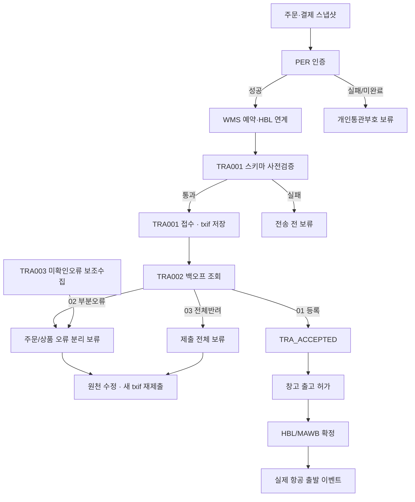

# 관세청 연동 기획 전면 재평가

기준일: 2026-08-06  
범위: 관세청 TRA001~003, PER001 중심 개인통관고유부호 확인, 자이언트 물류, Dongshu WMS, Geek 자사몰/관리자, 개인정보 처리방침, 계약·추가견적, 메신저 협의, 제공 화면 캡처

## 1. 최종 판정

**현재 기획은 운영 반영 NO-GO입니다.**

다음 네 가지가 동시에 충족될 때까지 운영 오픈을 승인하면 안 됩니다.

1. 관세청 REST API v1.4.1 기준으로 스키마와 조건부 필수 규칙을 전수 교정할 것
2. TRA002를 권위 있는 결과조회로 삼아 접수·부분오류·전체반려·재제출을 상태기계로 구현할 것
3. 구매자 결제금액과 조달/신고가격을 분리하고, 환율·할인·묶음·다중 HBL의 계산 규칙을 확정할 것
4. 개인정보 국외이전/위탁/보유기간 및 청약철회 문구를 법률 검토 후 재고지하고, 계약 변경합의를 문서화할 것

이 판정은 특정 담당자의 실수 때문이 아닙니다. 공식 API의 값 의미, 물류 데이터의 값 의미, 쇼핑몰 주문 데이터, 법률 고지가 한 문서 안에서 서로 다른 전제를 사용한 것이 핵심 원인입니다.

## 2. 이번 검토에서 확인한 자료

- 작업폴더의 HTML 11개, XLSX 1개, DOCX 1개
- 계약·견적·관세청 API·업무소개·회의자료·NICE 가이드 PDF 6개
- 외부 필드 매핑 XLSX 1개, 구버전 HTML 2개, 메신저 대화 2개
- 제공 화면 캡처 14개(동일 이미지 1쌍 포함)
- 현행 법령과 관세청·공정거래위원회 공식 안내

PDF·DOCX·XLSX는 텍스트 추출만으로 판단하지 않고 주요 페이지 및 모든 시트를 렌더링해 표와 주석을 확인했습니다. 원본은 수정하지 않았습니다.

## 3. 즉시 중단해야 할 치명적 모순

### 3.1 TRA003 무응답을 성공으로 보는 로직

현재 기획의 “TRA001 제출 후 30~40분 또는 11:50에 TRA003을 한 번 호출하고 오류가 없으면 승인” 방식은 성립하지 않습니다.

- TRA001의 정상 응답은 접수 성공이지 업무 검증 성공이 아닙니다.
- 특정 제출건의 최종 처리상태는 TRA002 `GET /v1/transactions/results/{txif_sbmt_no}`로 확인해야 합니다.
- TRA003은 최근 7일의 **미확인 오류만**, 1회 최대 50개 제출번호로 가져오는 보조 수단입니다.
- TRA002에서 이미 정상 결과를 확인했거나 TRA003 결과를 한 번 읽었다면 이후 TRA003에 나오지 않을 수 있습니다.
- 따라서 “TRA003에 없음 = 통관 전송 성공”은 거짓 양성(false positive)을 만듭니다.

교정안: TRA001 접수 → TRA002 지수 백오프 조회 → `01 등록 / 02 부분오류 / 03 전체반려` 분기 → 오류 단위별 수정 → 새 `txif_sbmt_no`로 재제출. TRA003은 누락오류 보조 수집기로만 사용합니다.

### 3.2 오류 하나를 주문 전체 삭제로 처리

공식 규격상 검증 단위는 `order_info`이며, 주문 오류와 상품 오류의 영향이 다릅니다. 정상 상품이 하나 이상이면 일부 상품만 오류로 남을 수 있습니다. 현재의 “오류가 하나라도 있으면 ERP 주문 삭제”는 정상 데이터까지 제거하고 감사 추적도 끊습니다.

교정안: 삭제 대신 `HOLD/QUARANTINE` 처리하고, `제출번호-주문번호-HBL-상품순번-오류항목-수정버전-재제출번호` 계보를 영구 감사로그로 남깁니다. 외부 주문삭제 API는 사용자가 승인한 실제 취소에만 제한합니다.

### 3.3 PER001 요청 구조와 인증 흐름 누락

현재 매핑은 수취인 이름·PCCC·전화번호 정도만 고려해 PER001 필수 구조를 충족하지 못합니다. 공식 규격은 요청번호, 요청유형, 주문자 이름, 수취인 이름·전화·우편번호, PCCC, 주문번호 포함여부 등을 요구합니다.

일반 인증(`reqt_tp=01`)은 관세청이 사업자에게 OTP 6자리 전체를 주는 구조가 아닙니다. 응답의 일부 숫자와 사용자가 이메일/SMS로 받은 값을 결합해 검증해야 합니다. 반면 CI로 동일인을 확인하는 주문기반 경로는 별도 조건입니다. 현재 기획은 관세청 직접 PER, NICE CI 중계, CI 미사용 경로를 동시에 가정합니다.

교정안: 다음 중 하나를 계약·UI·개인정보 고지까지 일관되게 선택합니다.

- 일반 PER: 주문자와 수취인이 달라도 가능, CI 불필요, 주문마다 OTP UI와 검증 필요
- 동일인 주문기반 PER: CI 처리 근거·NICE 계약·동의·실패 대체흐름 필요

### 3.4 `Z99999` 적용 범위와 기간 오류

`Z99999`는 PER001 응답값이 아닙니다. 관세청 업무소개 자료상 기존 신고/목록의 일회용 부호 칸에 2026-08-15부터 2026-09-14까지 한 달간 허용되는 한시값입니다. “연말까지 사용” 또는 “PER 응답 대체” 설계는 틀렸습니다.

또한 2026-08-28 전면 오픈이라는 전제도 공식 단계적 적용 일정과 맞지 않습니다. 적용대상과 종료일은 최신 관세청 공지로 다시 고정해야 합니다.

### 3.5 고객 결제금액과 조달/신고가격 혼용

화면 증거에는 동일 거래군에서 93,000 KRW 고객 결제, 53.028 USD 신고단가 합계, Giant 상품값 17.68/0.14 USD가 함께 보입니다. 이는 사기라고 단정할 증거는 아니지만 서로 다른 경제적 의미의 값을 같은 필드에 쓰고 있음을 보여줍니다.

TRA의 `tot_stlm_amt`, `prod_unprc`, `ord_amt`는 구매자의 실제 거래·결제 의미입니다. 자이언트의 구매가/신고가를 그대로 넣으면 안 됩니다. `USD 고정`도 실제 결제통화가 KRW인 주문에는 맞지 않습니다.

교정안: 최소 다음 세 원장을 분리합니다.

| 값 영역 | 예시 | 사용처 |
|---|---|---|
| 고객 거래 | 결제통화, 결제총액, 상품단가, 할인, 환불 | 관세청 TRA 주문/상품금액 |
| 조달 | 공급사 매입가, 구매수수료, 해외 현지비용 | 원가·정산 |
| 신고/물류 | 신고가격, 운임·보험, 중량, HS, 포장단위 | 물류/수입신고 |

세 원장의 차이는 환율기준일·반올림·할인배분·수수료를 포함한 조정표로 설명 가능해야 합니다.

### 3.6 공식 스키마와 다른 필드

현재 기획에는 다음 문제가 동시에 존재합니다.

- 필수 `ord_site_url` 누락
- 배송대행사업자 태그를 `dlvr_vcex...`로 작성했으나 공식 태그는 `shpn_vcex_bsmn_sgn/nm`
- `sale_ents_biz_no`는 공식 `sale_ents_bsns_no`와 불일치
- 제조사 태그도 공식 `prod_mkr_nm`, `prod_mkr_mdl_no`와 불일치
- `prod_srno`를 String(20)으로 잡았으나 공식은 Integer(3)
- `ord_prod_nm` 길이를 300으로 제한했으나 공식은 600
- `tot_wt`, `hs_cd`, `ord_qty_ut`, `stlm_mns_cd`, `stlm_dttm`, `insrc_amt`, `tax_amt`, `ordrr_email` 등 v1.4.1 TRA001에 없는 필드를 전송 대상으로 작성

스키마 외 필드를 보내면 구현체 검증정책에 따라 전체 요청이 거부될 수 있습니다. “화면에 있으니 전송”이 아니라 공식 JSON 스키마 화이트리스트로 직렬화해야 합니다.

### 3.7 실제 판매 URL을 대표 도메인으로 대체

`prod_sale_pge_url`은 상품이 실제 판매된 페이지입니다. 상품 ID가 없다는 이유로 `krone.com`이나 채널 대표 도메인을 고정 주입하는 것은 의미를 충족하지 않습니다. 구매시점 URL을 주문 스냅샷에 보관하고, 단축/리다이렉트 URL도 최종 원본과 함께 보존해야 합니다.

### 3.8 판매유형을 채널만으로 판정

자사몰은 무조건 A, 외부 28개 채널은 무조건 B라는 규칙은 위험합니다. `A 직접판매 / B 구매대행 / C 배송대행`은 판매·계약·대금수취·수입 역할의 실질로 판정해야 합니다. 채널은 보조 신호일 뿐입니다.

각 채널별 판매자 명의, 약관상 거래당사자, 영수증/결제수취자, 통관대행 구조를 법무·세무·통관 담당이 서명한 매트릭스로 확정해야 합니다.

### 3.9 TRA 성공을 “항공 출발”로 표시

TRA 검증 성공은 데이터가 등록된 상태일 뿐 물리적 출발이 아닙니다. 관리자 `g5 항공 출발` 같은 표시는 허위 상태가 됩니다.

교정안: `TRA_ACCEPTED`, `WAREHOUSE_RELEASED`, `HBL_ASSIGNED`, `MAWB_ASSIGNED`, `PHYSICAL_DEPARTED`를 분리하고 각 상태는 해당 시스템 이벤트로만 전이시킵니다.

### 3.10 운영환경 허위 테스트

“가짜 주문을 운영에 보내도 자동으로 사라진다”는 근거는 확인되지 않았습니다. 관세·개인정보·물류시스템에 허위 데이터를 넣는 시험은 서면 승인된 테스트사업자/파일럿 환경에서만 해야 합니다.

## 4. 필드·계산 재설계 핵심

### 4.1 주문 금액

- `tot_stlm_amt`: 구매자의 해외직구 상품 최종 결제금액. 국내상품 혼합 주문은 국내상품 결제분을 제외합니다.
- `tot_stlm_amt_curr_cd`: 실제 결제통화. USD 상수 금지.
- `prod_unprc`: 고객 거래 상품단가. 조달단가 금지.
- `ord_amt`: `수량 × 고객단가 - 상품별 할인`. 현재의 단순 `qty × unitPrice`는 할인주문에서 틀립니다.
- 하나의 주문이 여러 HBL로 나뉘면 공식 규격의 전체 주문금액 반복 규칙을 따르되, 내부 정산에서 중복 합산하지 않도록 반복값 플래그를 둡니다.

### 4.2 수량·묶음·다중 HBL

- `tot_ord_prod_qty`는 필수입니다. 매핑 “해당 없음”은 잘못입니다.
- 세트상품을 물리 구성품으로 쪼갤 때 고객이 본 상품명·판매페이지·결제금액과 괴리가 생깁니다.
- 주문 스냅샷에는 `listing_bundle`과 `physical_package_line`을 모두 보관하고, 구성품 금액 배분과 반올림 합계 일치 규칙을 둡니다.
- 국내/해외 혼합주문과 다중 HBL에서 총수량·상품목록 반복범위는 규격 문구만으로 해석하지 말고 관세청 서면 답변을 받아 테스트케이스로 고정합니다.

### 4.3 판매기업 조건부 필드

직접판매 A에서는 `sale_ents_nm`이 조건부 필수입니다. 현재 모든 판매기업명/부호를 선택값 또는 Null로 두는 설계는 잘못입니다. 사업자부호, 판매자명, 판매자 사업자번호의 공식 태그와 조건을 유형별로 검증해야 합니다.

### 4.4 크기·제약

`order_info`는 1~300건이지만 요청 본문은 3MB 제한이며 동시요청 없이 순차 호출해야 합니다. 고정 100건은 내부 운영 상한으로는 가능하나, UTF-8 직렬화 후 바이트 크기로 재분할해야 합니다.

## 5. 권장 상태기계

필수 데이터키는 `internal_order_id`, `ord_no`, `hbl_no`, `prod_srno`, `txif_sbmt_no`, `submission_version`입니다. 동일 `txif_sbmt_no` 재사용은 금지하고, 비즈니스키 중복방지와 기술적 재시도키를 분리합니다.

## 6. 개인정보·소비자법 검토

### 6.1 법조문 인용 오류

문서 본문 일부는 관세법 제254조 제2항·제3항으로 고쳤지만 팝업에는 여전히 “제254조의2”와 시행령 제289조가 보유근거처럼 남아 있습니다. 현행 [관세법 제254조](https://law.go.kr/LSW/lsLawLinkInfo.do?chrClsCd=010202&lsJoLnkSeq=900024279)는 전자상거래물품 신고 및 거래정보 요청 근거이고, [시행령 제258조](https://law.go.kr/LSW/lsLinkCommonInfo.do?chrClsCd=010202&lspttninfSeq=181351)는 제공 정보와 제공기간을 정합니다. 제258조 제7항은 관세청의 보유기간 근거가 아닙니다.

### 6.2 보유기간 모순

같은 문서에서 PCCC/CI/OTP를 “API 호출 후 즉시 삭제”한다고 하면서 “저장 시 회원탈퇴까지”라고도 합니다. 목적 달성 후 불필요해진 개인정보는 지체 없이 파기해야 한다는 [개인정보 보호법 제21조](https://www.law.go.kr/LSW/lsLawLinkInfo.do?chrClsCd=010202&lsJoLnkSeq=900078981)와 최소수집 원칙인 [제16조](https://www.law.go.kr/LSW/lsLinkCommonInfo.do?chrClsCd=010202&lsJoLnkSeq=1020399353)에 맞춰 항목별 시스템 보유 여부와 법정 보존근거를 하나로 정리해야 합니다.

거래·대금결제·재화공급 기록은 별도 법정 보존대상일 수 있으므로 [전자상거래법 시행령의 거래기록 보존규정](https://www.law.go.kr/lsLinkCommonInfo.do?lsJoLnkSeq=1018638379)에 따라 주문기록과 인증 비밀값을 분리 보관해야 합니다.

### 6.3 CI 과다수집

일반 PER 경로에서 CI는 필수 데이터가 아닙니다. 모든 해외구매 회원에게 CI를 강제하면 최소수집 원칙에 반할 위험이 있습니다. NICE CheckPlus를 쓰는 경우 목적·보유기간·제공/위탁 관계·재위탁을 계약과 고지에 반영해야 합니다.

### 6.4 국외이전 고지 부족

Yantai 등 국외 수령자에 대해 법인 정식명칭과 연락처, 이전국가·시기·방법, 목적·항목·보유기간, 이전 거부 방법과 불이익을 구체화해야 합니다. “회원탈퇴”만 거부방법으로 제시하면 해당 주문만 포기할 선택지가 사라집니다. 현행 [개인정보 보호법 제28조의8](https://www.law.go.kr/LSW/lsLinkCommonInfo.do?chrClsCd=010202&lsJoLnkSeq=1029334869)의 고지항목에 맞춰 다시 작성합니다.

위탁업체는 “Krone/국내 배송사 등”처럼 묶지 말고 수탁자와 업무를 개별 공개하고, 재위탁 관리조항은 [개인정보 보호법 제26조](https://law.go.kr/lsLinkCommonInfo.do?chrClsCd=010202&lsJoLnkSeq=1029335337)에 맞춰 계약·공개합니다.

### 6.5 반품·환불 절대 금지 문구

“해외배송은 모든 책임이 고객에게 있고 교환·환불이 절대 불가”라는 문구는 삭제해야 합니다. 전자상거래법상 일반적으로 7일 이내 청약철회가 가능하고, 표시·광고나 계약과 다르게 이행된 경우에는 더 긴 기간의 권리가 인정됩니다. 공정위도 [해외구매대행의 일률적 반품·환불 금지 특약이 무효가 될 수 있음을 안내](https://www.ftc.go.kr/www/selectBbsNttView.do?bordCd=1&key=5&nttSn=30655&pageIndex=80&pageUnit=10&searchCnd=all&searchCtgry=2)합니다. 왕복 국제운송비 부담과 법정 철회 제한사유는 개별적으로 설명해야 합니다.

### 6.6 합산과세 안내 오류

기존 문구의 “다른 판매자 상품도 같은 날 입항하면 합산과세”는 현재 기준과 맞지 않습니다. 관세청은 2022-11-17부터 입항일 동일만으로 합산하지 않도록 기준을 변경했습니다. 현재는 하나의 B/L·AWB를 분할하거나 같은 해외공급자에게 같은 날짜 구매한 물품을 분할 반입하는 경우 등이 핵심입니다. [관세청 개정 안내](https://www.customs.go.kr/kcs/na/ntt/selectNttInfo.do?mi=2891&nttSn=10069842&nttSnUrl=search)와 [관세청 FAQ](https://www.customs.go.kr/call/ad/crmcc/selectFaqViewPage.do?cnslKnwlSrno=469&mi=6822)를 기준으로 배너를 수정합니다.

> 이 문서는 기획·시스템 적합성 검토입니다. 최종 개인정보 처리방침, 약관, 국외이전 동의, 계약효력 판단은 한국 변호사의 확정 검토가 필요합니다.

## 7. 계약·견적 재평가

### 7.1 계약 당사자 표시

계약 본문은 고객사를 “Krone”으로 쓰지만 서명부는 “IBe/아이베”로 되어 있습니다. 법인명·사업자번호·대표자·권리의무 귀속을 정정한 부속합의가 필요합니다.

### 7.2 조문 상호참조 오류

- 제14조가 제8조를 비밀유지 조항으로 인용하지만 제8조는 지식재산권 조항입니다.
- 제14조가 제12조를 권리침해 관련 조항으로 인용하지만 제12조는 하자보증이고 실제 권리 관련 내용은 제13조입니다.
- 지연배상 조항이 제4조와 제9조에 각각 1일당 3/1000으로 중복되어 이중적용 또는 해석분쟁 위험이 있습니다.

### 7.3 원계약과 추가견적의 중복

원견적 32,311,505원(부가세 별도)에는 PER/NICE/CI, TRA 제출·결과·실패목록·재제출·관리자 기능이 이미 포함되어 있습니다. 추가견적은 표지 4,800,000원과 상세 합계 4,865,538원이 서로 다르고, Giant HBL 검색·사전 제출·관리자 상태/실패목록을 다시 청구합니다.

“상태목록 제거”, “CI 미사용”, “자이언트 중심 제출” 같은 변경은 원계약 범위와 직접 충돌할 수 있습니다. 메신저만으로 변경하지 말고 다음을 포함한 변경합의서를 체결해야 합니다.

- 삭제·유지·추가 기능의 정확한 목록
- 중복금액 조정과 최종 대금
- API 규격 버전, 데이터 소유권, 운영주체
- 검수 테스트와 합격기준
- 파일럿·운영 전환·롤백 일정
- 장애·오류·법령변경 시 책임 및 무상보완 범위

## 8. 운영 전 필수 확인사항

다음은 구현팀이 추정해서는 안 됩니다.

1. 국내/해외 혼합 주문의 `tot_ord_prod_qty` 범위
2. 다중 HBL일 때 각 `order_info.product_info`에 전체 상품을 반복하는지, 해당 HBL 상품만 넣는지
3. 세트상품을 판매단위와 물리 구성품 중 어떤 단위로 신고하는지 및 금액배분 방식
4. A/B/C 판정의 각 채널별 법적 기준과 판매기업 필드 입력조건
5. Giant 가격 필드가 고객거래가·조달가·신고가 중 무엇인지
6. Giant HBL 조회 가능기간 및 정정/취소/멱등성 보장
7. 2026 파일럿·단계적 적용 대상, `Z99999` 정확한 종료일과 사용 위치
8. PER/TRA 장애 시 사후 PER003 및 지연 TRA 제출의 허용범위

공식 질의 문안은 별도 파일에 정리했습니다.

## 9. GO 전환 게이트

다음 항목을 모두 증빙해야 GO로 바꿀 수 있습니다.

- [ ] v1.4.1 JSON 스키마 계약테스트 100% 통과
- [ ] A/B/C 각각의 조건부 필드 테스트 통과
- [ ] 일반 PER와 동일인 PER의 성공·실패·재시도 UI 테스트 통과
- [ ] TRA001 접수 후 TRA002의 01/02/03 모든 분기 및 3030 대기 테스트 통과
- [ ] 주문오류/상품부분오류/전체반려 수정·새 제출번호 재전송 테스트 통과
- [ ] 다중 HBL, 혼합주문, 세트상품, 할인, 환불, KRW/USD 결제 테스트 통과
- [ ] 구매자 결제금액과 조달/신고금액 대사표 합계 일치
- [ ] 운영관리자에서 제출·결과·오류·재제출 계보 조회 가능
- [ ] 개인정보 처리방침/약관/국외이전/위탁 문구 변호사 승인
- [ ] 관세청·Giant의 열린 질문에 대한 서면 답변 확보
- [ ] 변경합의서와 최종 검수기준 서명
- [ ] 서면 승인된 파일럿 환경에서 종단간 테스트 및 롤백 훈련 완료

## 10. 권장 즉시 조치 순서

1. 운영 배포와 허위 운영테스트를 중단합니다.
2. 관세청 v1.4.1 스키마 기준 필드 화이트리스트를 확정합니다.
3. 결제·조달·신고 가격 모델을 분리하고 기존 주문을 표본 대사합니다.
4. PER 경로 하나를 선택하고 결제/체크아웃 UI를 다시 설계합니다.
5. TRA002 중심 상태기계와 부분오류 재처리를 구현합니다.
6. 개인정보/약관 문구를 정정해 법률 재검토를 받습니다.
7. 공식 질의를 발송하고 답변을 테스트케이스로 전환합니다.
8. 계약 변경합의·검수기준을 체결한 후 파일럿으로 전환합니다.

## 11. 공식 기준 링크

- [관세청 전자상거래 전용 통관플랫폼 공지 게시판](https://www.customs.go.kr/kcs/na/ntt/selectNttList.do?bbsId=3800&mi=14185)
- [관세법 제254조](https://law.go.kr/LSW/lsLawLinkInfo.do?chrClsCd=010202&lsJoLnkSeq=900024279)
- [관세법 시행령 제258조](https://law.go.kr/LSW/lsLinkCommonInfo.do?chrClsCd=010202&lspttninfSeq=181351)
- [개인정보 보호법 제16조](https://www.law.go.kr/LSW/lsLinkCommonInfo.do?chrClsCd=010202&lsJoLnkSeq=1020399353)
- [개인정보 보호법 제21조](https://www.law.go.kr/LSW/lsLawLinkInfo.do?chrClsCd=010202&lsJoLnkSeq=900078981)
- [개인정보 보호법 제26조](https://law.go.kr/lsLinkCommonInfo.do?chrClsCd=010202&lsJoLnkSeq=1029335337)
- [개인정보 보호법 제28조의8](https://www.law.go.kr/LSW/lsLinkCommonInfo.do?chrClsCd=010202&lsJoLnkSeq=1029334869)
- [전자상거래법상 거래기록 보존규정](https://www.law.go.kr/lsLinkCommonInfo.do?lsJoLnkSeq=1018638379)
- [공정위 해외구매대행 반품·환불 안내](https://www.ftc.go.kr/www/selectBbsNttView.do?bordCd=1&key=5&nttSn=30655&pageIndex=80&pageUnit=10&searchCnd=all&searchCtgry=2)
- [관세청 합산과세 기준 개정 안내](https://www.customs.go.kr/kcs/na/ntt/selectNttInfo.do?mi=2891&nttSn=10069842&nttSnUrl=search)

