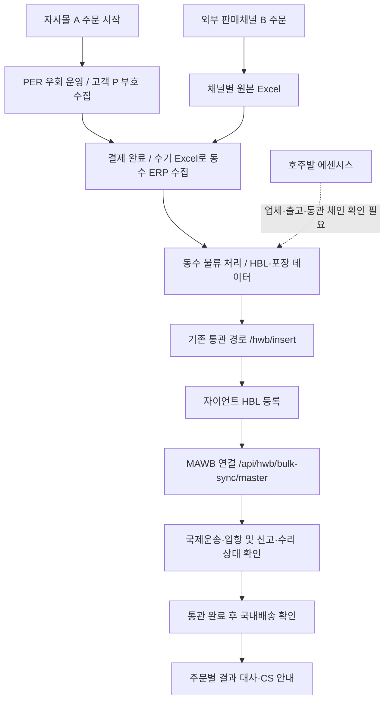
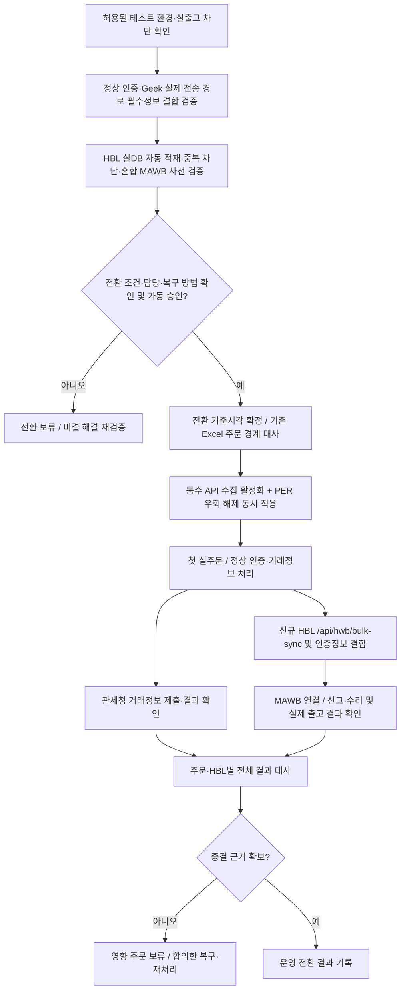
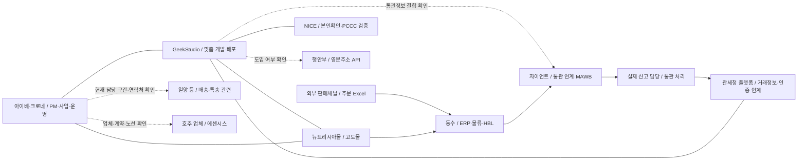
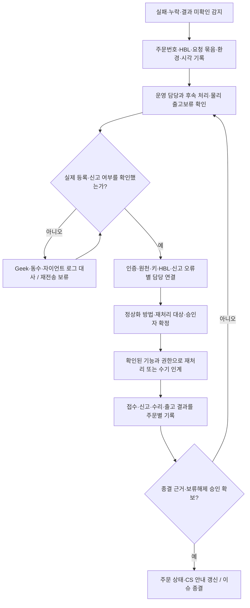
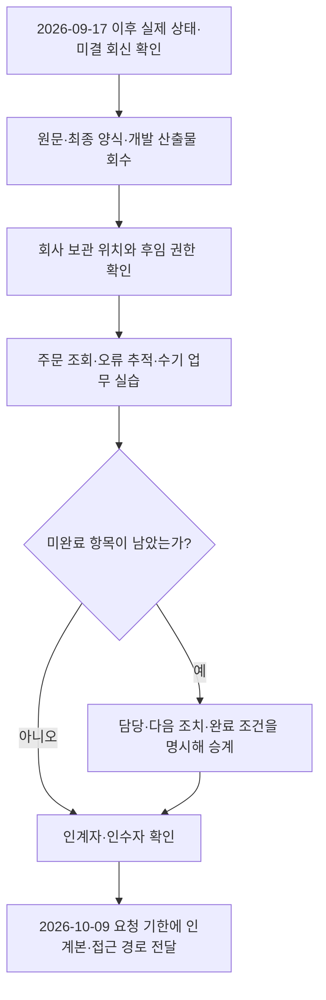

# 관세청 유니패스 전자상거래 통관플랫폼 연동 PM·운영 인수인계서

| 항목 | 내용 |
|---|---|
| 인계자 / 인수 요청자 | 박종혁 / 지윤환 — 요청 메일 [R01] |
| 작성 기준일 / 요청 제출기한 | 2026-10-04 / 2026-10-09 — 제출기한은 추가 요청 메일 [R01] |
| 범위 | 뉴트리시아 자사몰·외부 판매채널의 주문 수집, 본인확인, 통관 연동, 물류, 개발·계정·문서·협의 인계 |
| 자료로 확인한 마지막 운영 상태 | 2026-09-17 현황 [R02]. 그 이후 실제 운영 전환·이슈 종결 여부는 확인 필요 |
| 문서 상태 | 확보 자료를 통합한 인계본. 각 표의 **확인 필요**는 인수 전 확인·회수할 항목이며, 업무 완료를 뜻하지 않음 |
| 원본 자료 루트 | `C:/MyMain/main/관세청/`. 본문 파일 링크는 이 파일 기준 상대경로이며, 폴더 구조를 함께 유지해야 원본을 열 수 있음. R09·R14는 상위 저장소 자료이므로 관세청 폴더만 옮기면 링크가 끊김. 회사 공유 위치에 별도 연결 필요 |
| 취급 | 사내 인수인계용. 비밀번호·API Key·Secret·고객 통관부호·OTP 원문 미수록 |

**먼저 읽을 사항**

- 마지막 운영 기록인 **2026-09-17에는 자사몰도 수기 Excel 수집·기존 통관·PER 우회 방식**이었다. 신규 방식 적용일과 운영 스토어 재활성화는 확인되지 않았다. 이 상태를 2026-10-04 실시간 상태로 단정하지 않는다. [R02 `applied`, `waiting`]
- 신규 방식 테스트의 `SUCCESS`는 접수·연결 단계의 성공이다. **관세청 거래정보 제출, 세관 신고·수리, 실제 출고 완료를 한꺼번에 증명하지 않는다.** [R02 `chat`]
- `planning_v7.html`은 2026-09-08 통합 기획 기준이지만, 전송 경로·실제 주문 수집 방식은 2026-09-17 기록에서 정정됐다. **v7만 보고 운영하지 않는다.** [R02 `changed`, R03]
- A/B는 판매유형이고 기존/신규는 신고 방식이다. **자사몰 A 실패를 B로 바꾸는 확정 운영 절차는 확인되지 않았으며, 실제 존재 여부·승인 기준은 확인 필요다.** [R03 `route`, R01]
- GeekStudio 개발 완료 여부, 최종 산출물 수령 여부, 검수 합격 여부는 각각 확인해야 한다. 현 보유 계약·견적만으로 납품·검수를 완료 처리할 수 없다. [R01, R07]

## 목차

1. [현재 상태와 미결 이슈](#s1)
2. [전체 주문 흐름과 협력사 관계](#s2)
3. [관계사·담당자 연락처](#s3)
4. [A유형 출고 실패·재처리](#s4)
5. [수기 업로드와 Excel 양식](#s5)
6. [시스템·계정·접근 권한](#s6)
7. [개발·서버 확인 방법](#s7)
8. [테스트 주문·최근 테스트 이력](#s8)
9. [문서·산출물 정본](#s9)
10. [데이터·API 매핑](#s10)
11. [장애별 연락 체계](#s11)
12. [메일·메신저·개인 소유 자료 인계](#s12)
13. [GeekStudio 최종 개발 산출물](#s13)
14. [추가 인수 항목과 완료 확인](#s14)
15. [근거·요청사항 대응표](#s15)

## 1. 현재 상태와 미결 이슈

### 1.1 마지막으로 확인된 상태

| 대상 | 자료상 상태 | 인수자가 확인할 최신 증빙 | 근거 |
|---|---|---|---|
| 자사몰 주문 수집 | 2026-09-17 수기 Excel → 동수 ERP. 운영 스토어 API 수집은 2026-09-08 비활성화 후 재활성화 기록 없음 | 현재 수집 방식, 재활성화 시각, 중복 수집 방지 기준 | R02 `applied` |
| 자사몰 인증·통관 | PER 오류를 의도적으로 발생시켜 P 부호를 받고 기존 방식으로 통관 | 현재 우회 여부, 설정 위치·변경자, 신규 전환 시각 | R02 `applied`, `waiting` |
| 신규 방식 A | 2026-09-09 HBL 접수 성공, 2026-09-10 MAWB 연결 성공. 자동 적재·인증정보 결합·신고 수리는 미확인 | 실운영 주문의 전 구간 로그 및 신고 수리 결과 | R02 `chat` |
| 외부 채널 B | 원본 Excel → 동수 ERP 수집. 지마켓 신양식 가져오기 설정 완료 보고, 자이언트 연동 최종 결과 미확인 | 채널별 원본, 매핑, 신고 방식, 실제 요청·응답 | R02 `chat`, R03 `data` |
| 호주발 에센시스 | 자사몰 적용 프로세스 정립 중으로 기록 | 업체·출고지·HBL 발급·신고 주체와 중국발과의 차이 | R02 `waiting` |
| 마지막 정상 운영일 | **확인 필요**. 2026-09-17은 운영 현황 기록일이며 정상 처리 전체 로그의 날짜가 아님 | 정상 실주문 1건의 결제→신고 수리→출고 증빙 | R02 |
| 마지막 테스트 성공 | 응답이 요약에 명시된 것은 2026-09-10 MAWB 연결. 2026-09-11 동수는 테스트 2건 성공 보고 | 원문 요청·응답, 테스트 정리 결과 | R02 `chat`, 본문 8절 |

### 1.2 인수 직후 우선 확인할 미결 사항

아래 담당은 원문에 등장한 **업무 확인 상대**다. 현재 배정·회신 대기 여부는 마지막 근거일 이후 달라졌을 수 있다. 별도 표시한 “인계 제안”은 본 문서에서 정한 후속 확인 항목이며 이미 발송된 요청이 아니다.

| ID | 마지막 근거일 / 미결 사항 | 원인·현재까지 확인된 것 | 확인 상대 | 다음 조치·종결 증빙 |
|---|---|---|---|---|
| I01 | 2026-09-17 / 신규 가동 여부 | 다음 주 가동 가능 여부 문의 후 회신 기록 없음 | 동수 小熊, 박종혁→지윤환 | 이후 회신과 실제 가동일·기준 주문시각 회수 |
| I02 | 2026-09-17 / Excel→API 전환 | 이미 Excel 등록된 주문의 재수집 위험. 중복 HBL은 묶음 전체 실패 가능 | 동수 개발, 사내 운영 | 마지막 Excel 주문과 첫 API 주문 경계, 중복 제외 결과 확보 |
| I03 | 2026-09-17 / PER 우회 해제 | 먼저 해제하면 O 부호가 기존 경로로, 늦게 해제하면 신규 경로에 인증값이 없을 수 있음 | GeekStudio, 사내 운영 | 수집·신고 전환과 같은 기준시각 적용 여부, 변경 로그 |
| I04 | 2026-09-08~2026-09-17 / 인증정보 결합 | 동수 테스트 전문에 부호·인증번호·수하인 정보 없음. Geek의 실제 보완 경로 미확인 | GeekStudio, 자이언트 김현진 | 같은 주문번호·HBL의 양쪽 요청과 최종 데이터 대사 |
| I05 | 2026-09-10 / 실제 DB 자동 적재 | 테스트 HBL이 확인용 DB에만 있어 자이언트가 실제 DB로 수동 반영 | 자이언트 김현진 | 수동 개입 없는 적재·조회·중복 차단 증빙 |
| I06 | 2026-09-17 / 신고 판정·결과 회신 | P/O 부호와 신고 경로가 어긋나는 경우 판정 기준, 접수 이후 수리 확인 방법 미확인 | 자이언트, 실제 신고 담당 | 주문별 신고방식·신고번호·수리/오류 결과 및 확인 주기 |
| I07 | 2026-09-17 / 혼합 MAWB | 신규 HBL 1건 연결만 확인. 기존·신규 동시 신고 성공 증빙 없음 | 동수, 자이언트 | 같은 MAWB 내 각 경로별 결과 확인. 불가 시 방식별 분리 협의 |
| I08 | 2026-09-10 / 테스트 데이터 잔존 | 실제 DB에 들어간 테스트 HBL·MAWB 정리 여부 미확인 | 자이언트, 동수 | 테스트 HBL `318570884332`·MAWB `99433555535-1` 실신고/출고 차단 및 정리 회신 |
| I09 | 2026-09-09 / 채팅 키 노출 | 동수 전용 토큰과 처음 잘못 사용한 키의 교체 완료 미확인 | 자이언트, 동수, GeekStudio | 사용처 확인→안전한 경로로 재발급·반영→구 키 폐기 증빙 |
| I10 | 2026-09-11 / 지마켓 신양식 | 가져오기 설정 완료. AG열 인증번호 추출·자이언트 연동 최종 결과 없음 | 동수 小熊·개발, 자이언트 | 실제 Excel 원본·반영 매핑·요청/응답·신고 결과 회수 |
| I11 | 2026-09-17 / 호주발 에센시스 | 중국발과 같은 처리 체인인지 확인 필요 | 크로네·아이베, 호주 업체 확인 필요 | 발송국·송하인·출고지·HBL/MAWB·통관/국내배송 책임 확정 |
| I12 | 2026-08-31 사고 / 2026-09-17 미종결 기록 | 문제 주문 90건의 주문별 종결 증빙 없음 | GeekStudio, 동수, 자이언트, CS | 보완·재제출·신고·수리·취소 결과를 주문별 회수 |
| I13 | 2026-09-01 발생 / 2026-09-17 미종결 기록 | PCCC 공란 후보 32건. 원천 누락인지 출력 누락인지 미확인 | GeekStudio, 동수, CS | DB·고도몰 추가필드·동수 수집·CS 출력 대사, 출고보류/해제 기록. 90건과 겹칠 수 있어 합산 금지 |
| I14 | 2026-09-15 작성 / 고객 부호 수집 방안 | 개인정보·보안 검토 요청 메일 작성 기록만 있음. 발송·회신 미확인 | 사내 검토 담당 확인 필요 | 발송함·답신 확인 후 승인된 수집 방법과 운영자 확정 |
| I15 | 2026-09-17 / 네이버 연동 준비 | 내부 기록상 2026-10-14 시작 예정. TRA·인증·결과 공개·필드 문의의 발송/회신 미확인 | 네이버 담당 미확인, 사내 채널 운영 | 공식 최신 공지·문의 스레드 회수, 채널별 제출·보완 책임 확정 |
| I16 | 추가 인계 요청 / Geek 산출물 | 요청자는 A 개발 완료로 보인다고 기재. 최종 파일 수령·검수 증빙 없음 | GeekStudio 강명제·이준, 박종혁, 지윤환 | 13절 산출물 목록과 납품 메일·검수서 확보 |
| I17 | 2026-09-08 기획 / NICE·행안부 | NICE CI 권한·`3011` 등 미결 기록, 행안부 주소 API 실제 도입 여부 미확인 | GeekStudio·NICE 기술 담당(조다빈을 통해 연결) | 현재 호출 여부·운영 권한·최근 성공 결과, 미사용이면 미사용 표시 |
| I18 | 인계 제안 / 접근·연락·원문 누락 | 담당자 연락처·운영 URL·권한·2026-09-08 원문 일부가 로컬에 없음 | 박종혁, 각 서비스 소유자 | 3·6·9·12절의 확인 필요 항목을 회수하고 인수자 접속 실습 |

근거: I01~I15는 [R02 `waiting`, `chat`] 및 그 안의 과거 미결 기록, I16은 [R01, R07], I17은 [R03 `keys`, `conflicts`]. 이후 회신을 확인하기 전 “현재 상대가 미응답”으로 단정하지 않는다.

### 1.3 기한이 있는 후속 확인

| 날짜 | 항목 | 이번 인계에서의 처리 | 출처 |
|---|---|---|---|
| 2026-09-27 | 임시 인증번호 `Z99999` 사용 종료로 기록 | 이미 지난 기한. 현재 대체값으로 쓰지 말고 잔존 설정 확인 | R02 `dates`, R03 `operations`의 2026-08-21 공지 인용 |
| 2026-10-07 | 수입신고 정정 전자문서 5FE·5FK 변경 시행으로 기록 | 실제 신고 솔루션 영향·반영 여부를 자이언트/신고 담당에게 확인 | R02 `notices`, 관세청 2026-09-16 공지 인용 |
| 2026-10-09 | 인수인계 전달 요청 기한 | 미확인 항목도 담당·다음 조치를 붙여 함께 전달 | R01 |
| 2026-10-14 | 네이버 해외배송 주문 관세청 연동 시작 예정으로 기록 | 최신 공지와 실제 적용 범위 재확인 | R02 `waiting`; 공지 원문 로컬 미확보 |
| 2026-12-31 | 기존 통관목록 사용기한으로 기록 | 기존 수입신고서의 허용기한과 구분해 후속 변경 관리 | R02 `changed`, 관세청 2026-09-16 공지 인용 |

위 일정은 출처에 기록된 내용이다. 법령·대외 일정의 후속 변경은 운영 담당자가 최신 공식 공지와 대조한다.

## 2. 전체 주문 흐름과 협력사 관계

차트는 Mermaid 형식이다. Mermaid 지원 Markdown 뷰어에서 렌더링되며, 지원하지 않는 뷰어에서도 바로 아래 설명과 표로 같은 흐름을 확인할 수 있다.

### 2.1 마지막 운영 기록 기준 전체 흐름

**읽는 기준:** 자사몰의 수기 수집·기존 방식은 2026-09-17 운영 메모, 두 API 경로는 2026-09-08 협의 기록이다. 운영 요청·응답 원문과 주문별 신고/배송 완료 증빙은 별도 확인해야 한다. 국제운송·통관·국내배송의 세부 시점과 실행 업체는 노선별로 확정해야 하며, 위 차트의 후반부는 결과를 추적하는 순서를 나타낸다. 호주발을 동수 중국발 체인으로 확정한 그림이 아니다. [R02 `applied`, `basics`, `chat`, `waiting`]

### 2.2 신규 A 전환 시 확인할 흐름

**미완성 구간:** Geek의 인증정보 보완 경로, 관세청 제출 결과, 자이언트 실제 DB 자동 적재, 기존·신규 혼합 MAWB, 최종 신고 수리는 현재 자료로 완료 판정할 수 없다. 이 그림은 전환 확인 순서이며 배포 완료를 뜻하지 않는다. 동수와 Geek이 동일 HBL을 같은 등록 API로 각각 보내도 된다는 뜻이 아니다. [R02 `waiting`, `changed`]

### 2.3 협력사·시스템 관계도

**책임 경계:** GeekStudio는 맞춤 연동 구현, 고도몰은 주문 플랫폼, 동수는 주문 수집·물류 데이터, 자이언트는 통관 연계와 HBL/MAWB 처리의 확인 상대다. 거래정보 제출과 실제 수입신고는 서로 다른 업무다. 일양의 현재 계약 범위·호주 업체명·노선별 신고 주체는 확인 필요다. 관계도의 연결선은 협업 관계이며 법률상 위탁·계약 관계를 확정하지 않는다. [R02 `basics`, R03 `catalog`, R01]

## 3. 관계사·담당자 연락처

업무용 원문에 기재된 연락처만 옮겼다. 연락처의 현재 유효성, 공식 1차·2차 장애 담당 지정은 인수 시 확인한다. 요청 메일의 참조 수신자는 승인권자·2차 담당자로 자동 지정하지 않는다.

| 회사·관계 | 역할 / 담당자 / 직급 | 전화·연락 채널 | 이메일 | 문의할 업무·확인 범위 | 출처 |
|---|---|---|---|---|---|
| 크로네·아이베 | 인계 / 박종혁 / 팀장 | 070-4349-1781 | jong1357@eibe.co.kr | 원문·미결·협력사 연결. 문서상 직급 기준 | R01, R02 `chat`, R08 p.1 |
| 크로네·아이베 | 인수 요청 / 지윤환 / 과장 | 전화 확인 필요 | jyh@eibe.co.kr | 인계 수령·후속 개발 산출물 요청. 최종 검수 승인권은 확인 필요 | R01, R02 `chat` |
| 사내 계약·정산 | NICE 기관 담당 / 신선일 / 직급 미확인 | 070-4349-4099 | sun7942@eibe.co.kr | NICE 계약·정산·기관 담당자 변경 | R08 p.1 |
| GeekStudio | 자사몰 개발 / 강명제 / 직급 미확인 | 직접 연락처 확인 필요 | 확인 필요 | A 개발·배포·로그·재처리·소스·매뉴얼 | R09 등장인물 |
| GeekStudio | 대표·견적 연락 창구 / 이준 / 대표 | 010-8483-1663 | biz@geekstudio.co.kr | 최종 납품·검수·하자보수 담당 연결 요청. 견적 기재 업무 연락처 | R07 계약 p.5, 1차 견적 p.1 |
| 자이언트·GNG | 통관 API·물류 연계 / 김현진 / 계장 | 위챗 단체방, 전화 확인 필요 | 확인 필요 | API 키·DB 적재·HBL/MAWB·신고 결과·수기 담당 연결 | R02 `chat`, R05 |
| 동수 | ERP·중국 물류 / 小熊(공부장·孔祥兵), 개발 닉네임 `我是谁，你是谁`, AN. | 위챗 단체방, 전화 확인 필요 | 확인 필요 | 수집·HBL·MAWB·전송·출고보류. 정식 직급·각자 책임 확인 필요 | R02 `chat`, R09 |
| NICE | 계약 문의 / 조다빈 / 매니저 | 02-2122-4957 | dabeen@nice.co.kr | 계약·서비스 신청·기술 담당 연결. 기술 장애 담당자로 확정하지 않음 | R08 p.1 |
| NICE 경로 검증 관계자 | 과거 검증 담당 / 김동섭 / 소속·직급 미확인 | 확인 필요 | 확인 필요 | 인증 경로 협의 이력. NICE 직원 여부는 자료에 명시되지 않음 | R09 |
| 관세청 전자상거래통관과 | 제도·거래정보 문의 / 성명·직급 미확인 | 042-481-3258 | eccs@korea.kr | 2026-08-21 기록의 문의처. 현재 담당·API 기술 창구 재확인 | R10, 569행 |
| 고도몰·NHN커머스 | 주문 플랫폼·Open API / 전담자·직급 미확인 | 확인 필요 | 확인 필요 | 주문·추가필드·API 권한·호스팅, Geek과 지원 범위 구분 | R03 `catalog` |
| 행안부 주소 API | 영문주소 / 담당자·직급 미확인 | 확인 필요 | 확인 필요 | 실제 도입·승인키·호출 도메인·상세주소 보존 | R03 `catalog`, `keys` |
| 일양 익스프레스 | 과거 자료상 중국 제품배송·국제특송 / 담당자·직급 미확인 | 확인 필요 | 확인 필요 | 현재 참여 구간·출고보류·사고 접수·2차 연락처 | R11. 현재 분담은 미확인 |
| 호주 업체 | 에센시스 호주발 / 업체명·담당자·직급 미확인 | 확인 필요 | 확인 필요 | 출고지·송하인·HBL·MAWB·통관·국내배송 책임 | R02 `waiting` |
| 사내 CS·MD | 실패 주문·채널별 Excel / 담당자·직급 미확인 | 확인 필요 | 확인 필요 | 고객 보완, 보류/해제, 채널 원본·양식 변경, CS 공지 | R02, R03 `operations` |

**개별 최신 요청 상태 미확인 대상:** 관세청·고도몰·NICE·일양·행안부는 이번 자료만으로 마지막 발송일·회신 대기 스레드를 지정할 수 없다. “대기 없음”으로 처리하지 말고 박종혁의 발송함·메신저와 각 업체 담당자를 대조한다. 동수·자이언트·Geek·호주 관련 후속 확인은 1절 이슈와 연결한다.

## 4. A유형 출고 실패·재처리

### 4.1 현재 인수 가능한 범위

**신규 A의 실제 상시 운영 장애 매뉴얼은 확인 필요다.** 현재 확보된 것은 기획상 실패 처리안, 과거 오류 사례, 일부 연동 테스트다. 아래 표는 확인된 증상과 후임이 확인할 순서를 정리한 것이며, 미확인 버튼·서버 명령·자동 재시도를 만들어 제시하지 않는다.

| 요청 항목 | 확보된 내용 | 아직 받아야 할 실제 운영 방법 |
|---|---|---|
| 실패 확인 위치 | 기획서의 거래실패리스트·TRA 오류조회·GGATE 결과, 동수/자이언트 요청·응답 | 고도몰 정확한 메뉴, 화면 URL, 주문번호 검색 위치, 운영 로그 위치와 권한 |
| 재전송·실패 주문 재처리 | 테스트에서 키 수정 후 HBL 재전송, 실제 DB 반영 후 MAWB 재전송 사례 존재 | 누가 어느 화면/기능으로 실행하는지, 중복 대사·승인 기준, 실제 재처리 결과 확인법 |
| 수기 처리 조건 | 과거 기획은 자동창 내 미완료를 수기통관으로 인계 | 현재 자동 마감시각·보류 상태·담당자·양식·수기 신고 경로 |
| A 실패→B 변경 | 확정 절차 미확인, 결정 여부도 확인 필요 | 실제 존재 여부를 사내 운영·자이언트에 확인. A/B와 기존/신규 신고 방식 변경을 구분 |
| 서버 확인·재처리 기능 없음 여부 | 기능 유무 자체 미확인 | Geek가 “미구현/없음” 또는 실제 URL·절차를 회신해야 확정 가능 |

근거: [R03 `operations`, `catalog`], [R02 `chat`], [R12]. 과거 `p1` 무제한 원복·익일 자동 재처리, 오래된 PATCH 수정 설명은 후속 정정과 충돌하므로 현재 절차로 사용하지 않는다.

### 4.2 실제 기록이 있는 오류와 확인 순서

| 오류·현상 | 원문에서 확인된 내용 | 후임의 확인·조치 기준 | 확인 상대·근거 |
|---|---|---|---|
| `A005` 등록되지 않은 업체 | 2026-09-08 신규 HBL 전송 실패. 다음 날 다른 API 키 사용이 원인으로 확인됨 | 제공자·환경·전송 주체와 키 매핑부터 확인. 문서나 메일에 키 값 기재 금지 | 자이언트·동수 / R02 `chat` |
| `H006` HBL 중복 | 이미 등록된 HBL 재전송을 차단. 같은 요청 묶음의 다른 주문도 함께 실패 | 수신·실제 등록 여부 대사 후 미등록 주문의 재처리 범위를 확정. 타임아웃 직후 무조건 재전송 금지 | 자이언트·동수 / R02 `chat` |
| `H016` 연결할 하우스 없음 | 2026-09-10 MAWB 실패. HBL이 확인용 DB에만 존재해 실제 DB 수동 반영 후 성공 | 대상 환경·HBL 실제 DB 적재·MAWB 연결 키를 확인. 수동 DB 변경을 후임의 일반 절차로 채택하지 않음 | 자이언트·동수 / R02 `chat` |
| `SUCCESS`, `saved`, `consolidated` | 요청 묶음 접수·연결 성공을 나타내는 테스트 기록 | 주문/HBL별 신고번호·수리/오류·실제 출고 결과를 추가 확인 | 자이언트 / R02 `chat` |
| `issuedHwbNos`가 비어 있음 | HBL을 미리 넣어 보내면 비어 있는 것이 정상이라는 회신 | 빈 목록만으로 실패 처리하지 말고 실제 접수 결과·사전 부여 HBL 대사 | 자이언트 / R02 `chat` |
| PCCC 공란·인증 결과 누락 | 원천 누락과 CS 출력 누락을 구분하지 못한 이슈 존재 | 원주문→Geek DB→고도몰 `addField`→동수→CS 출력 순으로 값 존재를 대사 | Geek·동수·CS / R02 `waiting`, R03 |
| HBL 미할당·일부 포장만 조회 | 오래된 포장별 null 허용 설명과 이후 전 HBL 반환 합의가 공존 | 현행 반환 계약 확인 전 정상/버그 단정 금지. 주문별 포장수·HBL수 대사 | 동수·Geek / R09, R12 |
| TRA 결과 없음·오류 조회 공란 | 기획상 TRA003 중심 판정의 한계·대사 필요 기록 | 무응답/오류 없음만으로 성공 판정 금지. 제출번호·요청·응답 원문과 신고 결과 대사 | Geek·관세청·신고 담당 / R03 `operations`, R09 |

`SUCCESS` 이외 묶음 전체 실패라는 규칙은 **해당 자이언트 HBL 테스트 경로의 회신**이다. 다른 제공자의 모든 API에 같은 규칙을 적용하지 않는다. 위 코드는 전체 오류코드 목록이 아니며 나머지는 실제 사용 버전의 공식 명세로 확인한다.

### 4.3 후임용 실패 대응 순서 — 인계 제안

이 순서는 [R02 `waiting`, `chat`]의 미결 항목과 [R03 `operations`]를 토대로 만든 **권장 인계 절차**다. 실제 시스템의 자동 차단 기능 구현이나 후임의 재처리 권한이 이미 확보됐다는 뜻은 아니다. 원주문 삭제는 연관 주문·국내/해외 주문·창고 작업에 영향을 줄 수 있으므로 오류 해소용 기본 동작으로 쓰지 않는다. [R12]

## 5. 수기 업로드와 Excel 양식

### 5.1 요청한 세 양식의 판정

**현재 실무 최종 양식: 확인 필요.** 확인되지 않은 파일을 최종본으로 임의 지정하지 않는다.

| 파일 | 현재 보유 확인 | 용도·유효성 판정 | 받을 증빙 |
|---|---|---|---|
| `hwb_excel_register_template_gng.xlsx` | 이번 관세청 폴더 목록에서 미확인 | 이름만으로 자이언트 운영 최종 양식이라 확정 불가 | 원본·제공자·양식 버전·사용 시스템·최근 업로드 성공 결과 |
| `관세청전자상거래주문등록전용양식.xlsx` | 이번 관세청 폴더 목록에서 미확인 | 다른 Excel과 같은 양식인지도 미확인 | 실제 파일·메뉴·컬럼 정의·사용자 |
| [ECB0103001S_TxifExcelForm.xlsx](documents/ECB0103001S_TxifExcelForm.xlsx) | 파일 존재 확인 | 관세청 거래정보 포털 대량 제출용. v7 기존 검증상 `Form`/`Sample` 시트·60열. 실제 최종 운영 사용 여부는 미확인 | 현행 포털에서 받은 양식과 일치 여부·업로드 성공일·결과 조회 방법 |

근거: [R01, R03 `data`, `sources`], 2026-10-04 파일명 조사. **관세청 거래정보 제출, 동수 ERP 주문 수입, 자이언트 HWB 등록, 실제 수입신고는 서로 다른 작업이다.** 하나의 Excel을 다른 시스템에 쓰는 것으로 가정하지 않는다.

### 5.2 수기 운영 시연에서 반드시 채울 항목

| 확인할 항목 | 현 자료의 답 | 확인 상대·수령할 내용 |
|---|---|---|
| 수기 전환 조건·마감 | 과거 기획상 자동창 미완료 수기통관. 현행 적용 미확인 | 사내 운영·Geek·동수: 실제 마감·보류 처리·승인자 |
| 관세청 업로드 진입 | 전자상거래업자 포털 URL은 6절에 있음. 실제 메뉴 경로·등록 권한 미인수 | 사내 실제 업로더: 메뉴명·화면·권한·업로드 시연 |
| 입력 컬럼·필수값 | 최종 운영 컬럼 정의 없음 — 보유 자료 기준 | 업로더·Geek·자이언트: 현재 사용하는 양식과 작성 예시, 구현과의 대조 |
| 성공/실패 확인 | 처리결과 화면·오류파일·등록번호 확인 방법 미인수 | 업로더: 최근 정상 사례의 결과 조회·오류 다운로드 방법 |
| 실패 행 재업로드 | 기존 등록건 식별·중복 처리 규칙 미확인 | 포털/자이언트 담당: 전체 재업로드 또는 오류행 재업로드의 실제 규칙 |
| 업로드 후 종결 | 업로드 성공만으로 실제 신고 수리 완료라 할 수 없음 | 신고 담당: 주문/HBL·제출번호·신고번호·수리 결과 연결 |

**수기 인계 최소 기록 — 제안:** 원주문번호, HBL, 적용 신고 방식, 사용 양식/버전, 업로드 일시·수행자, 제출/접수번호, 성공/오류 결과, 재처리 내역, 신고 수리 결과, 보류해제 승인자를 남긴다. 고객 개인정보·키는 본 문서에 추가하지 않고 접근이 제한된 회사 기록에 보관한다.

## 6. 시스템·계정·접근 권한

### 6.1 접근 대장

URL은 기존 자료에 기록된 값이다. 이번 작업에서 로그인·운영 호출을 하지 않았다. 공개 문서 URL, API Base URL, 관리자 로그인 URL을 구분했다. **계정 ID·회사 명의·실제 권한·보안 보관 위치는 인수자 접속으로 확인해야 한다.**

| 시스템 / 환경 | 용도·URL | 계정·필요 권한 | 인증정보 보관 위치·확인 담당 | 출처 |
|---|---|---|---|---|
| 전자상거래 통관플랫폼 | [전자상거래업자 포털](https://unipass.customs.go.kr/ecb/index.do) / 거래정보 등록·조회 | 계정 미확인 / 조회·등록·API 사용관리 권한 확인 | 보안 위치 미확인 / 사내 신청자·Geek | R03 `sources`, `keys` |
| UNI-PASS | 전자통관·신고 조회 / 실제 사용 진입 URL 미확인 | 신고 조회 계정·인증수단·위임범위 미확인 | 위치 미확인 / 실제 신고 담당·사내 운영 | R01 요청, R02 역할 |
| 관세청 REST API | `https://ecapi.customs.go.kr` / API Base URL | 환경·발급계정·허용 IP·권한 확인 | 두 키 파일은 아래 6.2절. 운영 사용 참조 미확인 / Geek·신청자 | R03 `catalog`, `keys` |
| 뉴트리시아몰 | [고객용 몰](https://nutriciastore.co.kr/) | 운영자·테스트 계정 미확인 | 위치 미확인 / 사내 운영·Geek. 고객용 주소는 관리자 URL이 아님 | R08 p.1 |
| 고도몰 관리자 | 관리자 로그인 URL 미확인 | 주문 조회·추가필드·상태·송장 수정 권한 확인 | 위치·계정 소유자 미확인 / 사내 운영·Geek | R03 `catalog` |
| 고도몰 개발자 페이지·개발 서버 | 실제 프로젝트 URL 미확인 | 개발·설정·로그·재처리 권한 확인 | 위치 미확인 / Geek. 운영·개발 계정 분리 여부 확인 | R01, R03 |
| 고도몰 Open API | 운영 `https://openhub.godo.co.kr/` / Sandbox `http://sbopenhub.godo.co.kr/` | `partner_key`·`key` 발급자·몰별 권한 확인 | 위치 미확인 / Geek·고도몰 신청자 | R03 `catalog`, `keys` |
| 고도몰 공식 개발 문서 | [Open API 명세 다운로드](https://devcenter.nhn-commerce.com/godomall5/openapi/specDownload) | 문서 열람. 프로젝트 관리계정과 별개 | API 관리계정 화면은 별도 인수 | R03 `sources` |
| Geek 서버·DB·배포 | 운영/개발 URL·호스트·DB·배포 위치 미확인 | 로그 읽기·DB 조회·배포·재처리 권한 각각 확인 | Secret 보관 위치·관리자 미인수 / 강명제·Geek 운영 담당 | R03 `catalog`, `keys` |
| 자이언트 API | 기존 기록 `https://g-api.giantnetworkgroup.com` / 실제 운영 Base URL 확인 필요 | 동수·Geek 등 전송 주체별 자격증명 확인 | 환경·Agent별 키 참조 미인수 / 김현진·동수·Geek | R03 `catalog`, R02 `chat` |
| 자이언트 운영 화면 | 로그인 URL 미확인 | HBL·MAWB·신고·오류 조회/수기등록 권한 확인 | 위치 미확인 / 김현진 | R02 `waiting` |
| 동수 ERP/WMS | 관리자·API URL 미확인 | 주문 수집·심사·HBL·출고보류·MAWB·로그 권한 확인 | 내부 인증·IP·운영/개발 구분 미인수 / 小熊·개발 담당 | R03 `keys`, R02 `chat` |
| NICE 관리자·API·테스트 | 관리자·프로젝트별 운영/테스트 URL 미확인 | 기관계정·허용 IP·API Scope·CI/KEY 권한 확인 | 위치 미확인 / 조다빈을 통해 기술 담당 연결·Geek | R03 `keys`, R08 |
| 행안부 영문주소 API | [영문주소 API](https://business.juso.go.kr/addrlink/addrEngApi.do) | 실제 도입·`confmKey` 발급·승인 도메인 미확인 | 위치·발급자 미확인 / Geek·사내 신청자 | R03 `catalog`, `keys` |
| GitHub·Slack·Trello | 조직/저장소·채널·보드 URL 미확인 | 회사 조직 초대·소유권·관리권한 확인 | 견적에 사용 계획만 확인 / Geek·사내 PM | R07 1차 견적 p.1 |
| 고객 안내 채널 | 네이버 톡톡·알림톡 등 실제 사용 계정/URL 미확인 | 발송·조회·템플릿·과금 권한 확인 | 회사 소유자·복구 연락처 확인 / 사내 CS·MD | R13의 검토·개발 요청안 |

### 6.2 `관세청 secret key.txt`에 대한 직접 답변

| 확인 항목 | 판정 |
|---|---|
| 파일 존재 | `C:/MyMain/main/관세청/관세청 secret key.txt` 존재 확인 |
| 현재 운영에서 사용하는 유효한 Key인가 | **확인 필요**. 내용을 열거나 인증 호출을 하지 않았으며 존재만으로 유효성을 판단하지 않음 |
| 사용 시스템·API·환경 | **확인 필요**. 이름만으로 관세청 운영 자격증명이라고 확정하지 않음 |
| 추가 관련 파일 | `C:/MyMain/main/key.txt`도 존재. 두 파일 모두 Git 추적 상태 확인. 동일 내용인지·같은 제공자인지는 미확인 |
| 확인 담당·방법 | 사내 발급자와 Geek가 발급 포털의 소유자·환경·권한, 실제 배포 설정의 Secret 참조, 최근 인증 성공 로그를 값 노출 없이 대조 |
| 보안 이관 | 회사 승인 보관 위치·후임 접근·교체 필요/완료 여부·구 키 폐기 여부 확인. 이 문서 작성 중 키 변경·삭제·이력 재작성은 수행하지 않음 |

근거: 2026-10-04 경로·`git ls-files` 확인, [R03 `keys`], [R02 `waiting`]. 기존 파일을 보관 위치로 발견했다는 사실과 적정한 장기 보관·전달 방식이라는 판단은 다르다. 실제 비밀값은 사내 보안 경로로 별도 전달한다.

### 6.3 개인 명의·권한 이관 확인

- [ ] 서비스별 가입자·소유법인·관리자·청구 담당·복구 이메일/전화·MFA 관리자 확인
- [ ] 개인 명의 서비스 목록 작성: 현재 존재 여부 확인 필요
- [ ] 후임 회사 계정으로 로그인 및 필요한 조회·운영 권한 확인
- [ ] 소스·문서·메일·메신저·보안 보관소의 회사 접근권 확보
- [ ] 남은 운영 의존성을 확인한 뒤 회사 절차에 따라 기존 접근권 회수 시각 결정

위 체크는 **추가 권고·미완료 확인표**다. 개인 계정이 실제 존재한다거나 이관이 끝났다는 뜻은 아니다. [E04, E05]

## 7. 개발·서버 확인 방법

### 7.1 Geek에게 받아야 할 실제 조회·재처리 절차

| 확인 항목 | 확보 여부 | 인수받을 구체 내용 |
|---|---|---|
| 운영·개발 접속 URL / 계정·권한 | 미확인 | 환경표, 회사 관리자, 로그 읽기·재처리·배포 권한 구분 |
| 주문번호 조회 방법 | 조회 화면·명령 미확인 | 고도몰 원주문번호→ERP 주문/포장→HBL→제출번호를 찾는 실제 화면 시연 |
| 로그 위치·보존기간 | 미확인 | 서버/서비스·파일/조회 URL, 검색 키, 타임존, 보존기간, 조회권한 |
| API Request/Response | 테스트 요약 일부만 있음 | 마스킹된 원문, 실제 endpoint·환경·시각·응답 코드·재시도 이력 |
| 재전송 기능 | 실제 메뉴·지원 범위 미확인 | 지원 API·대상 상태·중복 방지·권한·실행 전후 결과 확인법 |
| 실패 주문 재처리 | 원인별 실제 실행 절차 미확인 | 인증 재확인·원천 보완·재신고/수기 이관의 담당과 단계 |
| 배치·스케줄·출고 마감 | 여러 과거 시간이 공존 | 현재 배포 스케줄, 실행 주체, 실패 알림, 동수 WMS 마감과 연동 |
| 배포·되돌리기 | 운영 버전·절차 미확인 | 현재 버전, 배포 책임자·기록, 장애 시 되돌리기 범위·데이터 정합성 확인 |

근거: [R03 `catalog`, `operations`, `conflicts`], [R02 `waiting`]. 실제 구현이 없는 항목은 Geek 회신에 따라 “없음”으로 바꾸고 대체 담당·방법을 지정한다. 확인하지 못한 현재 상태를 “없음”으로 단정하지 않는다.

### 7.2 공통 추적 기준

| 추적 단위 | 자료에 기록된 키 | 사용할 때 주의 | 출처 |
|---|---|---|---|
| 몰 원주문 | 고도몰 `orderNo`, 관세청 `ord_no`, GGATE `orderNo` | ERP 분할 포장번호와 원주문번호를 분리 보존 | R03 `data` |
| 포장·운송장 | 관세청 `hbl_no`, GGATE `hwbNo` | 한 주문의 여러 포장, 합배송을 구분. HBL 1개=주문 1개로 고정하지 않음 | R03 `data` |
| GGATE 데이터 연결 | `hwbNo + orderNo` | 두 업체 원문과 최종 저장값을 대사. 실제 사용 endpoint·결합 계약부터 확인 | R03 `data`, R02 `waiting` |
| 관세청 제출 | `txif_sbmt_no` | 동일 제출번호의 중복 제출·재처리 이력을 원문으로 확인 | R03 `data`, `operations` |
| NICE 인증 | `request_no` / `transaction_id` | 인증 원문은 제한 접근·마스킹. 비밀값을 인계 MD에 붙이지 않음 | R03 `operations`, `keys` |

문의 시 최소 전달 정보는 **주문번호·HBL·환경·실제 API 경로·발생시각·오류코드·마스킹 응답·직전 조치·물리 출고 상태**다. 이는 문의 양식 제안이며 실제 서버 필드가 새로 구현됐다는 뜻은 아니다.

## 8. 테스트 주문·최근 테스트 이력

### 8.1 확인된 실제 테스트

아래 주문번호는 협의 기록에 등장하는 테스트 식별자다. 고객 성명·주소·PCCC·OTP는 옮기지 않았다. 근거는 [R02 `applied`, `chat`]이며 대화 원문 자체는 이번 저장소에 보관되지 않았다.

| 일자 | 주문·HBL | 목적 | 기록된 결과 | 남은 확인 |
|---|---|---|---|---|
| 2026-09-08 | ERP `EP260903000175` / 고도몰 `2609011145067423` | 신규 방식 가정 주문 생성·심사 | TEST 스토어에서 생성·승인 | 계정·결제·인증 원문 |
| 2026-09-08 | ERP `EP260903000174` / 고도몰 `2609021407343361` | 기존 방식 가정 주문 생성·심사 | TEST 스토어에서 생성·승인 | 기존 방식 원문 요청·응답 |
| 2026-09-08 | 신규 주문 / HBL `318570884332` | 신규 HBL 전송 | `A005` 실패 | 당시 사용 환경·마스킹 로그 회수 |
| 2026-09-09 | 같은 HBL `318570884332` | 해당 주체 키로 재전송 | `SUCCESS`, `saved 1` 기록 | 인증정보·수하인 결합 결과, 실제 DB 자동 반영 |
| 2026-09-10 | HBL `318570884332` / MAWB `99433555535-1` | MAWB 연결 | 최초 `H016`; 자이언트 실제 DB 수동 반영 뒤 `SUCCESS`, `requested 1`, `consolidated 1` | 수동 개입 없는 운영 연결·실신고 차단·테스트 정리 |
| 2026-09-11 | 위 테스트 두 주문 | 전송 완료 여부 | 동수가 2건과 MAWB 전송 성공 보고. 기존 방식은 원문 응답 미확보 | 두 주문 각각의 요청/응답·신고 결과 |
| 2026-09-11 | 지마켓 신양식 / 주문번호 미확인 | 원본 Excel→동수 ERP 가져오기 | 템플릿 설정·가져오기 정상 보고 | 자이언트 전송·신고 수리 결과 미확인 |

**최근 정상 실주문의 신고 수리일: 확인 필요. 신규 통관 전 구간 성공일: 확인 필요.** 테스트 접수 성공일을 이 두 날짜로 대신 쓰지 않는다.

### 8.2 실제 테스트 방법 중 확인된 것과 빈칸

| 요청 항목 | 확인된 방법·자료 | 미확인·주의 |
|---|---|---|
| 사용하는 몰·환경 | 동수 스토어 `TEST - Godo Mall 爱他美官方商城`은 자사몰 테스트 서버 연결 | 정확한 테스트 몰 URL·현재 연결 유지 여부·계정 미확인 |
| 운영/테스트 구분 | `生产环境 - Godo Mall`은 실제 운영 연결로 기록, 당시 수집 비활성화 | 이름만 보고 안전하다고 판단하지 말고 연결 서버·키·출고 경로 확인 |
| 테스트 주문 생성 | 2026-09-08 설명상 한국 자사몰 API 주문 또는 ERP 자체 생성 가능 | 메뉴·계정·입력 순서 미인수. B 유형 별도 케이스는 당시 생성 방법 없어 제외 |
| 테스트 상품 | 신규 HBL 전문상 `APTAMIL COMF 1 ESC 400G` 포함 | 현재 선택할 상품 ID·재고·결제 가능 조건 미확인 |
| 결제 방법 | 미확인 | 실결제/테스트 결제 여부·취소·환불 담당 확인 |
| PCCC 입력·검증 | 테스트 전문의 부호·인증번호·수하인 결합 결과 미확인 | 실제 고객정보를 임의 재사용하거나 가짜 부호·OTP·PER 결과 생성 금지 |
| 관세청 정상 전달 확인 | 전 구간 근거 미확보 | TRA 제출/결과와 실제 신고 접수·수리를 별도로 확인 |
| 취소·정리 | 실제 DB에 들어간 테스트 HBL·MAWB 존재 | 몰 주문/결제, ERP/WMS, 자이언트 등록·MAWB·신고 여부를 각 담당과 정리하고 증거 보관 |

근거: [R02 `chat`, `waiting`], [R03 `data`의 테스트 게이트]. **테스트 송장·HBL은 사전에 동수에 전달해 실출고를 차단한다.** 실신고/실출고 가능 환경에서 인수자가 임의로 테스트를 재실행하지 않는다. `테스트주문_20260908.json`은 이번 폴더에서 미확인이며, 위 실제 이력은 그 파일 설명을 대신 추정한 것이 아니다.

## 9. 문서·산출물 정본

### 9.1 정본을 고르는 기준

**`planning_v7.html`을 현재 PM 업무의 유일한 최종 기준으로 보면 안 된다.** 통합 기획은 v7, 마지막 운영 기록은 2026-09-17 현황, 규격은 제공자 원본, 실제 구현은 배포 소스·설정·요청/응답으로 확인한다. 이 인수인계서는 원본을 찾고 차이를 해석하기 위한 통합 안내이며 원본을 대체하지 않는다.

| 주제 | 본 인계에서 지정하는 참조 기준 | 한계 |
|---|---|---|
| 실제 운영·최신 협의 상태 | [2026-09-17 운영현황](outputs/20260917_자사몰_운영적용현황/자사몰_신규통관_전환현황_20260917.html) | 2026-09-17 이후 가동·종결은 확인 필요. 채팅 요약의 원문 별도 회수 |
| 통합 기획·업체별 API·키·데이터 책임 | [planning_v7.html](planning/planning_v7.html) — 2026-09-08 | 전송 경로·실제 수집 방식은 2026-09-17 정정 우선. 구현 완료 증명 아님 |
| 관세청 필드 규격 | 아래 재개정포함판 | v7이 확인한 기술 기준. 현재 후속 개정 여부는 제공자 확인 필요 |
| 자이언트 실제 사용 경로 | 2026-09-08 협의·2026-09-09~2026-09-10 테스트를 담은 R02 | 버전 별칭 대신 Base URL·전체 경로·환경·적용판을 확인 |
| 최종 운영 소스·매핑·재처리 | **확인된 정본 없음** | Geek·동수·자이언트의 배포본 및 실제 요청/응답 인수 필요 |
| 과거 결정·질의·중문 전달본 | `planning/과거/`의 관련 원본 | 이력 보존. 현재 운영 기준으로 자동 승격하지 않음 |

### 9.2 요청된 관세청·고도몰·NICE 자료

“기준”은 해당 주제의 보유 원본을 지정한 것이며, 승인·계약 체결·운영 적용을 모두 확인했다는 의미가 아니다. 파일 존재는 2026-10-04 조사, 버전·역할 판정은 [R03 `authority`, `sources`] 기준이다.

| 요청 문서·실제 파일 위치 | 인계 판정 |
|---|---|
| [관세청 제공 전자상거래 전용 REST API 명세서_v1.4.1_재개정포함_20260727.pdf](<documents/관세청 제공 전자상거래 전용 REST API 명세서_v1.4.1_재개정포함_20260727.pdf>) | 보유 기술 기준. v7 대조상 76쪽 재개정판. 실제 개발 반영 및 이후 개정 여부 확인 |
| [관세청 제공 전자상거래 전용 REST API 명세서_v1.4.1.pdf](<documents/관세청 제공 전자상거래 전용 REST API 명세서_v1.4.1.pdf>) | v7 대조상 74쪽 구첨부. 비교·이력용, 위 재개정판과 파일명만으로 혼동 금지 |
| [2026 전자상거래  전용 통관플랫폼 FAQ.pdf](<documents/2026 전자상거래  전용 통관플랫폼 FAQ.pdf>) | 공식 설명자료. 실제 파일명은 ‘전자상거래’ 뒤 공백이 두 개. 후속 공지와 함께 참고 |
| [전자상거래전용 통관플랫폼 사업소개(202607)_v1.6(글꼴포함).pdf](<documents/전자상거래전용 통관플랫폼 사업소개(202607)_v1.6(글꼴포함).pdf>) | 사업 배경 설명. 운영·개발 완료 증빙 아님 |
| [godomall5_openAPI_spec_v1.0_20250616.pdf](documents/godomall5_openAPI_spec_v1.0_20250616.pdf) | 보유 고도몰 규격 기준. 프로젝트 커스텀 상태·추가필드·배포는 Geek 별도 확인 |
| [NICE [CI] 개인통관고유부호 유효성 검증 API 개발 가이드_20260724.pdf](<documents/NICE [CI] 개인통관고유부호 유효성 검증 API 개발 가이드_20260724.pdf>) | CI형 기술 원본. 실제 계약한 경로·권한·응답으로 적용판 확인 |
| [NICEAPI(대외비) 개인통관고유부호_유효성 검증_서비스_API 가이드_CI.pdf](<documents/NICE자료/NICEAPI(대외비) 개인통관고유부호_유효성 검증_서비스_API 가이드_CI.pdf>) | 대외비 기술 원본. 위 가이드·고유식별키형 자료와 차이 확인, 외부 배포 제외 |
| [개인통관고유부호 유효성 검증 서비스_고유식별키활용_20260728.pdf](<documents/개인통관고유부호 유효성 검증 서비스_고유식별키활용_20260728.pdf>) | 고유식별키형 설명 원본. `documents/NICE자료/`에도 동명 사본. 계약·실제 사용 경로 확인 |
| [개인통관고유부호_CI활용_기관.pdf](documents/개인통관고유부호_CI활용_기관.pdf) | CI 경로 참고 자료. 최종 권한 승인 여부 별도 확인 |

NICE 신청·계약·점검 파일은 다음과 같다. **파일명에 ‘제출용’이 있어도 실제 제출·승인·체결 증빙으로 대신하지 않는다.**

| 종류 | 실제 파일 | 인수 확인 |
|---|---|---|
| 통합 신청 | [(제출용)크로네_NICE아이디_통합_신청서_V0.pdf](<documents/NICE자료/(제출용)크로네_NICE아이디_통합_신청서_V0.pdf>), [NICE아이디_통합_신청서_V0.8.docx](documents/NICE자료/NICE아이디_통합_신청서_V0.8.docx) | 실제 제출판·승인 회신·기관 관리자 |
| 본인확인 연계 | [(제출용)크로네_(필수) 본인확인서비스_연계신청서.pdf](<documents/NICE자료/(제출용)크로네_(필수) 본인확인서비스_연계신청서.pdf>), [(필수) 본인확인서비스_연계신청서 .docx](<documents/NICE자료/(필수) 본인확인서비스_연계신청서 .docx>) | 연계 승인·운영 IP·적용 권한 |
| 종합 신청·동의 | [(제출용)크로네_종합 NICE 신청 및 동의서.pdf](<documents/NICE자료/(제출용)크로네_종합 NICE 신청 및 동의서.pdf>) | 제출·동의 최종본·회신 |
| 이용·위수탁 계약 | [이용계약서_크로네.docx](<documents/NICE자료/개인통관고유부호 유효성 검증 서비스_이용계약서_크로네.docx>), [개인정보처리위수탁 계약서_크로네.docx](<documents/NICE자료/개인통관고유부호 유효성 검증 서비스_개인정보처리위수탁 계약서_크로네.docx>) | 서명·체결본, 계약기간·운영 책임 |
| 취약점 점검 | [본인확인서비스 이용기관 취약점 자체점검 체크리스트.docx](<documents/NICE자료/본인확인서비스 이용기관 취약점 자체점검 체크리스트.docx>) | 최종 작성·제출·조치완료 여부 |
| 견적·정산 | [NICE 크로네 년선납 견적서 (26-08-14).pdf](<documents/NICE 크로네 년선납 견적서 (26-08-14).pdf>), [NICE자료 내 견적서](<documents/NICE자료/크로네 년선납 견적서 (26-08-14).pdf>) | 실제 발주·결제·서비스 시작·갱신일. 금액·기한은 정산 원본으로 확인 |

### 9.3 개발·기획·운영 자료

| 파일 | 정본·사용 판정 |
|---|---|
| [(GeekStudio) 뉴트리시아_관세청_연동_개발_계약서.pdf](<documents/(GeekStudio) 뉴트리시아_관세청_연동_개발_계약서.pdf>) | 계약 범위·검수·하자보증 원본. 실제 납품·합격일은 미확인 |
| [[GeekStudio] 뉴트리시아몰_관세청_API_연동_1차 견적 최종.pdf](<documents/[GeekStudio] 뉴트리시아몰_관세청_API_연동_1차 견적 최종.pdf>) | 매뉴얼·FO 소스·디자인 소스 및 범위 확인 근거. 수령 증빙 아님 |
| [[GeekStudio] 뉴트리시아몰_관세청_API_연동_추가개발_견적서_260810.pdf](<documents/[GeekStudio] 뉴트리시아몰_관세청_API_연동_추가개발_견적서_260810.pdf>) | 추가 제안 범위. 실제 발주·변경계약·검수·지급 여부 확인 필요 |
| [planning_v7.html](planning/planning_v7.html) | 통합 기획 기준. 9.1절의 후속 정정과 함께 사용 |
| [관세청_통관플랫폼_연동_브리핑_v3.pptx](documents/관세청_통관플랫폼_연동_브리핑_v3.pptx) | 내부 브리핑 파생본. 최신 구현·운영 증거로 대체 불가 |
| [관세청_통관플랫폼_연동_운영보고_v8.pptx](documents/관세청_통관플랫폼_연동_운영보고_v8.pptx) | 내부 보고 파생본. 최종 상태는 운영 기록·원로그 대조 |
| [뉴트리시아몰 해외직구 결제 및 통관 FAQ.docx](<documents/뉴트리시아몰 해외직구 결제 및 통관 FAQ.docx>) | 편집 가능한 고객 안내 자료. 현재 게시 내용·승인판 확인 필요 |
| [뉴트리시아몰 해외직구 결제 및 통관 FAQ_v26.09.07.pdf](<documents/뉴트리시아몰 해외직구 결제 및 통관 FAQ_v26.09.07.pdf>) | 날짜가 있는 고객·CS 안내본. API 정본 아님, 이후 운영 변경·개인정보 정책과 대조 |
| [20260901_자이언트_운영전환_협의원문.md](documents/20260901_자이언트_운영전환_협의원문.md) | 원문 보존. 당시 버전 명칭·검증 예외를 현재 전 주문 절차로 확대 금지 |
| [자이언트_API_메모.md](documents/자이언트_API_메모.md) | 과거 API 대조·협의 참고. 현재 endpoint·수정 지원·배포는 별도 확인 |
| [2026-09-17 운영현황](outputs/20260917_자사몰_운영적용현황/자사몰_신규통관_전환현황_20260917.html), [현황 공유메일 작성본](outputs/20260917_자사몰_운영적용현황/자사몰_현황공유메일_20260917.txt) | 후속 운영 정정 근거. 메일 발송 완료는 미확인 |
| [UNIPASS-Customs-Console.zip](test/UNIPASS-Customs-Console.zip) | 파일 존재. 내부는 `UNIPASS-Customs-Console.exe` 하나이며 소스·매뉴얼 없음. 제공자·버전·용도·납품 여부 미확인, 이번 조사에서 실행하지 않음 |

### 9.4 요청 목록에는 있으나 로컬에서 찾지 못한 파일

확인 범위는 `관세청/`의 보유 파일이다. **삭제·미작성·미수령을 뜻하지 않는다.** 요청자가 이미 받은 사본, 개인 메일 첨부, 메신저 원문을 대조해 회사 공유 위치로 연결해야 한다.

| 요청 파일명 | 현재 판정·다음 확인 |
|---|---|
| `20260908_자이언트_API경로_회신원문.md` | 로컬 미확인. 박종혁·지윤환 보관본과 자이언트 원회신 확인 |
| `자료검증_인식대장_20260908.html` / `자료검증_인식대장_20260908.md` | 두 형식 모두 미확인. 기획서·인계 수신본과 대조 |
| `동수_API회신_테스트주문_20260908.html` | 로컬 미확인. 테스트 원문 및 동수 전달본 회수 |
| `동수_위챗회신_20260908.txt` | 로컬 미확인. 위챗 원문·첨부 회수 |
| `동수_정정_20260908.txt` | 로컬 미확인. 정정 전후·적용 시점 확인 |
| `자이언트_전달_동수질의_20260908.txt` | 로컬 미확인. 질의·답변 대응 확인 |
| `종혁_메일회신_20260908.txt` | 로컬 미확인. 발송함·수신자 보관본 확인 |
| `테스트주문_20260908.json` | 로컬 미확인. 환경·주문 식별자·실제 테스트 로그와 대조 |
| `hwb_excel_register_template_gng.xlsx` | 로컬 미확인. 5절 최종 양식 회수 대상 |
| `관세청전자상거래주문등록전용양식.xlsx` | 로컬 미확인. 5절 최종 양식 회수 대상 |

### 9.5 반드시 남길 과거 자료와 정정 이력

| 과거 파일 | 계속 참고해야 하는 이유 | 현재 사용 제한 |
|---|---|---|
| [도메인모음_20260828.xlsx](planning/과거/도메인모음_20260828.xlsx) | 채널명·ERP 스토어명·업체부호 원천. v7 기준 자사몰 1·네이버 1·기타 9 | 현재 채널 변경은 담당 확인. 주문 원본 Excel 아님 |
| [리스크_질의대장.html](planning/과거/리스크_질의대장.html) | 과거 결정·관세청 질의·미해결의 배경 | 옛 위치 `planning/리스크_질의대장.html`은 현재 실경로와 불일치 |
| [api_field_mapping.html](planning/과거/api_field_mapping.html), [중문판](planning/과거/api_field_mapping_cn.html) | 협력사에게 전달된 과거 필드 계약과 변경 원인 추적 | 현재 운영 매핑으로 검증되지 않음. 한국어 최신 정정과 중문판 차이 확인 |
| [유형코드_부호체계_정리.html](planning/과거/유형코드_부호체계_정리.html), [중문판](planning/과거/유형코드_부호체계_정리_cn.html) | A/B·업체부호 설명·과거 전달 이력 | 현재 채널 마스터와 코드 의미를 대조 |
| [동수_최종전달기준_20260828.html](planning/과거/동수_최종전달기준_20260828.html), [중문판](planning/과거/동수_최종전달기준_20260828_cn.html) | 당시 협력사 전달 범위·업무 분기 확인 | 이후 경로 협의보다 우선하지 않음 |
| [dongsu-gng-clearance-flow-20260904.html](planning/과거/dongsu-gng-clearance-flow-20260904.html) | 채널별 기존/신규 분기의 변경 이력 | 현재 자동수집·배포 완료 근거 아님 |
| [planning_v6.html](planning/과거/planning_v6.html), [CS_QA_통관.html](planning/과거/CS_QA_통관.html) | 자동창 종료·수기 전환·익일 재처리 폐기 등 당시 정정 확인 | 과거 마감시간·상태·버튼을 현행 구현으로 확정 금지 |

| 정정·충돌 | 날짜·원문 비교 | 이 인계서의 적용 |
|---|---|---|
| [2026-10-04 정정] 운영 상태 | v7(2026-09-08) 자동 수집 목표 → 운영현황(2026-09-17) 수기 Excel·기존 통관 | 후자를 마지막 운영 기록으로 채택, 이후 상태는 확인 필요 |
| [2026-10-04 정정] 전송 경로 | v7(2026-09-08) 신규 `logistics/clearance` → 같은 날 채팅 합의·9월 테스트는 신규 `bulk-sync`, 기존 `/hwb/insert` | R02 후속 기록 우선. 실제 전체 Base URL·배포는 별도 확인 |
| [2026-10-04 정정] 금액·상품명 | L2·구기획의 동수 USD 통일·ERP 영문명 → v7의 2026-09-07 정정은 KCS 고객 결제금액·판매페이지 원문과 GGATE 원가 분리 | v7 데이터 정정 보존. 실제 구현 일치 여부 확인 |
| [2026-10-04 정정] 자동 재처리·수정 | L2/결정 기록의 무제한 `p1`·PATCH → 2026-08-26 구기획 정정의 수기 전환, v7(2026-09-08) C-07의 수정 미지원 | 무제한 재전송·PATCH를 현행 절차로 제시하지 않음 |
| 기존 방식 허용기한 | 과거 ‘12월 말 전체 종료’ → 2026-09-17 기록은 기존 통관목록과 기존 수입신고서 구분 | 당시 공지 인용으로만 기록, 현행 규정은 제공자 확인 |
| 현황판·정본 경로 | `C:/MyMain/main/project_state.md` 관세청 절에 Git 충돌 표식, L2는 옛 `planning/` 경로 참조 | 어느 한 갈래를 임의 정본으로 고르지 않음. 실제 파일은 `planning/과거/`에서 연결 |

업무 원본 문서·L2·현황판은 이번 작업에서 덮어쓰거나 삭제하지 않았다. 이 표는 인수자가 충돌을 인지하도록 남긴 정정 안내다.

## 10. 데이터·API 매핑

**최종 매핑표 없음 — 현재 보유 자료에서 운영 배포 소스 및 실제 요청·응답과 동일함이 검증된 최종본을 확인하지 못했다는 뜻이다.** 회사 전체에 매핑 자료가 전혀 없다고 단정한 것은 아니다. 새 표를 개발 정본처럼 만드는 대신, 확인해야 할 원천과 책임자를 아래에 연결한다.

| 구간 | 현재 참고할 자료 | 최종 구현 확인 상대·받을 증거 |
|---|---|---|
| 뉴트리시아몰·고도몰 → Geek | 고도몰 Open API 명세, v7 `data`, 실제 주문 추가필드 | Geek: 운영몰 필드명·소스 버전·마스킹 주문 응답 |
| NICE → Geek → 관세청 | 실제 사용하는 NICE 가이드·계약 권한, 관세청 재개정판, v7 `data` | Geek·NICE 기술 담당: 호출 경로·인증 응답·TRA 전문·결과 |
| 고도몰·외부 Excel → 동수 | 채널 마스터·각 채널 실제 내려받기 원본 | 동수·CS/MD: 원본 컬럼→ERP 필드·변환·오류·분할 기준 |
| 동수·Geek → 자이언트 | 2026-09-08 합의와 9월 테스트, GGATE 실제 사용 버전 | 세 업체: endpoint·환경·필수값 원천·동일 주문/HBL 최종 데이터 |
| 자이언트 → 실제 신고·결과 | 신고팀/관세사의 실제 전자문서·응답 | 자이언트·신고 담당: 신고서식·신고번호·접수/수리·오류 |

### 10.1 과거 표를 사용할 때 반드시 재확인할 차이

| 항목 | 후속 문서가 요구하는 구분 | 출처 |
|---|---|---|
| 거래유형과 신고방식 | `ecTypeCode=A/B`와 `declarationMode`는 서로 다른 축 | R03 `route`, R02 `basics` |
| 금액 | KCS `tot_stlm_amt`는 고객 최종 결제금액 도메인, GGATE `totalValueUsd`·`unitPrice`·`itemAmount`는 동수 물류 USD 도메인. 일괄 동일값 대체 금지 | R03 `data`, C-18 |
| 상품명 | KCS `ord_prod_nm`은 판매페이지 원문 기준으로 정정됨. 과거 ERP 영문명 설명 그대로 적용 금지 | R03 `data` |
| 주문·포장·합배송 | 원주문번호·ERP 포장번호·HBL을 분리, 합배송은 하나의 HBL 아래 여러 거래가 가능 | R03 `data` |
| PCCC·OTP·웹 접근번호 | PCCC, 일회용 인증번호, 고객 보완 페이지의 접근번호는 서로 다름 | R03 `data`, R13 |
| 주소 | `receiverZonecode`와 구 우편번호 필드 구분. 행안부 `engAddr`만으로 상세주소가 완성되지 않음 | R03 `data` |
| 지마켓 신양식 | AG열 ‘수령인 통관정보’→‘수령인 통관정보(인증번호)’ 변경·Excel 가져오기 설정 정상 보고. 실제 전송·신고 최종 결과는 미확인 | R02 `chat` |

`api_field_mapping.html`은 **과거 설계 참고**, `유형코드_부호체계_정리.html`은 **과거 코드 설명 참고**다. 둘 모두 현재 배포본과 동일한 최종 운영 자료로 지정하지 않는다. B·수기용 최종 컬럼 정의 역시 현재 보유 자료에서 확인되지 않았다.

### 10.2 채널 수집·통관 분기

| 채널군 | 문서상 거래유형·수집 | 남은 확인 | 근거 |
|---|---|---|---|
| 뉴트리시아 자사몰 | A. 2026-09-17 수기 Excel, API 전환 추진 | 실제 전환일·PER 해제·신규 신고 결과 | R02 |
| 네이버 | B. 원본 Excel 수집 | 플랫폼의 TRA·인증·결과 제공·신고 담당 연결 | R03 `data`, R02 `waiting` |
| G마켓·옥션·11번가·롯데온·오늘의집·SSG·쿠팡·CJ온스타일·카카오톡딜 | B. 원본 Excel 수집 | 채널별 최신 원본·ERP 매핑·PER 필수정보·신고 방식. 지마켓만 Excel 가져오기 정상 보고 확인 | R03 `data`, R02 `chat` |

이 목록은 v7과 채널 마스터에 기록된 범위다. 신규 채널·사업자·ERP 스토어 변경은 원본을 확인해 반영한다. 채널명을 찾지 못했을 때 임의 기본 업체부호를 사용하지 않는다. [R09, R03]

## 11. 운영 이후 장애별 연락 체계

**확정된 1차·2차 연락 순서·응답시간·당직표는 미인수다.** 아래는 기록에서 역할이 확인된 사람을 기준으로 만든 우선 연결안이며 인수자가 각 업체와 확정해야 한다.

| 이슈 | 우선 연결안 | 미해결 시 연결안 / 2차 확정 상태 | 같이 전달할 것 |
|---|---|---|---|
| 주문 생성 | 사내 운영·Geek 강명제 | 고도몰 전담자 연결 / 성명 미확인 | 몰·환경·원주문·발생시각·화면 오류 |
| A유형 전송 실패 | Geek 강명제, 실패 구간의 동수·자이언트 | Geek 대표·견적 연락 창구 이준 및 자이언트 김현진 / 공식 2차 확인 필요 | 실제 endpoint·마스킹 요청/응답·등록/신고 여부 |
| 수기신고·Excel 업로드 | 실제 업로더 확인, 자이언트 김현진에게 신고팀 연결 | 포털/신고 솔루션 담당 / 성명 미확인 | 양식 버전·업로드 결과·오류행·접수번호 |
| 관세청 API 오류 | Geek 기술 담당 | 관세청 API 기술 창구 연결 / 개별 담당 미확인 | API명·제출번호·오류 원문·환경 |
| 고도몰 API 오류 | Geek 강명제 | NHN커머스 지원 담당 / 성명 미확인 | 몰·API·응답·권한·추가필드 |
| 개인통관고유부호 검증 실패 | CS·Geek | NICE 기술 담당 또는 신고 담당 / 미확인 | 마스킹 오류·인증 거래 ID·원천/출력 대사 |
| NICE CI·KEY 문제 | Geek, 조다빈에게 기술 창구 연결 요청 | NICE 기술 담당 / 김동섭의 현행 소속·역할 별도 확인 | 계약 경로·권한·오류코드·마스킹 응답 |
| 자이언트 연동 | 김현진 계장, 동수 개발 | 자이언트 API/신고 책임자 / 성명 미확인 | HBL·MAWB·Agent·오류·실제 DB 적재 여부 |
| 개발 서버·배포 | Geek 강명제 | 이준에게 운영 관리자 연결 요청 / 관리자 미인수 | 운영 버전·변경시각·영향 주문·로그 |
| 실제 통관·출고 | 중국발: 동수 小熊 + 자이언트 김현진 | 일양·해당 노선 신고/현장 책임자, 호주 담당 / 미확인 | 물리 출고 상태·HBL/MAWB·신고 결과·보류 요청 |

역할 근거는 3절 연락망과 동일하다. 후임 PM이 접수·진행·종결 근거를 한 이슈로 묶고, 출고 마감 등 시간이 중요한 사건은 기술 문의와 물류 보류 확인을 병행하는 방식을 권고한다. 구체 응답시간은 업체 합의 없이 만들지 않는다.

## 12. 메일·메신저·개인 소유 자료 인계

| 대상 | 보유·진행 기록 | 인계할 것·확인 담당 | 완료 여부 |
|---|---|---|---|
| 위챗 단체방 | 2026-09-08~2026-09-17 요약과 참여자 보존. 원문은 R02에 ‘저장소에 보관하지 않음’으로 명시 | 박종혁: 실제 방명·후임 초대·최신 대화·첨부·키가 제거된 원문 공유 위치 | 확인 필요 |
| 2026-09-01 대화 | 자이언트 협의원문 MD 존재 | 실제 채널·원메시지·이후 정정 대응, 후임 연결 | 확인 필요 |
| 이메일 | 2026-09-30 인계 요청 원문·일부 작성본 있음 | 박종혁: 최종 발송일·답신·수신자·대기 질문·회사 메일 접근/보존 | 확인 필요 |
| 2026-09-17 가동 문의 | 동수에 문의한 기록, 보유 기록에서 후속 답변 미확인 | I01~I07 관련 답변 및 확정 변경시각 | 확인 필요 |
| 지마켓 신양식 | 전달 파일명·가져오기 정상 보고만 기록 | 원본 `신통관법_직구 - 지마켓 - Gmarket Direct Crone.xlsx`, 최종 매핑·연동 회신 | 로컬 원본 미확인 |
| PCCC 누락 보완·법무/보안 | `outputs/20260910_PCCC_수기수집_MVP/`에 요구사항·메일 작성본 존재 | 실제 발송·회신·최종 승인안·개발 여부·현재 담당 | 확인 필요 |
| Geek Slack·Trello·GitHub | 견적에 사용 계획 있음 | 실제 사용 여부·조직/채널/보드/저장소 URL·회사 관리자·후임 초대 | 확인 필요 |
| 카카오톡·구두 협의 | 최신 목록·방명·미문서 합의 미확인 | 박종혁: 합의일·상대·내용·변경된 기존 결정·서면 확인 | 확인 필요 |
| 개인 보유 파일·인증정보 | 보유 목록 미확인 | 메일/메신저 첨부·로컬 파일·보안 보관 위치·회사 이관 필요 여부 | 확인 필요 |
| 개인 명의 계정·서비스 | 목록·소유권·청구 수단 미확인 | 회사 소유자·관리자·복구수단·비용 담당·권한 회수 시각 | 확인 필요 |

근거: [R01, R02 `sources`, R05, R07, R13]. 작성본을 실제 발송 메일로 표시하지 않는다. 이미 공유된 파일과 개인만 가진 파일을 구분하고, 메일·단체방을 인계했다는 사실은 후임의 열람·참여 확인으로 남긴다.

**회신 대기 스레드 기록 양식 — 제안:** `이슈 ID / 채널·제목 / 마지막 발신·수신 일시 / 상대 / 마지막 질문 / 약속일 또는 미정 / 후임 다음 행동 / 원문 회사 보관 위치 / 완료 증빙`.

퇴사 이후 반드시 이어갈 연락은 1절 I01~I18로 관리한다. 이 문서를 만들며 외부 메일 발송·메신저 초대·협력사 연락은 수행하지 않았다.

## 13. GeekStudio 최종 개발 산출물

### 13.1 추가 요청에 대한 답변

| 질문 | 현재 답변 |
|---|---|
| A 개발이 최종 완료됐는가 | 요청 메일은 ‘완료된 것으로 보임’이라고 표현. 개발 완료 확인서·배포 버전·검수 합격 증빙은 미확인 |
| 최종 개발 산출물을 전달받았는가 | **수령 여부 확인 필요**. 보유 자료로 수령·미수령 어느 쪽도 확정할 수 없음 |
| 수령한 최종 파일명·위치 | 소스·매뉴얼·디자인 최종 납품본은 미확인. 계약·견적은 9.3절에 있음 |
| 실행파일 ZIP을 최종 산출물로 보면 되는가 | `test/UNIPASS-Customs-Console.zip`은 EXE 하나만 포함. 제공자·버전·수령 메일을 확인하지 못해 Geek 최종 납품물로 지정 불가 |
| 누구에게 확인할 것인가 | 박종혁: 수령 메일·개인 보관본. Geek 강명제: 개발·배포·소스. Geek 이준/업무 이메일: 납품 목록·검수·하자보수. 사내 검수 승인자: 확인 필요 |
| 다른 완료 개발사가 있는가 | 동수의 일부 테스트·지마켓 Excel 가져오기 완료 보고는 있으나 전체 개발 완료·납품·검수 여부 미확인. 다른 개발 완료 업체 목록도 확인 필요 |
| 누가 산출물을 요청하는가 | 지윤환은 인수인계서 검토 후 완료 개발사에 요청하겠다고 메일에 기재. 요청 발송은 이번 작업 범위에서 수행하지 않음 |

### 13.2 계약 근거와 인수표

Geek 계약 제2조는 첨부 견적서로 업무 범위를 정하고, 제11조는 최종결과물 제출·완료검사·합격을 구분한다. 1차 견적에는 **매뉴얼·FO 소스·디자인 소스 제공**이 기재돼 있다. 하자보증은 계약 제12조상 **완료검사 합격 후 6개월**이다. 실제 합격일이 미확인이므로 종료일을 계산하지 않는다. 계약기간 **2026-06-01~2026-08-31** 역시 실제 납품·검수일을 뜻하지 않는다. [R07 계약 p.1·3, 1차 견적 p.1]

| 인수 대상 | 구분 | 현재 수령·완료 상태 | 완료로 볼 증빙 |
|---|---|---|---|
| 운영 매뉴얼 | 견적에 제공 기재 | 파일명·버전·수령일 미확인 | 회사 보관 파일과 후임 열람·핵심 조작 시연 |
| FO 소스 | 견적에 제공 기재 | 저장소·파일·운영 버전 미확인 | 회사 저장소 접근, 태그/커밋 또는 버전 식별, 배포본 일치 설명 |
| 디자인 소스 | 견적에 제공 기재 | 원본 파일·편집 권한 미확인 | 파일명·도구·보관 위치·소유/편집 권한 |
| 완료검사·잔여 결함 | 계약 근거 | 검사 요청·합격·미결 범위 미확인 | 결과물 목록·검사 결과·잔여 수정 책임·합격일 |
| 추가개발 범위 | 추가 견적 존재 | 실제 발주·변경계약·검수·지급 미확인 | 발주/변경 승인·납품 목록·정산 원본 |
| 운영·개발 환경표 | 추가 인수 권고 | 미확인 | URL·서버·DB·실행 버전·관리자·설정·Secret 참조 |
| 배포·되돌리기·백업/복원 | 추가 인수 권고 | 미확인 | 수행 책임·절차·최근 기록·복원 확인 결과 |
| 배치·로그·장애·재처리 | 추가 인수 권고 | 미확인 | 실제 메뉴·로그 경로·스케줄·권한·실습 결과 |
| 최종 API/필드·테스트 | 추가 인수 권고 | 구현 동일성 검증본 미확인 | 실제 endpoint·마스킹 전문·필드 원천·정상/실패 시험 결과 |

추가 인수 권고는 운영 연속성을 위한 요청안이며, 기존 계약에 모두 납품 의무가 있다고 단정한 목록은 아니다. [E01, E02]

### 13.3 개발사에 보낼 수 있는 산출물 확인 문안

> 뉴트리시아몰 관세청 연동 A유형 개발 건의 인수인계를 위해 아래 사항 확인 부탁드립니다. 최종 개발 완료·운영 배포·완료검사 상태를 각각 구분하고, 이미 전달한 산출물이 있다면 실제 파일명 또는 저장소 URL, 버전, 전달일·수신자, 회사 보관 위치를 알려주십시오. 계약·견적상 매뉴얼, FO 소스, 디자인 소스의 전달 여부와 검수 결과도 함께 부탁드립니다. 운영을 이어가기 위해 환경별 접속·권한, 로그와 주문 조회, 재전송/실패 주문 처리, 배치·배포·되돌리기·백업 확인 방법 중 보유 자료의 위치를 연결해 주십시오. 별도 자료나 기능이 없으면 ‘없음’, 미정이면 ‘미정’으로 표시해 주십시오. 비밀번호·API Key·Secret 값은 본 회신에 넣지 말고 기존 회사 보안 경로로 전달 부탁드립니다.

위 문안은 **미발송 초안**이다. 다른 개발사는 실제 계약 범위와 완료 상태를 확인한 뒤 같은 형식으로 수령 증빙을 받는다.

## 14. 추가 인수 항목과 완료 확인

### 14.1 요청 외에 함께 인수할 항목 — 외부 조사 기반 권고

운영 체크리스트·후임 실습·복원 검증·퇴사자 업무자료 보존·관리자/과금 이관에 관한 공식 자료를 참고했다. 해당 자료에 등장하는 제품을 현재 회사가 사용한다고 가정하지 않았고, 아래 세부 항목은 이 프로젝트에 맞춘 인계 제안이다. 출처는 15.2절 [E01~E05].

| 추가 인수 항목 | 지금 기록할 내용 | 담당·완료 증빙 | 근거 |
|---|---|---|---|
| 후임의 직접 운영 실습 | 로그인→주문 조회→오류 추적→담당 연결→취소/정리 설명 | 인수자·Geek·동수·자이언트. 수행일·확인자·결과·잔여 질문 | E02 |
| 배포·변경·되돌리기 | 현재 버전·마지막 변경·배포 책임·실패 시 복구 범위 | Geek. 배포 로그·절차·데이터 영향 확인 | E01 |
| 백업·복원 | 백업 대상·위치·관리자·보존 기준·마지막 백업/복원 검증 | Geek·사내 관리 담당. 복원 접근·무결성 결과. 허용 중단·유실 기준은 미정이면 미정 표시 | E03 |
| 계약·과금·갱신·유지보수 | 서비스 소유법인·청구 담당·발주·잔금·지원 범위·갱신일 | 사내 정산·계약 담당. 실제 계약·청구·지급 원본. 추정 금액/날짜 금지 | E05 및 본 인계의 계약 관리 제안 |
| 업무 메일·파일·저장소 보존 | 회사 공유 위치·후임 권한·대표 연락처·복구 수단 | 회사 관리자·박종혁. 후임 열람 성공·소유권 확인 | E04, E05 |
| 잔여 주문·고객 대응 | 미출고·보류·취소·환불·반품·재신고·배송사고의 존재 여부 | CS·물류·정산. 실제 목록과 상태 대사. 자료 없는 건수를 0으로 기록하지 않음 | E01의 운영 준비 원칙을 적용한 제안 |
| 공급업체 종료·부재 대응 | 휴무·연락 불가·계약 종료 시 대체 창구 | 각 업체. 담당·대체 연락·응답 기준 합의 | E02 |
| 인수 확인·미완료 승계 | 인계 범위·받은 자료·직접 확인한 기능·미완료 담당 | 인계자·인수자·회사 지정 확인자. 확인일·예외·다음 조치 기록 | E02, E04를 적용한 제안 |

### 14.2 인수자 실습표

실제 테스트의 허용 환경과 실출고 차단이 확인되기 전에는 조회·설명 위주로 진행한다. 현재 실습 완료 증빙은 없다.

| 실습 | 통과 확인 내용 | 상태·증빙 |
|---|---|---|
| 자료 접근 | 이 MD와 각 원본·계약·메신저 스레드를 후임 계정으로 열기 | 미실시/확인 필요 |
| 주문 추적 | 원주문→ERP→HBL/MAWB→API 결과→신고 결과를 찾기 | 미실시/확인 필요 |
| 오류 대응 | `A005`·`H006`·`H016` 사례의 원인·담당·재전송 전 확인을 설명하기 | 미실시/확인 필요 |
| 수기 업무 | 확정된 최종 양식·실제 업로더·결과 조회·오류 재처리를 시연받기 | 미실시/확인 필요 |
| 운영 인수 | 신규 전환 상태, PER 설정, 실제 스케줄·출고 마감, 미결 주문 확인 | 미실시/확인 필요 |
| 권한·연락 | 관리자·보안 보관 위치·복구수단·회사 과금·2차 창구 확인 | 미실시/확인 필요 |

### 14.3 전달 전 마무리 순서 — 제안

| 인수 확인 항목 | 기록 |
|---|---|
| 인계자 / 인수 요청자 | 박종혁 / 지윤환 [R01] |
| 실제 인수 확인일·확인자 | 확인 필요 |
| 회사 공유 위치·원본 접근 확인 | 확인 필요. 현재 로컬 경로만 확보됨 |
| 계정·권한·메신저 인계 | 확인 필요 |
| 산출물 수령·검수 | 확인 필요 |
| 미완료 승계 | I01~I18의 최신 상태·담당·다음 행동 확정 필요 |
| 퇴사일·권한 회수일 | 미확인. 2026-10-09은 인계 전달 요청 기한이며 퇴사일로 해석하지 않음 |

## 15. 근거·요청사항 대응표

### 15.1 내부 원본 위치

| ID | 원본·위치 | 이 문서에서 사용한 범위 |
|---|---|---|
| R01 | 사용자 제공 인계 요청 원문: `C:/Users/ParkJongHyeok/.codex/attachments/bda8f563-d555-4047-a7b3-e8b5aeb39bd2/붙여넣은 텍스트.txt` | 원메일 2026-09-30, 추가 전달기한 2026-10-09, 요청 범위. 추가 메일 발송일 미확인. 후임용 원메일은 회사 메일 보관 필요 |
| R02 | [자사몰_신규통관_전환현황_20260917.html](outputs/20260917_자사몰_운영적용현황/자사몰_신규통관_전환현황_20260917.html) | `applied` 운영 상태, `waiting` 미결, `chat` 테스트·담당·응답, `changed` v7 정정, `sources` 원문 보관 여부 |
| R03 | [planning_v7.html](planning/planning_v7.html) | 기준일 2026-09-08. `authority`·`route`·`catalog`·`keys`·`data`·`operations`·`conflicts`·`sources`·`archive`·`changelog` |
| R04 | [자사몰_현황공유메일_20260917.txt](outputs/20260917_자사몰_운영적용현황/자사몰_현황공유메일_20260917.txt) | 당시 운영·전환 예정 공유 작성본. 발송 증빙 아님 |
| R05 | [20260901_자이언트_운영전환_협의원문.md](documents/20260901_자이언트_운영전환_협의원문.md) | 과거 협의·90건 사고·역할·당시 용어 |
| R06 | [자이언트_API_메모.md](documents/자이언트_API_메모.md) | 과거 규격 대조. 현행 운영 지원 여부와 구분 |
| R07 | [Geek 개발 계약](<documents/(GeekStudio) 뉴트리시아_관세청_연동_개발_계약서.pdf>), [1차 견적](<documents/[GeekStudio] 뉴트리시아몰_관세청_API_연동_1차 견적 최종.pdf>), [추가 견적](<documents/[GeekStudio] 뉴트리시아몰_관세청_API_연동_추가개발_견적서_260810.pdf>) | 계약 p.1·3·5 및 1차 견적 p.1의 범위·검수·제공물·연락처. 실제 납품·지급·검수 완료는 미확인 |
| R08 | [NICE 통합 신청서](<documents/NICE자료/(제출용)크로네_NICE아이디_통합_신청서_V0.pdf>), [NICE 견적](<documents/NICE 크로네 년선납 견적서 (26-08-14).pdf>) | 신청서 p.1의 회사 URL·업무 연락처 및 견적 연락처 |
| R09 | [customs 스킬](../.claude/skills/customs/SKILL.md), [결정·등장인물 기록](../.claude/skills/customs/references/decisions.md) | 기존 프로젝트 지식·과거 확정 이력. 후속 정정과 충돌하는 운영 절차는 그대로 채택하지 않음 |
| R10 | [과거 리스크·질의대장](planning/과거/리스크_질의대장.html) | 2026-08-21 관세청 연락처 기록 등 과거 협의 |
| R11 | [과거 개인정보처리방침](planning/과거/privacy_policy_final.html) | 일양·동수 등의 당시 업무 역할. 현재 계약 분담 증거 아님 |
| R12 | [과거 planning_v6](planning/과거/planning_v6.html), [과거 CS_QA](planning/과거/CS_QA_통관.html) | 2026-08-26 자동 처리창·수기 이관·익일 재처리 폐기 등 후속 정정 이력 |
| R13 | [PCCC 수집방안 사전검토요청메일 작성본](outputs/20260910_PCCC_수기수집_MVP/PCCC_수집방안_사전검토요청메일_최종.txt), [MVP 요구사항](outputs/20260910_PCCC_수기수집_MVP/PCCC_수기수집_MVP_요구사항.txt), [법무검토요청메일 작성본](outputs/20260910_PCCC_수기수집_MVP/PCCC_수집방안_법무검토요청메일_v3.txt) | 고객 보완 방안·개발/검토 요청안. 발송·승인·운영 구현 여부 미확인 |
| R14 | [project_state.md](../project_state.md) | 관세청 절의 충돌 표식 및 옛 정본 경로 확인. 전체를 현재 운영 정본으로 사용하지 않음 |

HTML 절 이름은 파일 내부 `id` 값이다. 파일을 연 뒤 목차에서 같은 이름의 절을 찾으면 된다. 문서가 지정한 원문이 로컬에서 누락된 경우는 9.4절에 따로 남겼다.

### 15.2 외부 조사 출처 — 추가 인수 항목

| ID | 공식 자료 | 인계서에 적용한 원칙 |
|---|---|---|
| E01 | [Google SRE — Launch Coordination Checklist](https://sre.google/sre-book/launch-checklist/) | 구조·의존성·종단간 테스트·모니터링·배포/복구를 함께 인수. 기존 체크리스트 예시를 프로젝트에 맞게 참고 |
| E02 | [Google SRE Workbook — On-Call](https://sre.google/workbook/on-call/) | 문서·실습·기존 담당자 관찰·장애 대응·상향 연락을 통한 후임 준비 |
| E03 | [AWS Well-Architected — Periodic recovery testing](https://docs.aws.amazon.com/wellarchitected/latest/framework/rel_backing_up_data_periodic_recovery_testing_data.html) | 백업 보유와 복원 성공을 구분하고 접근·무결성·복구 결과 확인 |
| E04 | [Microsoft Learn — Remove a former employee and secure data](https://learn.microsoft.com/en-us/microsoft-365/admin/add-users/remove-former-employee?view=o365-worldwide) | 퇴사자 접근 처리와 업무 메일·파일 보존·후임 접근을 함께 관리 |
| E05 | [GitHub Docs — Transferring organization ownership](https://docs.github.com/en/organizations/managing-organization-settings/transferring-organization-ownership) | 후임 소유자 접근과 청구정보를 확인한 뒤 기존 담당자 의존을 해소 |

외부 자료 확인 기준일은 2026-10-04다. 제품별 화면·보존기간을 이 프로젝트의 실제 운영 절차로 복제하지 않았다. 계약·잔여 주문·인수표의 구체 열 구성은 이를 참고한 제안이다.

[관세청 공식 공지 목록](https://www.customs.go.kr/kcs/na/ntt/selectNttList.do?bbsId=3800&mi=14185)에서 2026-09-15 일회용 개인통관고유부호 안내와 2026-09-16 쇼핑몰 협조사항의 제목·등록일은 확인했다. 개별 본문·첨부에는 접근하지 못했으므로, P/O 적용 제한과 허용기한은 R02·R04의 **당시 기록**으로 인용했다. 현행 규정 본문을 온라인 재검증한 것으로 해석하지 않는다.

### 15.3 요청 메일과 이 문서의 대응

| 요청 | 위치 |
|---|---|
| 현재 진행·막힘·대기·담당·다음 조치·최근 성공 | 1절, 8절 |
| 전체 주문 흐름·협력사 관계도 | 2절 |
| 회사·담당자·직급·전화·이메일·문의 업무 | 3절 |
| 자사몰 A 실패·재전송·수기·A→B 여부 | 4절, 5절 |
| 세 Excel의 최종본·컬럼 정의 | 5절, 10절 |
| 시스템 URL·계정·권한·Key 유효성·개인 명의 이관 | 6절 |
| 개발/서버·로그·주문 조회·Request/Response·재처리 | 7절 |
| 테스트 방법·주문번호·일자·결과·실출고/가짜 인증 금지 | 8절 |
| 요청 문서 전체 정본·planning_v7 지위·과거 필수자료 | 9절 |
| 최종 필드 매핑과 과거 표 유효성 | 10절 |
| 장애별 1차·2차 연락 체계 | 11절 — 확인된 관계자와 제안 순서를 구분 |
| 메일·위챗·카카오톡·구두·개인 파일·계정 | 12절 |
| Geek 및 다른 완료 개발사 산출물 수령·위치·확인 담당 | 13절 |
| 요청 외 추가 인수 항목·후임 실습·인수 확인 | 14절 |
| 2026-10-09 전달 기한 | 문서 상단, 1.3절, 14.3절 |

**미확인 표기 원칙:** ‘로컬 미확인’은 저장소에서 찾지 못했다는 뜻이다. ‘미정’은 아직 결정되지 않았음을 확인한 경우, ‘없음’은 자료나 기능의 부재가 확인된 경우에만 확정적으로 쓴다. 존재·결정 여부 자체를 모르면 ‘확인 필요’로 남긴다. 완료·승인·발송·수령 여부는 각각의 증빙으로 갱신한다.

