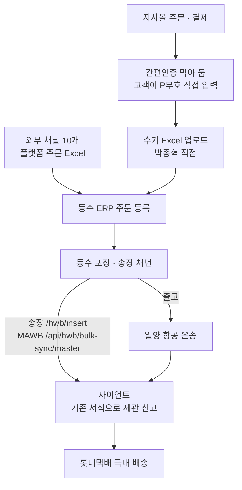
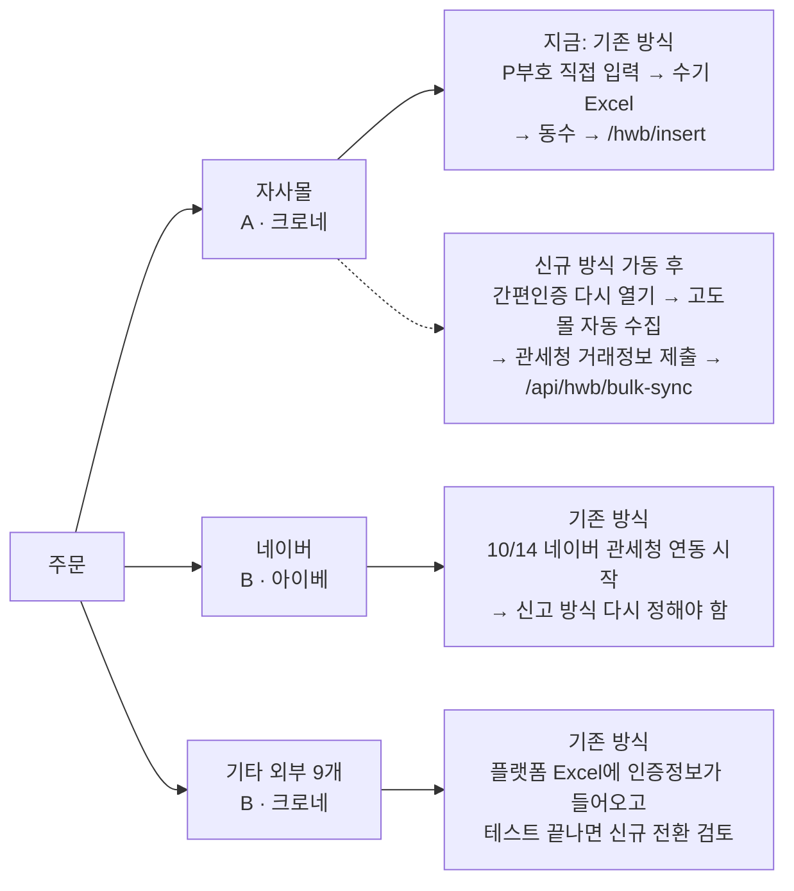
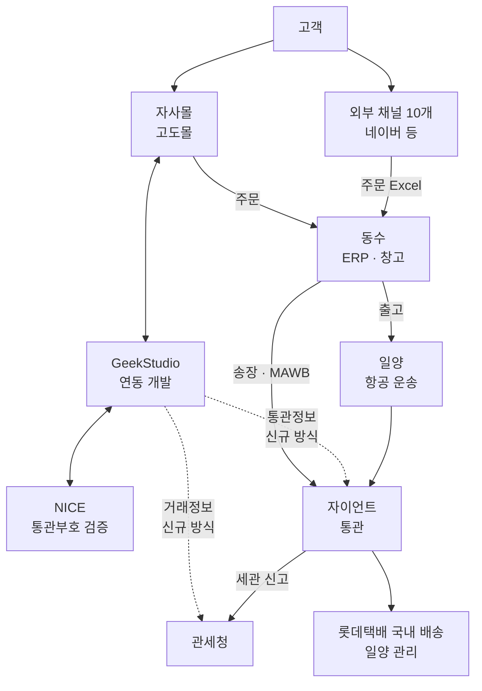
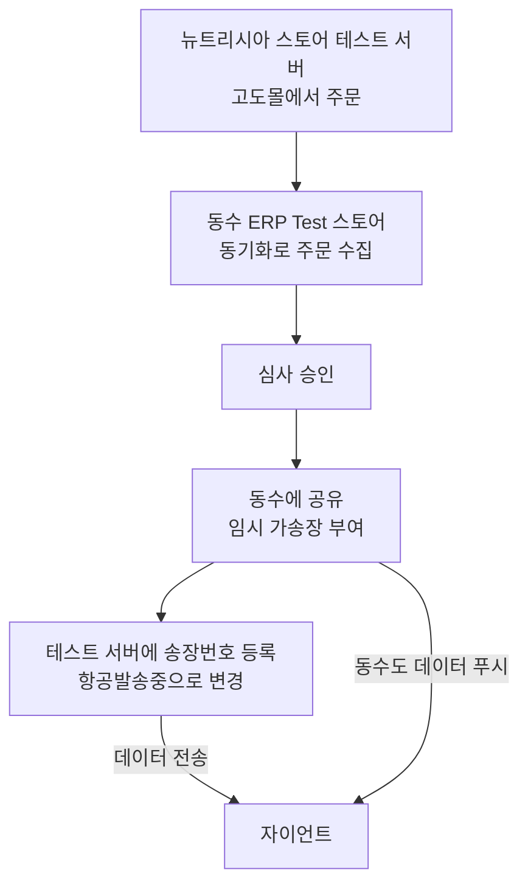

# 흐름도 원본

`전달용/흐름도/`의 PNG를 만든 mermaid 원본이다. 전달 문서에는 코드가 아니라 PNG를 넣는다.
그림을 고칠 때는 아래 코드를 고친 뒤 PNG를 다시 만든다. mermaid.live에 붙여넣고 PNG로 내보내도 된다.

## 현재_운영_흐름

```mermaid
flowchart TD
    C1["자사몰 주문 · 결제"] --> C2["간편인증 막아 둠<br/>고객이 P부호 직접 입력"]
    C2 --> UP["수기 Excel 업로드<br/>박종혁 직접"]
    X1["외부 채널 10개<br/>플랫폼 주문 Excel"] --> D1
    UP --> D1["동수 ERP 주문 등록"]
    D1 --> D2["동수 포장 · 송장 채번"]
    D2 -- "송장 /hwb/insert<br/>MAWB /api/hwb/bulk-sync/master" --> G1["자이언트<br/>기존 서식으로 세관 신고"]
    D2 -- "출고" --> Y1["일양 항공 운송"]
    Y1 --> G1
    G1 --> L1["롯데택배 국내 배송"]
```

## 채널별_신고_방식

```mermaid
flowchart LR
    O["주문"] --> A["자사몰<br/>A · 크로네"]
    O --> N["네이버<br/>B · 아이베"]
    O --> E["기타 외부 9개<br/>B · 크로네"]
    A --> A1["지금: 기존 방식<br/>P부호 직접 입력 → 수기 Excel<br/>→ 동수 → /hwb/insert"]
    A -.-> A2["신규 방식 가동 후<br/>간편인증 다시 열기 → 고도몰 자동 수집<br/>→ 관세청 거래정보 제출 → /api/hwb/bulk-sync"]
    N --> N1["기존 방식<br/>10/14 네이버 관세청 연동 시작<br/>→ 신고 방식 다시 정해야 함"]
    E --> E1["기존 방식<br/>플랫폼 Excel에 인증정보가 들어오고<br/>테스트 끝나면 신규 전환 검토"]
```

## 관계사_구조

```mermaid
flowchart TD
    CU["고객"] --> JS["자사몰<br/>고도몰"]
    CU --> EX["외부 채널 10개<br/>네이버 등"]
    JS <--> GK["GeekStudio<br/>연동 개발"]
    GK <--> NC["NICE<br/>통관부호 검증"]
    JS -- "주문" --> DS["동수<br/>ERP · 창고"]
    EX -- "주문 Excel" --> DS
    DS -- "송장 · MAWB" --> GN["자이언트<br/>통관"]
    GK -. "통관정보<br/>신규 방식" .-> GN
    GK -. "거래정보<br/>신규 방식" .-> KC["관세청"]
    GN -- "세관 신고" --> KC
    DS -- "출고" --> IY["일양<br/>항공 운송"]
    IY --> GN
    GN --> LT["롯데택배 국내 배송<br/>일양 관리"]
```

## 테스트_흐름

```mermaid
flowchart TD
    A["뉴트리시아 스토어 테스트 서버<br/>고도몰에서 주문"] --> B["동수 ERP Test 스토어<br/>동기화로 주문 수집"]
    B --> C["심사 승인"]
    C --> D["동수에 공유<br/>임시 가송장 부여"]
    D --> E["테스트 서버에 송장번호 등록<br/>항공발송중으로 변경"]
    E -- "데이터 전송" --> G["자이언트"]
    D -- "동수도 데이터 푸시" --> G
```
