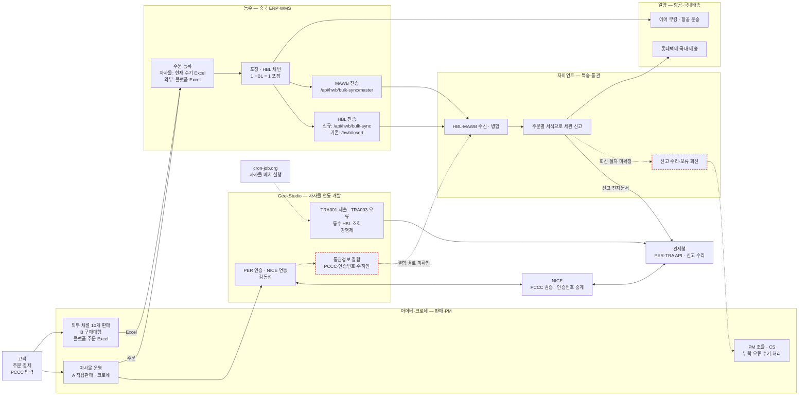
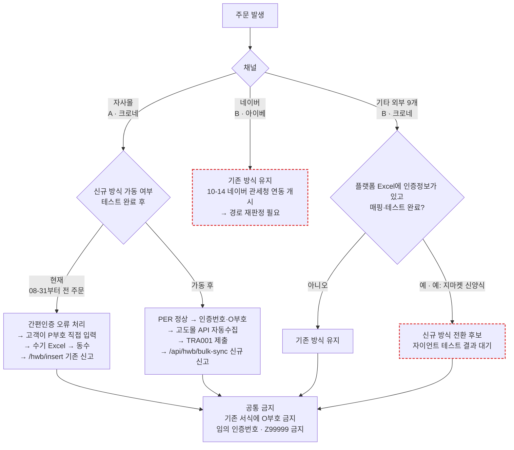
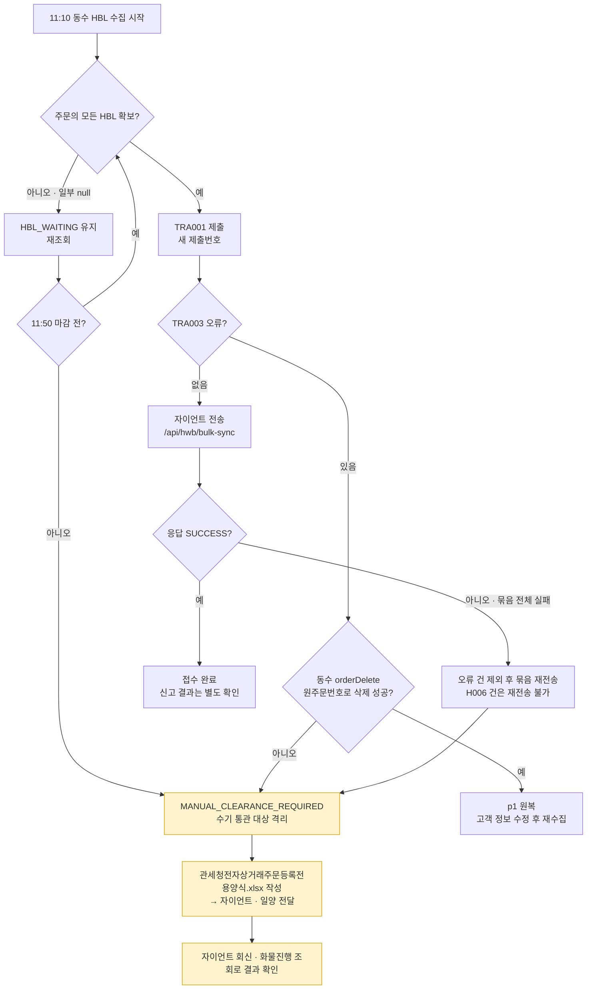
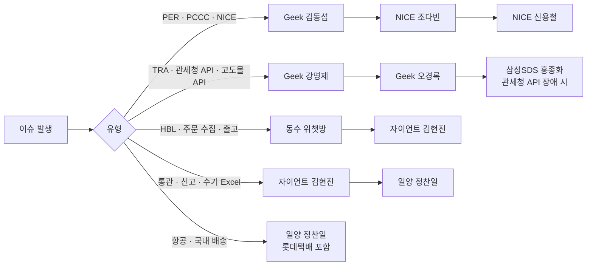

# 관세청 전자상거래 통관 연동 — 인수인계서

| 항목 | 내용 |
|---|---|
| 수신 | 지윤환 과장 (후임 PM·운영) |
| 작성 | 박종혁 팀장 |
| 작성일 | 2026-10-06 |
| 사실 기준 | 문서 기록은 2026-09-17 11:40까지. 이후 사항은 2026-10-06 박종혁 확인분 반영 |
| 함께 전달 | ① 이 문서 ② `documents/` 폴더(원본 자료) ③ 계정·비밀번호·API Key 정리 txt (별도 보안 경로로 전달. 이 문서와 메일에는 값을 적지 않음) |
| 표기 | `없음` 존재하지 않음 · `미정` 결정 안 됨 · `해당 담당자 확인 필요(회사)` 관계사만 답할 수 있음 |
| 경로 기준 | 파일 경로는 `관세청/` 폴더 기준 |

> 이 문서 하나가 과거 기획서(`planning_v6`·`planning_v7`), 리스크·질의 대장, 협의 원문, 현황 문서, 메일 초안의 내용을 모두 흡수했다. 해당 원본 파일은 전달하지 않는다. 흡수 목록은 부록 I.
>
> **흐름도 보는 법** — 흐름도는 Mermaid로 작성했다. GitHub, GitLab, Notion(코드블록 Mermaid 선택), Obsidian, Typora에서는 열면 바로 그림으로 보인다. VS Code는 확장 `Markdown Preview Mermaid Support`를 설치한 뒤 미리보기(Ctrl+Shift+V)로 본다. 메모장에서는 코드로만 보인다.

---

## 0. 한눈에 보기

**현재 상태 (2026-10-06)**
- 자사몰 포함 전 채널이 **기존 신고 방식**으로 통관 중이다.
- 자사몰은 2026-08-31부터 결제 단계의 통관부호 **간편인증에서 일부러 오류가 나도록** 해 두었다. 고객은 P부호(개인통관고유부호)를 직접 입력할 수밖에 없다. 간편인증으로 받는 O부호는 기존 서식에 쓸 수 없기 때문이다(관세청 09-15 공지). 전체 주문에 적용 중이다.
- **자사몰 신규 방식(전자상거래 전용 신고) 가동은 대기 중이다. 동수·자이언트와의 테스트가 끝나지 않았다.** 테스트는 1건이 자이언트 접수(09-09)와 MAWB 연결(09-10)까지만 통과했고, 세관 신고·수리까지 간 증빙은 없다.
- Z99999 임시 인증번호는 2026-09-27에 종료됐다. 기존 통관목록은 2026-12-31까지만 쓸 수 있다.

**인수 후 먼저 할 일**

| # | 할 일 | 이유 | 담당 |
|---|---|---|---|
| 1 | **유니패스 계정 메일 변경** | 관세청 전자상거래업자 전용 포털은 로그인할 때마다 인증메일이 필요하고, 현재 `jong1357@eibe.co.kr`(박종혁)로 간다. 계정 메일 인수인계 대상은 유니패스 하나다 | 박종혁 → 지윤환 |
| 2 | **NICE·관세청 담당자 변경** | 서비스 신청 명의는 아이베 신선일 이사, 현장담당자는 박종혁이다. 박종혁이 NICE·관세청에 각각 메일로 담당자 인계 예정 | 박종혁 |
| 3 | **자사몰 신규 방식 테스트 완료·가동일 확정** | 1-1의 I-01~I-08 | 지윤환 · 동수 · 자이언트 · GeekStudio |
| 4 | **2026-10-14 네이버 관세청 연동 개시 대응** | 네이버(B·아이베) 주문의 신고 경로가 정해지지 않았다(부록 D-3) | 지윤환 |

---

## 1. 현재 진행 현황 및 남아 있는 이슈

### 1-1. 막혀 있는 사항과 원인 (자사몰 신규 방식 전환)

| ID | 막힌 사항 | 원인 | 대기 상대 | 다음 조치 |
|---|---|---|---|---|
| I-01 | 자사몰 신규 방식 가동 대기 | 09-17 동수에 차주 가동 가능 여부를 문의했으나, 10-06 현재 테스트가 끝나지 않아 가동 대기 | 동수 · 자이언트 | 테스트 완료 후 가동일과 기준 주문시각을 서면 확정 |
| I-02 | 수기 Excel → API 자동수집 전환 경계 | 동수 ERP 운영 스토어(`生产环境 - Godo Mall`) 수집을 09-08 16:58 비활성화. 이후 재활성화 기록 없음 | 동수 | 재활성화 시각 확정, 이미 Excel로 올린 주문의 재유입 차단 확인. 중복이면 H006으로 묶음 전체 실패 |
| I-03 | 간편인증 오류 처리 해제 시점 | 08-31부터 전 주문에서 간편인증을 막아 P부호를 받는 중. 해제 요청 창구는 GeekStudio 김동섭(PER 개발) | 당사 · GeekStudio | I-01 기준시각과 동시 해제. 먼저 풀면 O부호가 기존 경로로 가고, 늦게 풀면 신규 경로에 인증값이 빠짐 |
| I-04 | 통관정보(PCCC·인증번호·수하인) 결합 경로 | 동수 전송 전문에는 해당 항목이 없다. Geek이 어떤 API로 같은 HBL에 붙이는지 서면 없음 | GeekStudio · 자이언트 | 경로 서면 확정 + 테스트 1건 |
| I-05 | 자이언트 실제 DB 자동 적재·중복 차단 | 09-10 테스트 데이터가 확인용 DB에만 들어가 자이언트가 수동으로 옮김 | 자이언트 | 운영 전송의 자동 적재와 H006 동작 확인 |
| I-06 | 부호별 신고 방식 판정 규칙 | 신규 경로에 P부호, 기존 경로에 O부호가 올 때 처리 기준 서면 없음 | 자이언트 | 서면 확인 |
| I-07 | 신고 결과 회신 절차 | SUCCESS는 접수일 뿐. 수리·오류를 주문별로 받는 방법 미정 | 자이언트 | 방법·주기·담당 확정 |
| I-08 | 한 MAWB 안 신규·기존 HBL 혼재 | 09-07 동수는 "같은 MAWB에 서로 다른 API의 HBL을 보낼 수 있다"고 했으나 전 과정 보장은 안 했다. 09-10 확인은 신규 1건뿐 | 동수 · 자이언트 | 혼재 테스트. 불가 시 출고 전 MAWB를 방식별로 분리 |

### 1-2. 해결되지 않은 개발·운영 이슈

| ID | 이슈 | 상태 | 담당 |
|---|---|---|---|
| I-09 | 2026-08-31 문제 주문 90건 (구 API로 전송돼 신규 신고 필드 누락) | 주문별 종결 증빙 없음. 경위는 부록 D 08-31·09-01 | 자이언트 · GeekStudio |
| I-10 | 2026-09-01 자사몰 PCCC 공란 후보 32건 | 원천 누락/출력 누락 구분 미종결. 경위는 부록 D | GeekStudio · 당사 |
| I-11 | 외부 채널 PCCC 누락 주문의 고객 재수집 방식 | 09-15 기준 네이버 톡톡으로 수집 중. 적법성 검토 요청 메일은 작성만 하고 **미발송** | 전략기획실 · 법무 |
| I-12 | PCCC 수기수집 임시 웹(주문별 1회용 URL) | 요구사항 작성(09-10). 개발 요청 메일 **미발송**. 요구사항은 부록 J | 미정 |
| I-13 | NICE·관세청 담당자 명의 변경 | 신청 명의 아이베 신선일 이사, 현장담당 박종혁 | 박종혁 (각 기관에 메일 인계 예정) |
| I-14 | 자이언트 테스트 데이터 정리 | 실제 DB에 넣은 테스트 HBL `318570884332`·MAWB `99433555535-1`이 실신고로 넘어가지 않았는지 미확인 | 자이언트 |
| I-15 | 기존 방식 테스트 원문 | 동수 "성공" 보고(09-11)만 있고 `/hwb/insert` 요청·응답 원문 없음 | 동수 |
| I-16 | 애플리케이션 소스·배포 환경 | 당사는 Geek 소스·배포 로그를 보유하지 않는다 | GeekStudio |
| I-17 | 금액 원천 구현 상태 | 관세청 `tot_stlm_amt`=고객 결제금액, 자이언트 `totalValueUsd`=동수 USD 매입금으로 분리하는 것이 09-07 기준(부록 C-2). Geek 구현이 이 기준인지 미확인 | GeekStudio |
| I-18 | 개인정보 처리 근거 | 유형별 개인정보 전달 경로(A: 고객→Geek→자이언트, B: 플랫폼→동수→자이언트)의 제3자 제공·위탁·국외이전 근거 승인 미완 | 법무 |

### 1-3. 운영 전환을 위해 추가로 처리할 사항

- **자사몰 A 신규 방식**: 테스트 완료 → I-01~I-08 해소 → 기준시각 확정과 간편인증 오류 처리 해제를 동시에 → 기준시각 이후 첫 실주문의 접수→신고→수리 확인.
- **네이버(B·아이베)**: 2026-10-14부터 네이버 해외배송 주문의 관세청 연동이 시작된다. 신고 경로가 정해지지 않았다. 배경과 질의 목록은 부록 D-3.
- **기타 외부 9개 채널(B·크로네)**: 플랫폼별 주문 Excel 양식이 바뀌는 중이다(예: 지마켓 09-11 신양식, AG열 인증번호). 채널별로 원본 Excel 확보 → 동수 ERP 매핑 → 자이언트 테스트 순서로 신규 방식 전환 여부를 정한다(부록 C-6).
- **기존 방식 기한**: 기존 통관목록 2026-12-31까지, 기존 수입신고서는 관세법 개정으로 전용 신고서가 의무화되기 전까지(관세청 09-16 공지). 자이언트가 기존 방식에서 어느 서식을 쓰는지 `해당 담당자 확인 필요(자이언트)`.
- **정정 전자문서 5FE·5FK 변경**: 시행 2026-10-07. 신고 주체(자이언트) 개발 사항이며 당사 조치 없음. 반영 여부만 확인.

### 1-4. 관계사별 요청 사항 진행 상태

| 관계사 | 요청해 둔 사항 | 진행 상태 |
|---|---|---|
| 관세청 | 진행 중 요청 없음. 담당자 변경 메일은 박종혁 발송 예정, 유니패스 계정 메일 변경은 당사 조치 | 0절 1·2번 |
| 자이언트 | I-04~I-08, I-09(90건 결과), I-14, 09-01 "PCCC 검증 제외" 예외의 범위·종료 조건, 5FE·5FK 반영, 부록 E-2의 규격 질의 | 09-17 기준 회신 기록 없음 |
| GeekStudio | I-03, I-04, I-10, I-16, I-17, `status/search` 구현 여부 | 회신 기록 없음 |
| NICE | 가이드 문서 불일치(경로·필드명·우편번호 자릿수) 서면 확인, 08-06 일반인증 요청에 구매간소화 응답 건, SMARTPCC_30 오류(3011) | 서면 회신 기록 없음. NICE 단톡방에서 진행. 담당자 변경 메일은 박종혁 발송 예정 |
| 동수 | I-01, I-02, I-15, 지마켓 신양식 자이언트 테스트, API 계약서(인증·한도·오류코드) | 자사몰 신규 가동 테스트 미완료로 대기. 나머지 결과 기록 없음 |
| 일양 | 관세청 연동 관련 요청 기록 없음 | `없음` |
| 고도몰(NHN커머스) | 직접 요청 기록 없음 (고도몰 관련 개발은 GeekStudio 경유) | `없음` |
| 크로네 | 당사 관계 법인(판매업체 부호 보유). 별도 요청 없음 | `없음` |
| 호주 업체 | 에센시스 호주발 포트폴리오를 자사몰에 적용하는 절차 정리 중. **업체명·담당자 받은 것 없음** | `없음` (업체 정보) |
| 행안부 주소 API | **사용하지 않기로 결정.** 우편번호(5자리)만 정확하면 되어 영문주소는 자동 로마자 변환으로 처리 | 종결 |
| 네이버 | B 경로 질의 7개 정리(부록 D-3) | 네이버에 질의한 기록 없음 |
| 전략기획실·법무 | I-11, I-12 관련 검토 요청 | 메일 작성만, 미발송 |

### 1-5. 마지막 정상 운영·테스트 성공 일자

| 구분 | 일자 | 내용 |
|---|---|---|
| 기존 방식 운영 | 10-06 현재 운영 중 | 자사몰 포함 전 채널 |
| 자사몰 A 정상 경로 운영 테스트 | 2026-08-31 | 정상 입력 건의 호출 성공(박종혁 확인). 음성경로·누락 차단은 미검증 |
| 신규 방식 HBL 전송 | 2026-09-09 11:04 | `/api/hwb/bulk-sync` SUCCESS 1건 |
| 신규 방식 MAWB 연결 | 2026-09-10 10:19~10:24 | `/api/hwb/bulk-sync/master` SUCCESS 1건 (자이언트 수동 DB 적재 후) |
| 기존 방식 테스트 | 2026-09-11 | 동수 성공 보고. 원문 없음 |
| 신규 방식 세관 신고·수리 | `없음` | 증빙 없음 |

---

## 2. 관계사 및 담당자

### 2-1. 연락처

1차/2차는 공식 에스컬레이션 규정이 아니라 **역할 기준**으로 적었다.

| 회사 | 역할 | 담당자 | 직급 | 연락처 | 이메일 | 문의 업무 | 구분 |
|---|---|---|---|---|---|---|---|
| GeekStudio | 팀 공용 | — | — | — | op@geekstudio.co.kr | 개발·운영 일반 접수 | 공용 |
| GeekStudio | 총괄 | 오경록 | 팀장 | 010-9290-1334 | — (팀메일 사용) | 운영비·추가 개발·일정, 미해결 에스컬레이션 | 2차 |
| GeekStudio | PER 개발 (NICE 연동) | 김동섭 | — | 010-5039-9964 | aaron@geekstudio.co.kr | PER·PCCC 검증, 인증번호, 간편인증 오류 처리 해제 | 1차 |
| GeekStudio | TRA 개발 (관세청 거래정보) | 강명제 | — | 010-4032-8730 | jay@geekstudio.co.kr | TRA001·TRA003, 동수 HBL 조회, 자이언트 전송, 고도몰 주문 연동 | 1차 |
| 동수 (Yantai Dongshu / EIBE ERP) | 중국 ERP·WMS, 주문 등록·포장·HBL 채번, 자이언트 전송 | 小熊 / 개발 담당 / AN. | 小熊 공부장 | 위챗 단체방 (연락처 기재 생략) | — | 주문 수집, HBL, 전송 오류, Excel 수입 | 1차 |
| 자이언트 (GNG) | 특송·통관, GGATE API | 김현진 | 계장 | 010-4024-3740 | akfur2@giantnetworkgroup.com | HBL·MAWB 수신, 신고, 결과, API 키 | 1차 |
| 일양 | 항공 운송, **롯데택배 국내 배송까지 컨트롤** | 정찬일 | 과장 | 010-4591-8587 | — | 항공·MAWB, 국내 배송 | 1차 |
| NICE | PCCC 유효성 검증 서비스 담당 | 조다빈 | 매니저 | 010-4457-5231 | dabeen@nice.co.kr | PCCC 검증 서비스, 계약·과금 | 1차 |
| NICE | 선임 | 신용철 | 선임매니저 | 010-9082-8647 | syctry@nice.co.kr | 미해결 에스컬레이션 | 2차 |
| 관세청 통관시스템 (삼성SDS) | 관세청 통관시스템 총괄담당 | 홍종화 | 프로 | 010-2367-5030 | — | 관세청 API·시스템 장애 | 2차 |
| 관세청 전자상거래통관과 | 제도·서식 대표 문의 | — | — | 042-481-3258 | eccs@korea.kr | 제도·서식·신고 기준 (관세청 2026-08-21 공지 기재) | 2차 |
| 아이베 (당사) | NICE·관세청 서비스 신청 명의 | 신선일 | 이사 | 사내 | — | 신청 명의 관련 | — |
| 크로네 | 판매업체. 자사몰 A·외부 9개 B의 업체부호 | 별도 담당 기록 없음 | — | — | — | — | — |
| 고도몰 (NHN커머스) | 자사몰 플랫폼 | 직접 연락 기록 없음 | — | — | — | GeekStudio 경유 | — |
| 롯데택배 | 국내 배송 | 일양 정찬일 과장이 컨트롤 | — | — | — | — | — |
| 호주 업체 | 에센시스 호주발 포트폴리오 | `없음` (업체 정보 받은 것 없음) | — | — | — | — | — |

**소통 채널**
- 위챗 단체방: 아이베(박종혁·지윤환)·동수(小熊·개발 담당·AN.)·자이언트(김현진). 지윤환 과장 참여 중
- NICE 단톡방: NICE(조다빈·신용철)·Geek(김동섭)·박종혁. 지윤환 과장 참여 중
- 관계사 단톡방은 모두 지윤환 과장 초대 완료
- GeekStudio: 팀 메일 op@geekstudio.co.kr

**업체부호·사업자 정보** (출처: `documents/기타자료/직구 사업자별 판매 URL 주소.xlsx`, 채널 마스터)

| 법인 | 전자상거래업자부호 | 사업자번호 | 쓰는 곳 |
|---|---|---|---|
| (주)크로네 | K26000099 (표기 K-26-000099) | 776-87-00068 | 자사몰 A의 판매업체·제출자, 기타 외부 9개 B의 구매대행업체 |
| (주)아이베 | K26014765 (표기 K-26-014765) | 132-81-63067 | 네이버 B의 구매대행업체 |

시스템 전송값은 하이픈 없는 9자리다. 테스트용 부호 K26000127·K26000128은 사용하지 않는다(08-26 결정).

### 2-2. 관계사 흐름과 책임도

실선은 운영 중이거나 테스트로 확인된 흐름, 점선은 미확정·미검증 흐름이다. 빨간 테두리는 신규 방식 가동 전에 풀어야 할 공백이다.

### 2-3. 주문별 신고 경로 (2026-10-01 현재)

판매유형 A/B는 "누가 파는가", 기존/신규는 "어느 서식으로 신고하는가"다. 두 축을 서로 추론하지 않는다(2026-08-28 결정).

### 2-4. 책임 매트릭스

R 실행 · A 최종 책임 · C 협의 · I 통보

| 활동 | 아이베·크로네 | GeekStudio | NICE | 관세청 | 동수 | 자이언트 | 일양 |
|---|:-:|:-:|:-:|:-:|:-:|:-:|:-:|
| 채널 마스터·업체부호 관리 (11개) | A/R | I | | | C | C | |
| 고객 본인확인 (PER·PCCC 검증) | A | R | R | C | | | |
| 자사몰 주문 → 동수 ERP | A | R | | | R | | |
| 외부 채널 주문 Excel 확보·전달 | A/R | | | | C | | |
| Excel → ERP 매핑 | A | | | | R | C | |
| 관세청 거래정보 제출 (TRA001, 신규 방식) | A | R | | C | | | |
| 포장·HBL 채번 | I | I | | | A/R | | |
| HBL·MAWB 전송 | I | | | | A/R | C | |
| 통관정보 결합 | A | R | | | C | R | |
| 주문별 서식 판정·세관 신고 | C | | | C | | A/R | |
| 항공 운송·국내 배송 | I | | | | C | C | A/R |
| 신고 결과 회신·오류 재처리 | A | C | | | C | R | |
| 누락·오류 CS, 고객 PCCC 재수집 | A/R | C | | | | I | |
| 전환 기준시각·가동일 확정 | A | R | | | R | R | |

---

## 3. 자사몰(A, 신규통관) 출고 실패 시 실제 운영 조치

**현재 실제로 하고 있는 조치 기준: `없음`.** 자사몰 신규통관은 테스트 미완료로 가동 전이고, 08-31부터 전 주문을 기존 방식으로 신고하고 있어 신규통관 실패 처리 실적이 없다.

아래는 **문서로 정한 설계 기준**이다. 운영에서 검증되지 않았다.

| 항목 | 답변 |
|---|---|
| 실패 확인 위치 | `미정`. 설계상 ① 관세청 TRA003 미확인 오류 ② 자이언트 응답 `code`(SUCCESS 외 전체 실패) ③ 자이언트 통관 이상 조회 `gngMsgCode`. 거래실패 리스트 화면 위치는 `해당 담당자 확인 필요(GeekStudio 강명제)` |
| 주요 실패 사유·오류코드 | 부록 B-6 오류코드표 |
| 실제 처리 순서 | 설계 기준(08-26 확정): 11:10 동수 HBL 수집 시작 → 11:50까지 TRA 제출·오류 확인·동수 삭제 요청 마감 → 마감까지 HBL 미수신·결과 미확정·삭제 실패 건은 `MANUAL_CLEARANCE_REQUIRED`로 격리해 **수기 통관** → 자동 재제출·자동 출고에 재편입하지 않음. 개별 반려 건은 동수 삭제(원주문번호) 성공 시에만 `p1` 원복 가능. 흐름도 3-1 |
| 재전송 여부·방법 | 자이언트: 부분 성공 없음. 이미 등록된 HBL 재전송은 H006으로 차단. DELETE API 없음, 수정(PATCH)은 "삭제 예정"으로 기능 미제공 → **등록된 HBL 수정·재전송 방법 `해당 담당자 확인 필요(자이언트)`**. 관세청 TRA001: 새 제출번호로 재제출(같은 번호는 3000 중복 반려). HBL이 바뀌면 새 제출번호로 다시 제출(관세청 FAQ 8-14). 수입신고·통관목록 접수 후에는 TRA001 제출 불가(FAQ 8-8) |
| 수기 처리 조건 | 위 `MANUAL_CLEARANCE_REQUIRED` 조건(설계). 실운영 기준은 `미정` |
| 수기 처리 시 업로드 방법 | **`관세청전자상거래주문등록전용양식.xlsx`로 작성해 자이언트·일양 통관에 사용한다**(박종혁 지정). 수기가 필요해질 때 쓰는 양식이며, 작성 주체·전달 방식·마감 시각은 `미정` |
| 수기 업로드 후 성공/실패 확인 | `미정`. 확인 수단 후보: 자이언트 회신, 자이언트 `GET /api/unipass/cargo-progress`(화물 진행), 유니패스 화물진행조회 |
| 재처리 방법 | `미정` |
| **A 실패 시 B로 변경해 출고하는 절차** | **`없음`.** 판매유형 A/B는 실패 대응으로 바꾸는 값이 아니다. 현재 자사몰을 기존 방식으로 신고하는 것은 A→B 변경이 아니라 신고 서식(기존/신규) 선택이다 |

**Excel 양식 지정**

| 파일 | 역할 | 운영 사용 |
|---|---|---|
| `관세청전자상거래주문등록전용양식.xlsx` | 전자상거래 수기 Excel 등록. 자이언트·일양 통관까지 사용 | **최종 양식** (박종혁 지정) |
| `hwb_excel_register_template_gng.xlsx` | — | 지정 양식 아님 |
| `documents/ECB0103001S_TxifExcelForm.xlsx` | 관세청 거래정보 포털 대량제출 양식(Form/Sample 시트, 60열). 플랫폼 주문 원본·동수 ERP 수입 양식이 아님 | 지정 양식 아님 |

- B유형·수기 업로드 컬럼 정의 최종본: **`없음`**.

### 3-1. 출고 실패 처리 흐름 (설계 기준)

---

## 4. 시스템 URL / 계정 / 접근 권한

계정 ID·비밀번호·API Key **값**은 이 문서와 메일에 적지 않는다. **별도 계정 정리 txt로 보안 경로를 통해 전달한다.** 현재 키는 그대로 사용하며 재발급 계획은 없다.

| 시스템 | 용도 | URL | 계정 | 비고 |
|---|---|---|---|---|
| 관세청 전자상거래업자 전용 포털 (유니패스) | 전자상거래 통관플랫폼 업무(거래정보 조회·관리) | https://unipass.customs.go.kr/ecb/index.do | 크로네·아이베 각 1개 (계정 txt) | **로그인마다 인증메일 필요.** 현재 수신 메일이 박종혁(`jong1357@eibe.co.kr`)이므로 유니패스 계정 메일을 지윤환으로 변경해야 한다. 계정 메일 인수인계 대상은 이 하나뿐이며, 이것으로 전자상거래 플랫폼도 함께 쓴다 |
| 관세청 전자상거래 REST API | PER·TRA 호출 (GeekStudio 연동이 사용) | 운영 `https://ecapi.customs.go.kr` | 크로네·아이베 client_id/secret (계정 txt) | 6개월간 토큰 미발급 시 정지, Secret은 최초 발급 때만 확인 가능, 계정당 최대 3개 |
| 고도몰5 Open API | 주문 조회·상태 변경 (GeekStudio·동수 연동이 사용) | 운영 `https://openhub.godo.co.kr/` · Sandbox `http://sbopenhub.godo.co.kr/` | 운영·테스트 서버키 (계정 txt) | 1초 100회 이상 호출 시 429 |
| cron-job.org | 자사몰 배치 실행 | https://console.cron-job.org | 계정 txt | — |

- 그 외 시스템(고도몰 관리자·개발서버, NICE·자이언트 관리 화면, 동수 ERP 등): **별도로 인수인계할 URL·계정 없음.** 연동 키는 각 관계사(GeekStudio·동수)가 보유하고, 확인이 필요하면 9절 연락 체계로 요청한다.
- 서비스 신청 명의: NICE·관세청 모두 **아이베 신선일 이사** 명의, 현장담당자는 **박종혁**. 박종혁이 NICE·관세청에 각각 메일로 담당자를 지윤환으로 인계한다.
- 관계사 단톡방(위챗·NICE)은 모두 지윤환 과장 초대 완료.
- 테스트 계정 등 나머지 계정 정보는 박종혁이 별도로 전달 완료.

---

## 5. A유형 출고 실패 시 개발/서버 측 확인 방법

**당사가 직접 확인하는 서버·로그 화면: `없음`.** 연동 소스·로그·배포는 GeekStudio가 보유한다. 확인·재전송·재처리는 GeekStudio에 요청한다(TRA·주문 연동 강명제, PER 김동섭, 팀메일 op@geekstudio.co.kr).

| 항목 | 답변 |
|---|---|
| 접속 URL · 계정 · 권한 | `없음` (GeekStudio 요청) |
| 운영/개발 구분 | 고도몰: 운영 `openhub` / Sandbox `sbopenhub`. 동수 ERP: 운영·TEST 스토어 분리. GeekStudio 개발서버도 관세청 운영 환경에 연결된다(08-26 기록) |
| 주문번호 조회 | 공통 키는 **플랫폼 원주문번호**(고도몰 `orderNo` = 관세청 `ord_no` = 자이언트 `orderNo` = 동수 삭제 키). 동수 `-1`·`-2` 분할번호는 ERP 내부 포장 식별자 |
| 로그 · Request/Response | `해당 담당자 확인 필요(GeekStudio)` |
| 재전송 · 재처리 | `해당 담당자 확인 필요(GeekStudio)`. 참고: 08-26 GeekStudio가 단계별 테스트 API(TRA001 전송 → 상품행 추출 → TRA003 오류조회 → 결제완료 원복 → 동수 삭제 → 자이언트 HWB 등록)를 제공한 기록이 있다 |

---

## 6. 테스트 주문 및 최근 테스트 이력

| 항목 | 답변 |
|---|---|
| 테스트 몰·환경 | 자사몰 테스트 서버(고도몰) ↔ 동수 ERP `TEST - Godo Mall 爱他美官方商城` 스토어 |
| 테스트 계정 | 박종혁이 별도 전달 완료 |
| 테스트 상품 | 박종혁이 별도 전달 완료. 09-08 테스트 전문의 상품은 `APTAMIL COMF 1 ESC 400G` 4개 |
| 주문 생성 | 자사몰 테스트 서버 주문 또는 동수 ERP 자체 생성 두 가지만 가능. 케이스별 생성 불가. B유형 테스트 주문은 Excel 가져오기 |
| 결제 방법 | 박종혁이 별도 전달 완료 |
| PCCC 입력·검증 | 박종혁이 별도 전달 완료. 현재 자사몰은 간편인증이 막혀 있어 P부호 직접 입력만 가능 |
| 테스트/실주문 구분 | 동수 ERP 스토어로 구분. 운영 스토어는 실제 운영서버와 연결돼 있어 테스트에 쓰지 않는다. 동수는 특정 스토어만 출고 중지하는 기능이 없어 평시 Pull OFF, 테스트 때만 ON, 수집된 테스트 주문은 심사 보류 또는 ERP 즉시 삭제(06-29 운영 기준) |
| 관세청 전달 확인 | 신규 방식으로 세관 신고까지 간 테스트 `없음`. 관세청 테스트 서버는 08-21 종료 |
| 취소·정리 | 테스트 송장·HBL을 사전에 동수에 전달해 실출고를 막는다. 자이언트 실제 DB에 들어간 테스트 데이터 정리 여부 `해당 담당자 확인 필요(자이언트)`(I-14) |

**최근 테스트 이력**

| 주문번호 (동수 / 고도몰) | 일시 | 목적 | 결과 |
|---|---|---|---|
| EP260903000175 / 2609011145067423 · HBL 318570884332 | 09-08 18:43 | 신규 방식 HBL 등록 | 실패 A005 (다른 API 키 사용) |
| 같은 건 | 09-09 11:04 | 재전송 | 성공 (SUCCESS, saved 1) |
| 같은 건 · MAWB 99433555535-1 (09-08 KJ926편) | 09-10 09:57 | MAWB 연결 | 실패 H016 (테스트 HBL이 확인용 DB에만 있었음) |
| 같은 건 | 09-10 10:19~10:24 | MAWB 재전송 | 성공 (자이언트가 실제 DB에 수동 적재 후) |
| EP260903000174 / 2609021407343361 | 09-11 보고 | 기존 방식 전송 | 동수 성공 보고. 원문 없음 |
| 자사몰 A 정상 경로 운영 테스트 | 08-31 | 정상 입력 건 호출 | 성공(박종혁 확인) |
| 09-18 이후 | — | 자사몰 신규 방식 가동 테스트 | 진행 중, 미완료 (10-06 기준) |

**주의사항**
- 임의 인증번호·가짜 PER 결과·가짜 주문완료일시를 만들지 않는다.
- Z99999는 2026-09-27 종료. 사용 불가.
- O부호(일회용 개인통관부호)는 기존 서식에 쓰지 않는다(관세청 09-15 공지).
- 동수 ERP 운영 스토어로 테스트하지 않는다.

---

## 7. 기존 문서 및 산출물의 정본

**기획 기준은 이 문서다.** `planning_v7.html`(09-08)과 그 이전 기획서·대장의 내용은 이 문서에 흡수됐고 원본은 전달하지 않는다. v7 이후 바뀐 4가지(전송 경로, 버전 명칭, 자사몰 수집 방식, 기존 방식 종료일)는 이 문서에 반영돼 있다.

| 분류 | 파일 (`documents/` 기준) | 판정 |
|---|---|---|
| 관세청 | `관세청 자료/관세청 제공 전자상거래 전용 REST API 명세서_v1.4.1_재개정포함_20260727.pdf` | **정본** (76쪽, 489,967바이트) |
| 관세청 | `관세청 자료/관세청 제공 전자상거래 전용 REST API 명세서_v1.4.1.pdf` | **폐기본** (74쪽 구첨부). 같은 버전명이라 파일명으로 판별하지 말 것 |
| 관세청 | `관세청 자료/2026 전자상거래  전용 통관플랫폼 FAQ.pdf` | 유효 (관세청 공식 FAQ) |
| 관세청 | `관세청 자료/전자상거래전용 통관플랫폼 사업소개(202607)_v1.6(글꼴포함).pdf` | 유효 (제도 배경) |
| 관세청 | `ECB0103001S_TxifExcelForm.xlsx` | 관세청 포털 대량제출 양식. 운영 지정 양식 아님 |
| 고도몰 | `godomall5_openAPI_spec_v1.0_20250616.pdf` | 정본 |
| NICE | `NICE자료/개인통관고유부호 유효성 검증 서비스_고유식별키활용_20260728.pdf` | **우선 정본** |
| NICE | `NICE자료/NICE [CI] 개인통관고유부호 유효성 검증 API 개발 가이드_20260724.pdf` | 참고. 0728판과 필드·경로가 다르면 0728판 + NICE 실응답 우선 |
| NICE | `NICE자료/NICEAPI(대외비) 개인통관고유부호_유효성 검증_서비스_API 가이드_CI.pdf` | 참고 (대외비, 외부 공유 금지) |
| NICE | `NICE자료/개인통관고유부호_CI활용_기관.pdf` | 참고 |
| NICE | 신청서·계약서·취약점 점검·견적서 (`NICE자료/`) | 원본 보관. 신청 명의 아이베 신선일 이사, 현장담당 박종혁 (담당자 변경은 박종혁이 NICE에 메일로 인계) |
| 계약 | `Geek 계약서/(GeekStudio) 뉴트리시아_관세청_연동_개발_계약서.pdf` | 유효. 계약기간 2026-06-01~08-31 종료 |
| 계약 | `Geek 계약서/[GeekStudio] 뉴트리시아몰_관세청_API_연동_1차 개발 견적서.pdf` | 계약 범위 |
| 계약 | `Geek 계약서/[GeekStudio] 뉴트리시아몰_관세청_API_연동_추가개발_견적서_260810.pdf` | 추가 제안 범위 |
| 계약 | `Geek 계약서/관세청 통관플랫폼 및 자이언트 API 연계 개발 마일스톤 계획서.pdf` | 참고 (2026-05 작성) |
| 기획 | `관세청_통관플랫폼_연동_브리핑_v3.pptx`, `관세청_통관플랫폼_연동_운영보고_v8.pptx` | 08-26 작성. 08-28 결정 이전 자료라 **현행 기준 아님** |
| CS | `뉴트리시아몰 해외직구 결제 및 통관 FAQ.docx` / `_v26.09.07.pdf` | 고객 안내용(docx가 편집 원본). 기술 정본 아님. 09-07판이라 09-15 공지(O부호 제한) 이전 내용 |
| 기타 | `기타자료/직구 사업자별 판매 URL 주소.xlsx` | 유효 (채널별 URL·사업자) |
| 기타 | `기타자료/아이베 개인정보처리방침 등 수정안_최앤리 검토(markup).docx` | 법무 검토 이력 |
| 기타 | `기타자료/도메인 등록확인서.png` | 참고 |
| 기타 | `기타자료/관세청 secret key.txt` | 계정·키 정보. 메일에 첨부하지 않고 계정 정리 txt와 함께 별도 보안 경로로 전달 |

**요청 목록 중 전달하지 않는 파일**
- `20260901_자이언트_운영전환_협의원문.md`, `자이언트_API_메모.md` → 내용은 부록 B·D에 흡수
- `20260908_자이언트_API경로_회신원문.md`, `자료검증_인식대장_20260908`, `동수_API회신_테스트주문_20260908.html`, `동수_위챗회신_20260908.txt`, `동수_정정_20260908.txt`, `자이언트_전달_동수질의_20260908.txt`, `종혁_메일회신_20260908.txt`, `테스트주문_20260908.json` → 작업 PC 저장소에 없음. 09-08 합의 내용은 1·6절과 부록 D에 반영. 
- `planning_v7.html` 및 과거 폴더 전체 → 이 문서에 흡수

---

## 8. 데이터/API 필드 매핑 자료

**최종 매핑표 없음.** 실제 개발 내용과 일치가 검증된 매핑 자료는 없다.

- 과거 `api_field_mapping.html`: 현행 기준 아님(분리형/일체형 Postman 주소가 반대로 기록돼 있었고, 금액 원천 결정이 이후 정정됨). 전달하지 않음
- 과거 `유형코드_부호체계_정리.html`: A/B·업체부호 개념은 부록 C-4·C-5에 흡수. 전달하지 않음
- 설계 기준 매핑(공통 식별자·금액 원천·민감정보·길이 한도)은 부록 C에 정리했다. 개발 일치 여부는 미검증

현재 개발 기준을 확인하려면:

| 구간 | 확인처 |
|---|---|
| 자사몰 연동(고도몰·NICE·관세청·자이언트 통관정보) | GeekStudio 소스 → 강명제(TRA), 김동섭(PER) |
| 동수 → 자이언트 전송 | 동수 개발 담당 + 자이언트 Postman 컬렉션 원본 JSON (화면이 아니라 JSON으로 확인) |
| 관세청 필드 | REST API 명세서 v1.4.1 재개정판(76쪽) |
| 외부 플랫폼 Excel → 동수 ERP | 매핑표 `없음` (플랫폼 원본 Excel 미확보) |

---

## 9. 운영 이후 이슈별 연락 체계

공식 에스컬레이션 규정은 없다. 아래는 역할 기준 배정이다. 연락처는 2-1.

| 이슈 | 1차 | 2차 |
|---|---|---|
| 주문 생성 문제 (자사몰 → 동수) | 동수(위챗) · 수기 Excel 업로드는 당사 | GeekStudio 강명제 (고도몰 연동 측) |
| A유형 전송 실패 | GeekStudio 강명제 (TRA) · 동수 개발 담당 (HBL 전송) | 자이언트 김현진 · GeekStudio 오경록 |
| 수기신고·Excel 업로드 | 자이언트 김현진 | 일양 정찬일 |
| 관세청 API 오류 | GeekStudio 강명제 | 삼성SDS 홍종화 · 관세청 전자상거래통관과 |
| 고도몰 API 오류 | GeekStudio 강명제 | GeekStudio 오경록 |
| PCCC 검증 실패 | 당사 CS(고객 안내) → GeekStudio 김동섭 | NICE 조다빈 |
| NICE CI 관련 | GeekStudio 김동섭 · NICE 조다빈 (NICE 단톡방) | NICE 신용철 |
| 자이언트 연동 | 자이언트 김현진 · 동수 개발 담당 (위챗) | GeekStudio 오경록 (Geek 측 전송 건) |
| 개발서버·배포 | GeekStudio 강명제 / 김동섭 (영역별) · op@geekstudio.co.kr | GeekStudio 오경록 |
| 실제 통관·출고 | 출고: 동수 / 통관: 자이언트 김현진 / 항공·국내배송: 일양 정찬일 | 관세청 전자상거래통관과 (제도 문의) |

---

## 10. 메일·메신저 및 개인 소유 자료 인계

| 항목 | 내용 |
|---|---|
| 회신 대기 메일 | `없음`. PCCC 누락 대응 메일 초안들은 작성만 하고 발송하지 않았다. 내용은 부록 J |
| 단톡방 | 위챗(아이베·동수·자이언트), NICE 단톡방(NICE·Geek 김동섭) 모두 지윤환 과장 초대 완료 |
| 구두로만 운영 중인 사항 | 자사몰 간편인증 오류 처리(08-31부터 전 주문). 이 문서 0절·1-1 I-03에 기록 |
| 본인 명의 계정 | 유니패스 계정 메일(4절) — 변경 필요. NICE·관세청 신청 명의(아이베 신선일 이사)와 현장담당(박종혁) — 박종혁이 각 기관에 메일로 인계 |
| 본인만 보유한 인증정보 | 계정 정리 txt로 별도 전달 |
| 반드시 후속 연락 | 동수·자이언트(자사몰 신규 가동 테스트), 네이버(10-14 전 B 경로), GeekStudio(간편인증 해제·결합 경로), NICE·관세청(담당자 변경) |

**GeekStudio 비용 기준 (박종혁 확인)**
- 개발비(계약)는 종료됐다.
- 이후 추가 수정·개발·운영은 뉴트리시아 마케팅 예산의 **Geek 운영비** 안에서 처리한다.
- **이미 개발된 로직 안에서 생긴 문제는 Geek이 별도 비용 없이 해결한다.**

---

# 부록

## 부록 A. 업무 흐름 상세

### A-1. 전체 구조

- 뉴트리시아 유럽 물량을 중국 동수 창고(옌타이)에 선배치한다. 재고 소유권은 당사(크로네)에 있다.
- 한국 고객 주문 → 동수 창고 출고 → 중국 세관 수출 신고 → 일양 에어 부킹·항공 운송 → 한국 도착 → 자이언트 개인직구 통관(고객 PCCC 기준) → 롯데택배 국내 배송.
- 해외에 재고가 있어야 해외직구(A)가 성립한다. 국내 재고 판매는 해외직구가 아니다(관세청 담당자 08-21 회신).

### A-2. 일일 운영 시각 (설계 기준과 변경 이력)

| 기준일 | 흐름 | 상태 |
|---|---|---|
| 08-11 | 09:00 동수 주문 수집·HBL 할당 → 11:50 실패 건 통보 → 12:00 WMS 취소 반영 마감 → 13:00 라벨·출고 | 08-26 폐기 |
| 08-26 | 11:10 동수 HBL 수집 시작 → 11:50 TRA 제출·오류 확인·삭제 요청 마감 → 12:00 WMS 마감 → 13:00 출고 | 마케팅·MD 회의 결정 |
| 08-28 | 10:00 주문·HBL·상품 수집 → 11:10~11:50 전용신고 TRA 처리 → 17:00 MAWB 전송 → 18:00 500건 단위 대사 | 동수 전달 기준. 기존 신고 주문은 TRA 배치에 넣지 않음 |

### A-3. 주문 상태값 (본 프로젝트 커스텀, 고도몰 표준 아님)

| 상태 | 의미 | 고객이 할 수 있는 것 |
|---|---|---|
| `p1` 결제완료 | 동수 수집 전 | 취소·환불·배송지 수정 가능 |
| `d1` | 동수 수집 완료 | — |
| `g1` 상품준비중 | 동수가 가져가 포장 중. 오류 건도 유지 | 취소·수정 불가 |
| `g5` 항공발송중 | 신고 정상 처리 후 출고 | 취소 불가, 배송완료 후 반품 |
| `p1` 원복 | 신고 반려 → 동수 삭제 성공 후 되돌림 | 정보 수정·취소 가능 |
| `MANUAL_CLEARANCE_REQUIRED` | 11:50 마감 이탈 → 수기 통관 | 자동 재시도 대상 아님 |

내부 처리 상태: `HBL_WAITING`(HBL 일부 null) → `HBL_READY`(전 HBL 확보) → `TRA_SENT`.

### A-4. 핵심 운영 원칙

- **1 HBL = USD 150 이하 포장 1건 = TRA001 1건 = 자이언트 HWB 1건.** 한 주문이 여러 포장이면 TRA001도 여러 번. 고도몰에는 첫 송장만 저장. 선발급 후 HBL·품목·수량·금액 변경과 HBL 재사용 금지.
- 동수는 주문의 모든 HBL이 할당된 뒤에만 반환한다. 하나라도 미할당이면 그 주문의 HBL이 전부 null. Geek은 null 주문을 `HBL_WAITING`으로 유지하고 전건 확보 후에만 제출한다.
- 동수 삭제(`orderDelete`)는 플랫폼 원주문번호로만 호출한다. 서브번호(`…-1`)는 `state:300 订单状态不可删除`로 실패. 원주문번호 호출 시 모·서브 전부 삭제된다.
- **혼재 주문**(해외직구+국내 상품)은 국내 상품도 해외직구 신고 확정까지 함께 출고 보류한다. 동수 ERP 최소 단위가 주문이라 부분 삭제·재생성이 불가하기 때문이다(08-26).
- 동일 `hwbNo+orderNo`는 하나의 경로로만 보낸다. API와 Excel로 중복 제출하지 않는다.

### A-5. CS 응대 기준 (과거 CS 통관 Q&A 대응집 요지)

- 혼재 주문: "같은 주문번호의 상품은 통관 완료 후 함께 출고됩니다. 급하면 취소 후 국내 상품만 따로 주문하시면 바로 출고됩니다."
- 11:50 이탈 건: "내일 자동 재시도"라고 안내하지 않는다. "담당 부서에서 개별 처리 중"이 정확하다.
- 자이언트 `gngMsgCode` `00`은 정상 통관이 아니라 "아직 아무 일도 없음"이다.
- 원인이 확정되지 않은 PCCC 누락을 고객에게 "관세청 서버 오류"로 안내하지 않는다. PCCC, 관세청 인증번호, 임시 웹 접근번호는 서로 다른 번호다.
- 폐기된 과거 정책: "7일 경과 시 강제 취소", "관세청 95% 정합성 페널티"(근거 없음), "합산과세는 입항일 동일 기준"(2022-11-17 폐지).
- 결제창 "반품/환불 절대 불가" 문구는 법무 검토 대상으로 남아 있다.

---

## 부록 B. 연동 규격 요약

### B-1. 관세청 REST API (정본: 76쪽 재개정판)

Base `https://ecapi.customs.go.kr`, JSON/UTF-8, KST, TLS 1.3만 지원.

| ID | Method/Path | 목적 | 제약 | 적용 |
|---|---|---|---|---|
| AUT001 | `POST /oauth/token` | 접근토큰 | 24시간, 인증정보당 활성 2개, 초과 시 먼저 발급분 무효(1분 유예) | 사용 |
| AUT002 | `POST /oauth/revoke` | 토큰 폐기 | — | 사고·교체 시 |
| TRA001 | `POST /v1/transactions/submission` | 거래정보 제출 | Body 3MB, order_info 1~300 | 전용신고만 |
| TRA002 | `GET /v1/transactions/results/{txif_sbmt_no}` | 제출 결과 | 초당 10건 이하 | **미도입** (08-11 결정) |
| TRA003 | `GET /v1/transactions/errors/unread` | 미확인 오류 | 최근 7일, 제출번호 최대 50건, 1회 조회 후 재조회 불가 | 사용 |
| PER001 | `POST /v1/pccc/validation` | PCCC 검증·인증번호 | 수탁기관 경유 가능 | NICE 경유 |
| PER002 | `POST /v1/pccc/revalidation` | 정보 변경 재검증 | PCCC 자체 변경은 PER001 신규 | NICE SMARTPCC_20 |
| PER003 | `POST /v1/pccc/validation/post-processing` | 공식 장애 허용건 사후처리 | 임의 우회 금지 | NICE SMARTPCC_30 (3011 오류 미해결) |

- 거래제출번호 `txif_sbmt_no` = 업체부호(9) + YYMMDD + 일련번호(6). 같은 번호 재제출은 3000 중복 반려.
- TRA003 단독 판정의 수용된 리스크: `txif_rgsr_err_cnt=0`이어도 상품 개별 오류가 있을 수 있어 일부 반려 건이 승인처럼 보일 수 있다. 완화: 제출 건수 대 응답 건수 일 대사 + 자이언트 `gngMsgCode`(44·45·99) 사후 탐지.
- 관세청 인증정보: 계정당 최대 3개, 6개월간 토큰 미발급 시 정지, Secret은 최초 발급 때만 확인, 양도 금지.
- 관세청 FAQ 기준: 거래정보 제출 후 반품으로 신고하지 않으면 별도 조치 없음(8-9). HBL 변경 시 새 제출번호로 재제출(8-14). 수정 재제출에 같은 번호 금지(8-7). 신고·통관목록 접수 후에는 TRA001 제출 불가(8-8). 2단계 분류가 없으면 1단계와 같은 값 또는 기타(8-12).
- 관세청 담당자 회신(08-25): 기존 수입신고서로 처리하면 거래정보·인증번호 불필요. "거래정보 미제출해도 통관은 되나 검사율이 오르고 제출률이 감소한다." 협력인정업체 평가는 4분기 내역 기준.

### B-2. NICE (PCCC 검증 중계)

도메인 `smartpcc.niceid.co.kr`. Outbound IP·업체부호 등록, 암복호화·무결성 검증 선행.

| ID | Path | 목적 |
|---|---|---|
| SMARTPCC_01 | `/cons/pccc/v1.0/auth/token` | 접근토큰 (24시간) |
| SMARTPCC_02/03 | `/cons/pccc/v1.0/issue/customskey/url`·`/result` | NICE KEY 발급(최초 회원) |
| SMARTPCC_10/11 | `/cons/pccc/v1.0/verify/url`·`/result` | PCCC 검증 요청·결과(인증번호 6자리 포함) |
| SMARTPCC_20 | `/cons/pccc/v1.0/verify/info` | 주문·수하인 변경 재검증 |
| SMARTPCC_30 | `/cons/pccc/v1.0/verify/post` | 사후처리 (3011 오류로 미검증) |

- NICE KEY는 API 비밀키가 아니라 회원별 개인식별값이다. 암호화 저장.
- 문서 불일치: 07-24판과 07-28판의 경로·필드명(`result_msg`/`result_message`)·우편번호 자릿수가 다르다. 07-28판과 실응답 우선.
- 08-06: 주문자와 수하인이 달라 일반인증을 요청했는데 구매간소화로 응답했다. 서면 회신 전 이 경로를 신뢰하지 않는다.
- 협력인정업체(간소화, O부호 발급) 신청은 보류(08-10). 일반인증만으로 결제·통관이 성립한다.

### B-3. 고도몰5 Open API

POST/XML/UTF-8. 주문조회 `POST /godomall5/order/Order_Search.php`(30일 이내, 날짜 또는 주문번호 필요), 상태변경 `POST /godomall5/order/Order_Status.php`. 우편번호는 `receiverZonecode`(5자리)를 쓴다. 구 6자리 `receiverZipcode`는 관세청 3180 오류. 전화는 050 안심번호가 아닌 `receiverCellPhone`. PCCC는 주문 `addField`에 저장되며 명칭 `개인통관부호`/`개인통관고유부호` 둘 다 허용.

### B-4. 동수 내부 API (협의형, 공개 명세 없음)

| API | 목적 | 계약 |
|---|---|---|
| `getTRA001OrderInfo` | 해외 TRA용 주문·포장·HBL 조회 | `customerOrderNos`에 원주문번호를 쉼표로 연결. 국내(KR) 주문은 반환 안 함 |
| `POST /api/openAPI/erp/orderInfo/orderDelete` | ERP 주문 삭제 | 원주문번호, 1건씩, 11:50 전 |
| `serachOrderInfo` (원문 철자 그대로) | 국내·해외 송장, `isCrossBorder`(Y 해외 / N 국내) | — |

미확정: 인증 헤더, 운영 Base URL, 1회 최대 건수, 전체 오류코드.

### B-5. 자이언트 GGATE

인증은 전 경로 `X-Api-Key`. **규격은 Postman 화면이 아니라 컬렉션 원본 JSON으로 확인한다**(화면은 일부만 로딩돼 08-10 오판 원인).

**2026-09-08 합의된 실제 운영 경로** (15:07 동수 정리, 15:19 자이언트 확인)

| 구분 | 경로 |
|---|---|
| 신규 방식 HBL (A·B) | `/api/hwb/bulk-sync` |
| 기존 방식 HBL | `/hwb/insert` (문서 규격 없음) |
| MAWB (공통) | `/api/hwb/bulk-sync/master` |

**공개 문서 2종**

| 구분 | 문서 | 최신 이력 | 주요 경로 |
|---|---|---|---|
| 분리형 | `.../2sBYArTsRz` "GGATE API V2 아이배" | v2.0.1 (2026-08-31) | `clearance`(Geek 통관·수하인) + `logistics`(동수 물류·상품)를 `hwbNo+orderNo`로 병합, `status/search`, `search`, `master`, `entry-exit/search`, `unipass/cargo-progress` |
| 일체형 | `.../2sBXqGrh3A` "GGATE API V2" | v1.3.7 (2026-08-25) | `POST /api/hwb/bulk-sync`(전체 한 번에), `GET /api/hwb/:hwbNo`, `POST /api/hwb/search`, `master` |

- 버전 이름(V1·V2-1·V2-2·GNGV2)이 문서마다 다른 대상을 가리켰다. **소통할 때는 전체 경로로만 부른다.**
- v2.0.0(08-20)에서 PATCH 정정, 자이언트 PCCC 검증 API, 레거시 search가 삭제됐다. DELETE API는 없다. 등록 후 정정 경로가 없다.
- 응답 `SUCCESS`만 묶음 전체 성공. 부분 성공 없음. `SUCCESS`는 접수이지 수리가 아니다.
- `issuedHwbNos`는 `hwbNo` 없이 보냈을 때 자이언트가 부여한 번호. 미리 붙여 보내면 비어 있는 게 정상.
- 조회 1회 최대 500건, 증설 불가. 요청 N건 대 응답 M건을 대사한다(없는 `hwbNo`는 에러 없이 빠진다).
- 분리형 `clearance` 필수: `ordererName`, `consigneeName`, `consigneeNameEng`, `consigneeAddr`, `consigneeAddressEng`, `consigneeZip`(5자리), `consigneeTel`(실번호), `pccCode`(P/O 13자리), `tempAuthNo`(6자리), `orderCompletionDate`(14자리). 기존 신고 주문에 이 값을 임의로 채우지 않는다.
- 상품명 `productName` 최대 200자, `items[]` 1~50건, `itemSeq` 3자리(001부터, 병합 키), `hsCode` 6자리.
- 09-01 운영 합의: 같은 키에서 Geek 쪽 유효한 비공백 값이 동수 값보다 우선, 빈 값으로 기존 값을 지우지 않음.

### B-6. 오류코드

| 출처 | 코드 | 의미 |
|---|---|---|
| 자이언트 | A003 / A004 | API 키 누락 / 무효 |
| 자이언트 | A005 | 등록되지 않은 업체 (다른 API 키 사용) |
| 자이언트 | C001 | 공통 오류 |
| 자이언트 | H005 | 한 요청 안에 같은 키 중복 |
| 자이언트 | H006 | 이미 등록된 운송장번호 (묶음 전체 실패) |
| 자이언트 | H014 | 중량 0 |
| 자이언트 | H016 | MAWB에 연결할 HBL 없음 |
| 자이언트 | H019 | 병합 확정 후 재전송 |
| 자이언트 `gngMsgCode` | 00 | 초기값 (이상 없음, 정상 통관 아님) |
| | 01 / 02 / 11 | 검사 / 검역 / 검사(X-RAY) |
| | 22 / 23 / 27 | 취하(지재권 / 수량과다 / 기타): 서류제출 |
| | 28 / 29 | 세금 발생 / 서류보완 |
| | 44 / 45 / 99 | 기타(통관오류) / 무적화물 / 통관불가 |
| 관세청 | 3000 | 같은 거래제출번호 중복 (IP 차단 아님) |
| 관세청 | 3180 | 수하인 정보 불일치 (구 우편번호·PER002 누락 등) |
| 관세청 TRA002 | `txif_prcs_stcd` 01/02/03 | 성공 / 부분오류 / 전체반려 |
| 관세청 TRA003 실오류 | "판매유형코드A인 경우 판매업체명은 필수" | A유형 `sale_ents_nm`·`sale_ents_sgn` 누락 (08-26 실제 발생) |
| 동수 | state 300 | 파라미터 오류 또는 서브번호로 삭제 호출 |
| NICE | 3011 | 내부 로직 처리 오류 (SMARTPCC_30) |

`gngMsgCode` 전체 코드표는 자이언트에 요청 필요(공개 문서는 "별첨 참고").

---

## 부록 C. 데이터 매핑 기준 (설계 기준, 개발 일치 미검증)

### C-1. 공통 식별자

| 개념 | 필드 | 기준 |
|---|---|---|
| 원주문번호 | 고도몰 `orderNo` · 관세청 `ord_no` · 자이언트 `orderNo` · 동수 삭제 키 | 플랫폼 원주문번호 단일 기준(08-26 확정) |
| ERP 포장번호 | 동수 `-1`·`-2` | 내부 포장 식별자. 외부 전송·삭제 키로 쓰지 않음 |
| HBL | 관세청 `hbl_no` · 자이언트 `hwbNo` | 동수 채번 |
| 병합 키 | 자이언트 `hwbNo + orderNo` | 동수·Geek 완전 일치 |
| 상품 순번 | 관세청 `prod_srno` · 자이언트 `itemSeq` | HBL 단위 001부터 발신측 채번 |

### C-2. 금액 원천 (09-07 기준)

| 필드 | 원천 | 비고 |
|---|---|---|
| 관세청 `tot_stlm_amt` | 고객이 실제 결제한 해외직구 최종 결제금액 | 여러 HBL로 나뉘어도 각 거래정보에 주문 전체 금액 반복 |
| 관세청 `prod_unprc`·`ord_amt` | 주문상품 단가·금액 | — |
| 자이언트 `totalValueUsd`·`unitPrice`·`itemAmount` | 동수 USD 매입금 | 관세청 결제금액으로 쓰지 않음 |

결정 변천: 08-05·08-10 전부 동수 USD → 08-19 고객 결제액 별도 조달 → 08-26 다시 전부 동수 USD → **09-07 관세청 최신 명세에 맞춰 분리.** Geek 구현 상태 미확인(I-17). 소수점: 관세청 Number(16,3), 자이언트 `unitPrice` 3자리·`totalValueUsd` 2자리.

### C-3. 민감·통관 데이터

| 의미 | 원천 | 관세청 | 자이언트 | 주의 |
|---|---|---|---|---|
| PCCC (P부호) 또는 일회용 개인통관부호 (O부호) | 고객 입력·NICE 결과 | `cnsi_pers_ecm` | `pccCode` | 임의값 생성 금지 |
| 일회용 인증번호 6자리 | NICE 결과 | `su_crtf_no` (명세상 선택) | `tempAuthNo` (분리형 필수) | 고도몰·동수에 저장하지 않음 |
| 우편번호 | 고도몰 `receiverZonecode` | `cnsi_psno` 5자리 | `consigneeZip` 5자리 | — |
| 수하인 전화 | 고도몰 `receiverCellPhone` | 하이픈 제외 | `consigneeTel` | 050 안심번호 금지 |
| 영문주소 | 고도몰 주소 | — | `consigneeAddressEng` | **행안부 API 미사용. 자동 로마자 변환**(10-01) |
| 상품명 | 판매페이지 게시 원문 | `ord_prod_nm` 600자 | `productName` 200자 | 자동 절단 금지, 초과건 예외 처리 |

### C-4. 판매유형

| 코드 | 의미 | 당사 적용 |
|---|---|---|
| A 직접판매 | 주문 전 매입·소유한 해외 재고를 직접 판매. 당사가 거래정보 제출 | 자사몰 전건. `sale_ents_nm=(주)크로네`, `sale_ents_sgn=K26000099` 필수 |
| B 구매대행 | 고객 주문 후 해외에서 대신 구매 | 외부 플랫폼 10개. 관세청은 당사가 B 제출자가 되는 구조도 인정(08-21) |

**신고 경로는 별개 속성이다**: `LEGACY_IMPORT`(기존 수입신고, TRA001·인증번호 불필요) / `ECOMMERCE_DEDICATED`(전용 신고, 거래정보·인증번호 필요). A/B로 신고 경로를 정하지 않는다.

### C-5. 채널 마스터 (11개, 2026-08-28)

| 채널 | 도메인 | 동수 ERP 스토어명 | ecTypeCode | 판매·구매대행 업체 |
|---|---|---|---|---|
| 자사몰 | nutriciastore.co.kr | 직구 - 자사몰 - Aptamil Official Direct Store | A | 크로네 K26000099 (buyingAgent 미전송) |
| 네이버 | brand.naver.com/nutricia | 직구 - 네이버미니샵 - Naver Mini Aptamil Direct | B | 아이베 K26014765 |
| 지마켓 | gmarket.co.kr | 직구 - 지마켓 - Gmarket Direct Crone | B | 크로네 K26000099 |
| 옥션 | auction.co.kr | 직구 - 옥션 - Auction Direct Crone | B | 크로네 K26000099 |
| 11번가 | 11st.co.kr | 직구 - 11번가 - 11th Street direct Crone | B | 크로네 K26000099 |
| 롯데ON | lotteon.com | 직구 - 롯데온 - Lotte On Crone | B | 크로네 K26000099 |
| 오늘의집 | ohou.se | 직구 - 오늘의집 - Todays House Crone | B | 크로네 K26000099 |
| SSG닷컴 | ssg.com | 직구 - SSG - SSG Direct Crone | B | 크로네 K26000099 |
| 쿠팡 | coupang.com | 직구 - 쿠팡 - Coupang direct Crone | B | 크로네 K26000099 |
| CJ온스타일 | display.cjonstyle.com | 직구 - CJ온스타일 - CJ-On Store direct Crone | B | 크로네 K26000099 |
| 카카오 톡딜 | store.kakao.com | 직구 - 카톡 - KakaoTalk Crone | B | 크로네 K26000099 |

규칙: ERP 스토어명을 정확히 조회하고 미등록 채널에 기본값을 쓰지 않는다. 업체부호는 공백 제거 후 9자리 검증. `broker*`와 `buyingAgent*`는 다른 역할이라 서로 복사하지 않는다. 주문자·수하인·PCCC·인증번호는 채널 고정값이 아니라 주문 데이터다.

### C-6. 외부 플랫폼 Excel 전환 게이트

외부 10개 채널은 현재·향후 모두 플랫폼 원본 Excel → 동수 ERP 방식이다(09-08 확정). 신규 방식 전환은 API 개발이 아니라 Excel 컬럼 매핑과 인증정보 검증이다. Excel에 없는 PCCC·인증번호는 만들어지지 않는다.

G0 플랫폼별 원본 Excel 확보 → G1 원본 컬럼→ERP→자이언트 매핑 승인 → G2 동수 무수정 수입 시험 → G3 행·주문·상품·금액 대사 → G4 자이언트 전송 시험 → G5 혼합 MAWB 시험 → G6 출고 차단·결과 보존. 10-01 기준 원본 Excel은 확보되지 않았다(지마켓 신양식만 동수 템플릿 설정).

---

## 부록 D. 결정·변경 이력 (전체 히스토리)

### D-1. 연표

| 일자 | 내용 |
|---|---|
| 2026-05 | Geek 마일스톤 계획서 작성 (`documents/Geek 계약서/`) |
| 06-01 | GeekStudio 개발 계약 시작 (~08-31) |
| 06-16 | Geek 1차 견적 |
| 06-29 | 고도몰 운영 OpenHub → 동수 ERP Pull 검증: URL 유지·키 교체, 06-22부터 조회해 25건 동기화 성공. 특정 스토어 출고중지 불가 → 평시 Pull OFF, 테스트 때만 ON |
| 07-23 | NICE 인증 모달 시연. SMARTPCC_30 3011 오류 확인 |
| 07-27 | 관세청 REST v1.4.1 재개정판(76쪽) 게시 |
| 07-31 | 오픈일 08-28 확정. 거래정보 취합 주체를 자사몰로 이관. 오류 건 Push 방식. 영문 상품명·가송장 폐기 쟁점 제기 |
| 08-03 | 가송장 폐기 가능 확인. 동수 주문 삭제 API 신설. 동수→자이언트 직송 구조 추가 |
| 08-04 | 필드 매핑 화상회의. 동수 제공 범위 14개 속성으로 정리 |
| 08-05 | 동수 이원화: EIBE ERP → Geek(발송 전 예정 데이터), DS Logistics → 자이언트(발송 후 실측). 신고가격 ERP USD 매입가 |
| 08-06 | 세트 상품은 단품별 전송. 1주문 복수 HBL·복수 TRA001. NICE 일반인증 요청에 구매간소화 응답 |
| 08-10 | 결정: 신고금액 동수 USD 단가, `sellerName`(A 크로네/B 실제 해외 판매업체), HS코드 6자리 자이언트 전송, 전송 완료 판별은 `mwbNo`, NICE 경유라 PER001 앞 2자리 이슈 해당 없음, 협력인정업체 신청 보류. Geek 추가개발 견적 |
| 08-11 | 확정 12건(영문 상품명·HS코드 동수 ERP값, PCCC `addField` 저장, PCCC 명칭 2종 허용, 오류 건 `p1` 원복 등). **TRA002 미도입, TRA003 단독 판정.** 일일 운영 09:00/11:50/12:00/13:00 |
| 08-12 | **1 HBL 원칙 확정.** 국내·해외 혼재 주문 분리. 인증번호는 Geek→자이언트 직송. 자이언트 조회 500건 상한. `isCrossBorder` 신설. 송하인 동수 고정값 |
| 08-13 | `getTRA001OrderInfo` 다건(`customerOrderNos`). 주문 전 HBL 일괄 반환(하나라도 미할당이면 전부 null). Geek: null 주문은 `HBL_WAITING` 유지 |
| 08-14~15 | 실응답 검증: 고도몰 조합 SKU와 동수 신고 단품 SKU가 달라 혼합구매 시 상품행↔HBL 매칭 불가 → 원주문상품행→단품→HBL 다대다 매핑 요구(P0 등록) |
| 08-19 | 금액 원천 재개방(고객 결제액). 실주문 테스트는 비출고·비신고 범위로 제한. 자이언트 PATCH 회신(전화·PCCC·인증번호 중 하나면 셋 다 필수, 콘솔 전 항목 수정 예정) |
| 08-20 | 자이언트 GGATE v2.0.0: 분리형 전환, PATCH·PCCC 검증·레거시 search 삭제 |
| 08-21 | 관세청 테스트 서버 종료. **관세청 공지**: Z99999 08-28~09-27 한시 허용, DKX HBL 필수·DKW/5TF 상품명 600→300·화물관리번호 19자리, 기존 통관목록 A 12월 말까지. 관세청 담당자 A/B형 서면 확인 |
| 08-24 | 판매유형 확정: 자사몰 A/크로네, 네이버 B/아이베, 기타 B/크로네 |
| 08-25 | 관세청 회신: PER값 없는 주문은 기존 수입신고 가능(거래정보·인증번호 불필요). 자이언트 일체형 v1.3.7. Geek: `bulk-sync/search` 미구현 |
| 08-26 | 다수 확정: Z99999 종료 09-27, 주문번호 원주문번호 단일화, 동수 삭제는 원주문번호만, **혼재 주문 국내분 동반 지연**, **11:10~11:50 처리창 + MANUAL_CLEARANCE_REQUIRED**(무제한 `p1` 반복 폐기), TRA003 실오류로 A유형 판매업체 필드 필수 확정(원인: Geek이 구버전 기획서 보유), 금액 다시 동수 USD 통일, 어드민 Excel 관세청 제출 로직 제거, TRA 배치 수동 기동, Geek 단계별 테스트 API 7종 인수, 동수에 공유 패키지 전달, CS 통관 Q&A 대응집 작성 |
| 08-28 | **오픈 09:00.** 관세청 담당자 협의로 A/B와 신고 경로 분리(기존 수입신고는 TRA001·인증번호 불필요). 채널 11개 확정. 동수 전달 패키지 4종. 처리 패턴 10:00/11:10~11:50/17:00/18:00 |
| 08-31 | 자사몰 A 정상 경로 운영 테스트 완료. **90건 구 API 전송 사고**, **CS 엑셀 PCCC 공란 32건**. **자사몰 간편인증 오류 처리 시작(전 주문, P부호 직접 입력)**. 자이언트 분리형 v2.0.1(B형 9개 필드 조건부 필수) |
| 09-01 | 자이언트 협의: 동수 분리형 통일(09-02 적용 예정), Geek 값 우선 병합, 90건은 당일 13~14시까지 신규 필드 전부 필요, `O000000000004` 의심, 자이언트 "PCCC 검증 제외" 단기 예외, 기존·신규 신고 3일 혼재. 임시 웹 개발요청 초안 |
| 09-04 | 동수 설명 문서: 자사몰은 신규 방식 가능, PER 없는 외부 플랫폼은 기존 API 유지, 한 MAWB 혼재 문제와 7개 질문 |
| 09-07 | 동수: 같은 MAWB에 서로 다른 API HBL 전송 가능(보장 없음, 테스트 요청). 금액 원천 분리로 정정. 채널 수 11개로 정리(27/29 표기 폐기). 고객 FAQ v26.09.07 |
| 09-08 | 통합 기획서 v7. 외부 플랫폼 주문 수집은 모두 Excel로 확정. **자이언트 경로 3개 합의**. 테스트 주문 2건. 동수 운영 스토어 수집 중지 |
| 09-09~10 | 신규 HBL A005→SUCCESS, MAWB H016→SUCCESS(수동 DB). 지마켓 신양식 전달. PCCC 수기수집 MVP 요구사항 |
| 09-11 | 동수 테스트 2건 성공 보고. 지마켓 템플릿 설정 완료, 자이언트 연동 테스트 요청 |
| 09-14~16 | 관세청 공지: 5TF 변경, O부호는 전용 서식에만, 쇼핑몰 협조 요청·기존 서식 기한, 5FE·5FK 변경. 법무·전략기획실 검토 요청 메일 작성 |
| 09-17 | 동수에 차주 자사몰 신규 방식 가동 문의. 사내 현황 공유 메일 |
| 09-27 | Z99999 허용 종료 |
| 10-01~06 | 인수인계 정리. 박종혁 확인: 간편인증 오류 처리 유지, 자사몰 신규 가동은 테스트 미완료로 대기, 행안부 미사용, Geek 운영비 기준, 호주 업체 정보 없음, 수기 양식 지정, 키 재발급 없음, 단톡방 초대 완료, PCCC 대응 메일 초안 미발송 |

### D-2. 자이언트 전송 구조의 변천

자사몰 단일 등록 → 동수 단일 등록(전 유형 개인정보 포함) → Geek `clearance` + 동수 `logistics` 분리 병합 → (08-28) 신고 경로별 endpoint 확정 전 자동 전송 금지 → (09-01) 동수 분리형 통일 + Geek 값 우선 → (09-04) 자사몰 신규, 외부 기존 API 유지 → **(09-08) 신규 `/api/hwb/bulk-sync`, 기존 `/hwb/insert`, MAWB `/api/hwb/bulk-sync/master`** (현재)

### D-3. 네이버 B 경로 (2026-10-14 대응)

- 배경: 네이버 공지로 확인된 것은 2026-10-14 해외배송 주문의 관세청 연동 시작, 같은 날 이후 주문부터 신규 전용 수입신고서 사용 가능, **네이버는 수입신고서를 관리·제출하지 않는다**는 세 가지다.
- 해석: "네이버가 TRA001 거래정보를 제출하고 관세사·특송사(자이언트)가 수입신고" 구조가 가장 유력하지만, 공지에 API명·필드·인증번호 처리·결과 공개 범위가 없어 확정하지 않았다. Z99999가 09-27에 끝났으므로 네이버 B에 임시값을 쓸 수 없다.
- 네이버에 확인할 7개: ① "관세청 연동"이 TRA001 직접 제출인지 ② B 주문의 전자상거래업자=네이버, 구매대행업자=판매자 부호(아이베 K26014765) 매핑이 맞는지 ③ PER·인증번호 처리 주체와 6자리 또는 인증결과를 판매자·관세사에 주는지 ④ 거래제출번호·오류·재제출 결과를 판매자가 조회할 수 있는지 ⑤ HBL 입력 후 제출 시점, 분할·변경 시 재제출 주체 ⑥ 전용/기존 신고서 적용 기준과 장애 재전송 절차 ⑦ 테스트 주문·샌드박스·명세 제공 여부.
- 외부 채널 분류 기준: (1) 플랫폼이 거래정보·인증·결과까지 제공 → 중복 제출 금지 (2) 플랫폼이 거래정보는 내지만 인증·결과를 안 줌 → 관세사 보완과 자이언트 조건부 필드 계약 필요 (3) 플랫폼이 연계 안 함 → 당사 명의 제출 또는 기존 신고 경로.
- 네이버에 이 질의를 보낸 기록은 없다. 네이버 공지 원문은 이 자료에 포함되지 않는다.

### D-4. 2026-08-31 사건 (I-09·I-10)

- **90건**: 08-31 자사몰 주문이 자이언트에 구 API로 전달돼 신규 신고에 필요한 업체부호·인증번호가 빠졌다. 09-01 자이언트는 신규 방식으로 처리하려면 당일 13~14시 전까지 전체 데이터를 달라고 했다. 보완 완료·신고 결과는 기록 없음.
- **32건**: 08-31 CS 엑셀(91행, 고유 주문 90건) 중 32건(회원 31명)이 PCCC 공란, 전부 상품준비 상태. 원인 후보: PER 미실행·실패 허용, PER 성공 후 `addField` 쓰기 누락, 고도몰 응답 누락, 명칭 파싱 누락, CS 출력 매핑만 누락, 배포 버전 차이. 원천 누락인지 출력 누락인지 대사가 종결되지 않았다.
- 두 "90"이 같은 주문 집합인지 기록상 확인되지 않는다.
- 같은 날부터 자사몰 간편인증 오류 처리가 시작됐다(박종혁 확인). 이후 자사몰도 P부호로 기존 방식 신고 중이다.
- 대응: 09-01 Geek에 고객 입력용 임시 웹 개발 요청 초안 → 09-10 범위를 줄인 MVP 요구사항(부록 J).

### D-5. 버전 드리프트 교훈 (08-26)

Geek이 구버전 기획서를 보고 TRA001을 개발해 판매업체 필드가 빠졌고, 운영에서 TRA003 실오류가 났다. 이후 원칙: 공유본 파일명에 배포일자를 넣고, 재배포 시 변경 필드를 같이 준다. 값을 정정할 때는 상대가 어느 판을 들고 있는지부터 묻는다.

---

## 부록 E. 미확정 사항

### E-1. 미결 목록

| 번호 | 사항 | 확정 책임 |
|---|---|---|
| E-01 | 운영 Base URL·배포 버전·첫 성공 응답 (자이언트) | 자이언트 |
| E-02 | 한 MAWB의 기존·신규 HBL 혼재 (I-08) | 자이언트·동수 |
| E-03 | 자이언트 `status/search` 운영 URL (공개 문서에 localhost로 남음), Geek 구현 여부 | 자이언트·Geek |
| E-04 | 자이언트 등록 후 정정·삭제 방법 | 자이언트 |
| E-05 | NICE KEY 응답 필드명·길이, 문서 간 불일치 | NICE·Geek |
| E-06 | 동수 API 전체 계약(인증·한도·오류·멱등성) | 동수 |
| E-07 | 90건 종결 (I-09) | 자이언트·Geek |
| E-08 | 외부 플랫폼 Excel 원본·매핑 (C-6) | 당사·동수 |
| E-09 | 상품명 원문 사용과 한 HBL 복수 주문(관세청 재개정판 반영) | Geek·동수 |
| E-10 | A 코드 표시명: 관세청 "직접판매" vs 자이언트 문서 "직접구매" | 자이언트 |
| E-11 | 금액 원천 분리 구현 (I-17) | Geek·동수 |
| E-12 | 관세청·자이언트 길이·건수 한도 차이 처리(상품명 600/200, 상품 999/50) | Geek·자이언트·동수 |
| E-13 | 고도몰 상품행 ↔ 동수 단품 ↔ HBL 매핑 계약 | 동수·Geek |
| E-14 | 동수 상품분류 값 오류: 1단계에 "국내 발송/국제 직구", 2단계에 브랜드명이 들어감 | 동수 |
| E-15 | 동수 응답의 포장 개수 누락, 수량·단가 문자열 타입 | 동수 |
| E-16 | 고도몰 조회 기준(`dateType` order/modify, 시작일) | 동수 |
| E-17 | 통관 이상 코드 수신 후 CS 처리·조회 주기 | 당사·Geek |
| E-18 | 통관 완료 후 반품 시 관세 환급 절차 | 관세사 |
| E-19 | 관세청 간담회 권고 "09~18시 외 거래정보 제출 분산"과 배치 시각 충돌 | 당사 |
| E-20 | 개인정보 5건: 유형별 전달 경로 근거, A 인증번호 보관 금지 범위, NICE KEY만 보유 시 KISA 제출 대상 여부, 결제창 반품 불가 문구, 합산과세 배너 | 법무 |

### E-2. 자이언트에 확인할 규격 질의

① 기존 수입신고 주문을 받는 공식 경로와 필수 필드 ② 잘못 등록된 HWB 정정 방법 ③ `gngMsgCode` 전체 코드표(24·26 존재 여부) ④ 신규 search가 없는 `hwbNo`를 조용히 빼는지 ⑤ H006·H014가 신규 API에서도 유효한지 ⑥ "PCCC 검증 제외" 예외의 범위·종료일 ⑦ Geek 우선 병합의 필드 목록과 빈 값 처리 ⑧ 필드별 최종 적용 원천 조회 수단

---

## 부록 F. 관세청 공지 요약

| 일자 | 공지 | 영향 |
|---|---|---|
| 2026-08-21 | 신규 서식 변경(재수정): Z99999 08-28~09-27 한시, DKX HBL 필수, DKW·5TF 상품명·옵션 600→300, 화물관리번호 19자리, 기존 통관목록 A 12월 말까지 | Z99999 종료됨. 상품명 길이 검증 |
| 2026-09-14 | 수입신고 동기화 결과통보서(5TF) 변경 | 자이언트 반영 여부만 확인 |
| 2026-09-15 | 일회용 개인통관부호(O로 시작 13자리)는 전용 신고서·통관목록에만. 기존 서식은 P부호만. 2026-12-31 이후 기존 통관목록 불가 | 자사몰 간편인증 오류 처리의 근거. 기존 경로에 O부호 차단 |
| 2026-09-16 | 쇼핑몰 협조 요청: 기존 통관목록은 연말까지, 기존 수입신고서는 법 개정 시까지. 국내 쇼핑몰은 입점 구매대행업자에 통관부호·인증번호 전달 지원, 해외 쇼핑몰은 주문창에 입력 기능 제공 | 외부 플랫폼 주문 양식이 계속 바뀜. O부호 주문은 기존 방식 불가 |
| 2026-09-16 | 정정 전자문서 5FE·5FK: 연계 테스트 09-28~30, 시행 10-07 | 자이언트 반영 여부만 확인 |

---

## 부록 G. 금지 규칙과 함정

**금지**
- 임의 인증번호, `Z99999`, 가짜 주문완료일시, 형식만 맞춘 P/O 부호를 만들지 않는다.
- A/B로 신고 경로를 추론하지 않는다.
- 같은 `hwbNo+orderNo`를 두 경로(API 두 종류, 또는 API와 Excel)로 보내지 않는다.
- 빈 값 재전송으로 유효값을 지우지 않는다.
- 동수 ERP 운영 스토어로 테스트하지 않는다.
- 관세청 명세는 76쪽 재개정판만, 자이언트 규격은 컬렉션 원본 JSON만 기준으로 삼는다.

**함정**
- "오류 없음 = 성공"이 아니다. TRA003은 미확인 오류만 1회 돌려준다. 자이언트 `SUCCESS`는 접수다. `gngMsgCode 00`은 초기값이다.
- 자이언트 조회는 없는 `hwbNo`를 에러 없이 뺀다. "결과에 없음"과 "동수 미전송"이 구분되지 않는다.
- 동수 `hblNo=null`은 버그가 아니라 발송 준비 전 상태다.
- 자이언트 묶음 전송은 한 건만 틀려도 전체 실패다.
- NICE는 가이드와 실제 동작이 다르다.
- 인증 관련 번호 세 가지를 혼동하지 않는다: PCCC(P부호) / 관세청 일회용 인증번호·O부호 / 임시 웹 접근번호(관세청과 무관).

---

## 부록 H. 용어

| 용어 | 뜻 |
|---|---|
| PCCC | 개인통관고유부호. 관세청이 발급하는 P로 시작하는 13자리 |
| O부호 | 일회용 개인통관부호. 관세청 인정 본인인증 체계를 갖춘 쇼핑몰에 주는 13자리. 전용 서식에만 사용 |
| 일회용 인증번호 | 본인확인 뒤 발급되는 6자리. 관세청 `su_crtf_no`, 자이언트 `tempAuthNo` |
| PER | 관세청 PCCC 검증·인증번호 발급 기능. 자사몰은 NICE 경유 |
| TRA001/002/003 | 거래정보 제출 / 결과 조회 / 미확인 오류 조회 |
| 기존 방식 | 기존 통관목록·수입신고서. TRA001·인증번호 불필요 |
| 신규 방식 | 전자상거래 전용 통관목록·수입신고서(DKX·DKW). 2026-08-28 시범운영 시작 |
| HBL / HWB | 고객 포장 1개의 운송장. 자이언트 `hwbNo` |
| MAWB / MWB | 한 항공편의 HBL을 묶는 마스터 운송장. 자이언트 `mwbNo` |
| Z99999 | 08-28~09-27 한시 허용 임시 인증번호. 종료됨 |
| 혼재 주문 | 해외직구와 국내 상품이 같은 주문에 있는 경우 |
| 협력인정업체 | 관세청 인정 업체. O부호 발급 가능. 당사 신청 보류 |

---

## 부록 I. 이 문서가 흡수한 원본

전달하지 않는 아래 자료의 내용은 이 문서에 반영됐다.

| 원본 | 반영 위치 |
|---|---|
| 통합 기획서 `planning_v6`(국문·중문), `planning_v7` | 1~9절, 부록 A~C, E |
| 리스크·질의·협의 대장, 협의이력 | 1절, 부록 D·E |
| 2026-09-01 자이언트 운영전환 협의 원문, 자이언트 API 메모 | 부록 B-5·B-6, D-1·D-4, E-2 |
| 현황 브리핑(09-01), 자이언트 확인요청(09-01), 동수 협의자료(09-01), 동수 최종전달기준(08-28), 동수-GNG 경로 설명(09-04), 동수 연동회의 한중 | 1절, 부록 C-5, D |
| API 필드 매핑, 유형코드·부호체계 정리 (국문·중문) | 8절, 부록 B·C |
| CS 통관 Q&A 대응집, 배너·CS 정책, 개인정보처리방침 최종안 | 부록 A-5, E-20 |
| 도메인모음 채널 마스터(08-28) | 부록 C-5 |
| 자사몰 신규통관 전환현황(09-17), 현황 공유 메일 | 1·6절, 부록 D·F |
| PCCC 임시 보완·수기수집 MVP 산출물(09-01~09-15) | 1절 I-11·I-12, 부록 J |
| 전자상거래업자 간담회 안건 | 부록 E-19 |
| 테스트 폴더 `UNIPASS-Customs-Console.exe` (08-12 빌드 테스트 도구) | 운영에 쓰이지 않음. 전달하지 않음 |

---

## 부록 J. PCCC 누락 대응 메일 초안 요약 (모두 미발송)

| 일자 | 문서 | 수신 | 요지 | 발송 |
|---|---|---|---|---|
| 09-01 | 임시 웹 개발요청 (상세본·간단본) | "담당 과장님"(수신자 미기재) | 자사몰 32건 대상. 엑셀 업로드 → 고도몰 API로 주문·회원 PCCC 조회 → 주문별 URL + 6자리 접근번호 → 알림톡 문구 생성 → 고객 입력 → 관리자 엑셀. 개인정보 보호조치 8개, 1~3차 단계 오픈 | 미발송 |
| 09-01 | 현황 공유 메일·현상황 요약 | 사내 | 32건 현황, 임시 웹 요청, 09-27은 정상화일이 아님 | 미발송 |
| 09-10 | PCCC 수기수집 MVP 개발요청 + 요구사항 | 미기재 | 범위 축소: API 연동 없이 담당자가 엑셀로 등록, **주문별 1회용 URL**(별도 번호 없음, 72시간 유효, 제출 시 만료), 알림톡은 수기 발송, 형식만 검증, 관리자 화면 마스킹, 암호 XLSX 출력, 업무 후 파기 | 미발송 |
| 09-10~15 | PCCC 수집방안 검토 요청 (사전검토·v2·법무 v3) | 법무 | 타 채널 PCCC 누락 건을 받는 3가지 방식(현재 네이버 톡톡 / 자사몰 1:1 게시판 / 전용 임시 서비스)의 적법성 판정 요청. 톡톡은 대화 3년 보관 문제 | 미발송 |
| 09-15 | 전략기획실 검토·조치 요청 | 전략기획실 | 현재 네이버 톡톡 수집 방식의 적법성, 판매 법인·개인정보처리자·톡톡 계정 주체 일치 여부, 검토 중 계속 사용 가능 여부, 미통관 건 처리 방향 | 미발송 |
| 09-17 | 자사몰 현황 공유 메일 | 사내 | 9/17 현황, 차주 전환 계획, 관세청 공지 | 미발송 |
