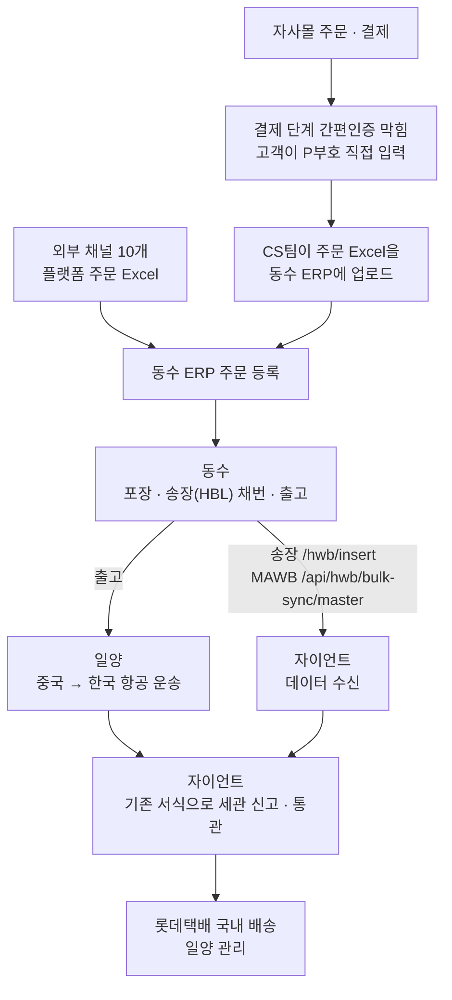
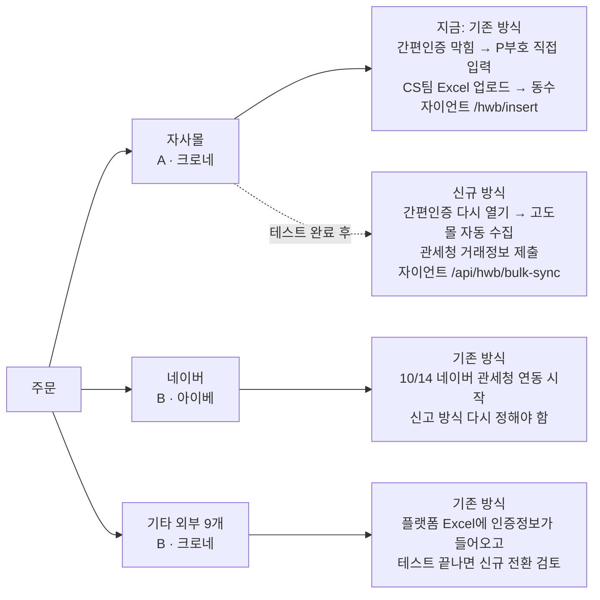
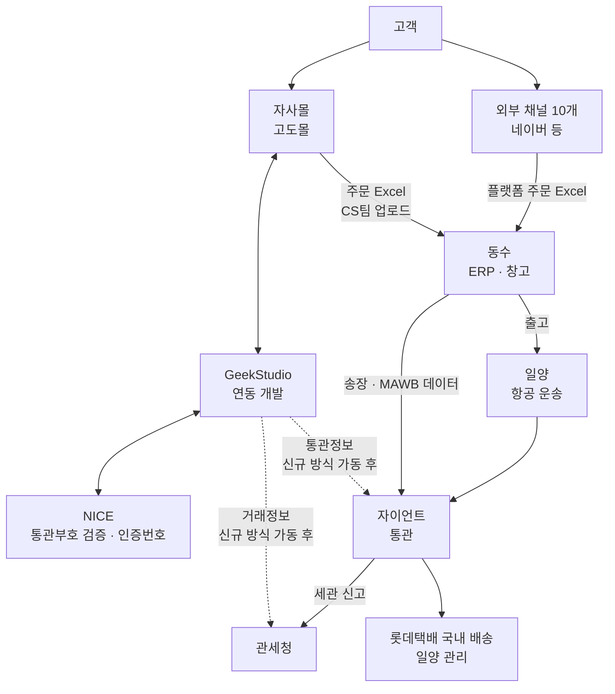
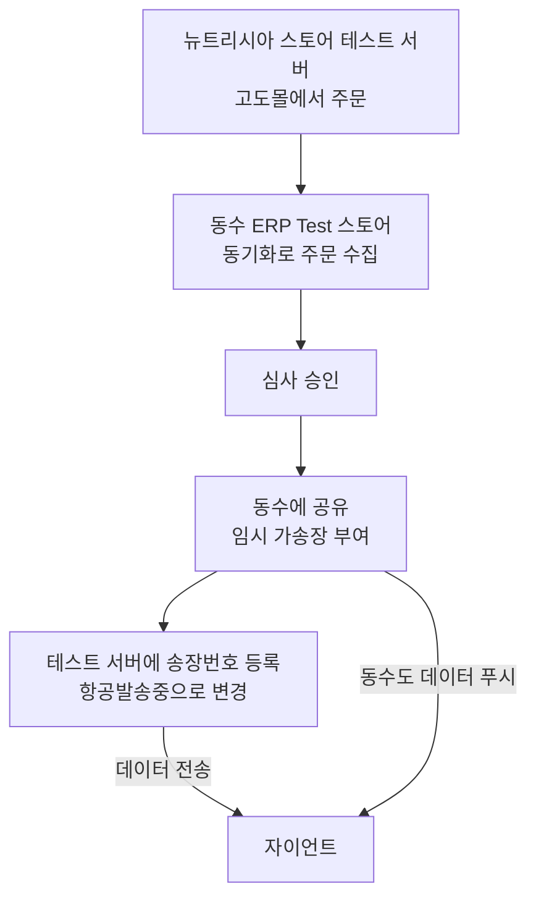

# 관세청 전자상거래 통관 연동 인수인계

## 1. 현재 상황

- 자사몰 포함 전 채널 기존 신고 방식으로 통관 중
- 자사몰은 8/31부터 결제 단계 통관부호 간편인증을 일부러 막아 둠. 고객이 P부호(개인통관고유부호)를 직접 입력하고 전 주문에 적용 중. 간편인증으로 받는 O부호는 기존 서식에 못 쓰기 때문(관세청 9/15 공지)
- 자사몰 주문은 CS팀이 Excel로 동수 ERP에 업로드하는 중. 동수 운영 스토어 자동 수집은 9/8부터 꺼 둠
- 자사몰 신규 방식(전자상거래 전용 신고)은 동수·자이언트 테스트가 끝나지 않아 가동 대기
- Z99999 임시 인증번호는 9/27로 끝남. 기존 통관목록은 12/31까지만 사용 가능

지금 운영 흐름(기존 방식)

### 채널별 신고 방식

판매유형 A/B(누가 파는지)와 기존/신규(어느 서식으로 신고하는지)는 별개라서 A/B만 보고 신고 방식을 정하지 않음.

기타 외부 채널은 플랫폼 주문 Excel 양식이 계속 바뀌는 중(예: 지마켓 9/11 신양식에 인증번호 열 추가). 채널별 원본 Excel 확보 → 동수 ERP 매핑 → 자이언트 테스트 순서로 신규 전환 여부를 정하면 됨.

### 신규 방식 가동 전에 풀어야 할 것

| 내용 | 상대 | 다음 할 일 |
|---|---|---|
| 가동일 | 동수, 자이언트 | 테스트 끝나면 가동일과 기준 주문 시각을 서면으로 확정 |
| 수기 Excel → 자동 수집 전환 | 동수 | 운영 스토어 수집을 다시 켤 시각을 정하고, 이미 Excel로 올린 주문이 다시 안 들어오는지 확인. 같은 송장이 겹치면 H006으로 묶음 전체 실패 |
| 간편인증 막아 둔 것 해제 | GeekStudio 김동섭 | 가동 시각에 맞춰 같이 풀어야 함. 먼저 풀면 O부호가 기존 방식으로 가고, 늦게 풀면 신규 방식에 인증값이 빠짐 |
| 통관정보(통관부호·인증번호·수하인) 붙이는 경로 | GeekStudio, 자이언트 | 동수 전송 데이터에는 이 값이 없음. Geek이 어떤 API로 같은 송장에 붙이는지 서면으로 받고 1건 테스트 |
| 자이언트 실제 DB 자동 적재 | 자이언트 | 9/10 테스트 때는 확인용 DB에만 들어가서 자이언트가 수동으로 옮겼음. 운영에서 자동 적재·중복 차단 확인 필요 |
| P부호·O부호 처리 기준 | 자이언트 | 신규 경로에 P부호, 기존 경로에 O부호가 오면 어떻게 하는지 서면 확인 |
| 신고 결과 회신 | 자이언트 | 응답 SUCCESS는 접수일 뿐이라 수리·오류를 주문별로 받는 방법을 정해야 함 |
| 한 MAWB에 기존·신규 송장 섞임 | 동수, 자이언트 | 9/7 동수는 된다고 했지만 보장은 안 함. 섞어서 테스트하고 안 되면 출고 전에 MAWB를 방식별로 나눔 |

### 일정

- 10/7 정정 전자문서(5FE·5FK) 변경 시행. 신고하는 자이언트 쪽 일이라 반영됐는지만 확인
- 10/14 네이버 해외배송 주문 관세청 연동 시작. 네이버 주문 신고 방식은 아직 미정이고 네이버에 문의한 적 없음
- 12/31 기존 통관목록 사용 종료. 기존 수입신고서는 전용 신고서가 법으로 의무화되기 전까지 사용 가능. 자이언트가 기존 방식에서 어느 서식을 쓰는지는 자이언트 확인 필요

### 관계사에 요청해 둔 것

- 자이언트: 위 표의 자이언트 건, 오류코드 전체 표. 9/17 이후 회신 기록 없음
- GeekStudio: 간편인증 해제, 통관정보 붙이는 경로. 회신 기록 없음
- 동수: 자사몰 신규 가동 테스트 진행 중
- NICE: 가이드 문서끼리 경로·필드명이 다른 부분, 8/6 일반인증을 요청했는데 구매간소화로 응답 온 건, 사후처리 3011 오류. 서면 회신은 없고 NICE 단톡방에서 진행 중
- 관세청: 진행 중인 요청 없음. 담당자 변경 메일만 보낼 예정
- 일양, 고도몰, 크로네: 요청한 것 없음
- 호주 업체: 업체명·담당자 받은 것 없음
- 행안부 주소 API: 안 씀. 우편번호만 정확하면 돼서 영문주소는 자동 로마자 변환으로 처리
- 네이버: 문의 안 함

### 마지막 정상 운영·테스트 성공

- 기존 방식: 지금 정상 운영 중
- 신규 방식: 9/9 송장 전송 성공, 9/10 MAWB 연결 성공. 세관 신고·수리까지 간 건은 없음

## 2. 관계사 / 담당자

공식 에스컬레이션 체계는 없어서 역할 기준으로 적음.

| 회사 | 담당 업무 | 담당자 | 연락처 | 이메일 |
|---|---|---|---|---|
| GeekStudio | 개발·운영 일반 접수 | 팀 메일 | | op@geekstudio.co.kr |
| GeekStudio | 총괄. 운영비·추가 개발·일정, 안 풀리는 건 | 오경록 팀장 | 010-9290-1334 | 팀 메일 사용 |
| GeekStudio | PER 개발. NICE 연동, 통관부호 검증, 간편인증 해제 | 김동섭 | 010-5039-9964 | aaron@geekstudio.co.kr |
| GeekStudio | TRA 개발. 관세청 거래정보, 동수 송장 조회, 자이언트 전송, 고도몰 주문 연동 | 강명제 | 010-4032-8730 | jay@geekstudio.co.kr |
| 동수 | 중국 ERP·창고. 주문 수집, 포장, 송장 채번, 자이언트 전송, Excel 수입 | 小熊 공부장, 개발 담당, AN. | 위챗 단체방 | |
| 자이언트 | 특송·통관. 송장·MAWB 수신, 신고, 결과, API 키 | 김현진 계장 | 010-4024-3740 | akfur2@giantnetworkgroup.com |
| 일양 | 항공 운송, 롯데택배 국내 배송까지 관리 | 정찬일 과장 | 010-4591-8587 | |
| NICE | 통관부호 검증 서비스, 계약·과금 | 조다빈 매니저 | 010-4457-5231 | dabeen@nice.co.kr |
| NICE | 위 담당의 상위 | 신용철 선임매니저 | 010-9082-8647 | syctry@nice.co.kr |
| 관세청 통관시스템(삼성SDS) | 관세청 API·시스템 장애 | 홍종화 프로 | 010-2367-5030 | |
| 관세청 전자상거래통관과 | 제도·서식 문의 | 대표 번호 | 042-481-3258 | eccs@korea.kr |
| 아이베 | NICE·관세청 서비스 신청 명의 | 신선일 이사 | 사내 | |
| 고도몰(NHN커머스) | 자사몰 플랫폼. 직접 연락한 적 없고 GeekStudio 통해 진행 | | | |
| 크로네 | 판매 법인, 업체부호 보유. 별도 담당 없음 | | | |
| 호주 업체 | 에센시스 호주발. 업체 정보 받은 것 없음 | | | |

- 단톡방: 위챗(아이베·동수·자이언트), NICE 단톡방(NICE·Geek 김동섭·박종혁) 모두 지윤환 과장님 초대 완료
- 업체부호
  - (주)크로네 K26000099, 사업자번호 776-87-00068: 자사몰 판매업체, 기타 외부 9개 채널 구매대행업체
  - (주)아이베 K26014765, 사업자번호 132-81-63067: 네이버 구매대행업체
  - 시스템에는 하이픈 없이 9자리로 넣음. 테스트용 부호 K26000127, K26000128은 쓰지 않음

## 3. 자사몰 신규 방식 출고 실패 시

- 실제로 하고 있는 조치 기준: 없음. 자사몰 신규 방식이 아직 가동 전이라 실패를 처리해 본 적이 없음
- A 실패 시 B로 바꿔서 출고하는 절차: 없음. A/B는 실패했다고 바꾸는 값이 아님
- 실패 확인 위치: 미정. 설계상으로는 관세청 미확인 오류 조회(TRA003), 자이언트 응답 코드, 자이언트 통관 이상 코드(gngMsgCode)로 보기로 했음. 거래실패 리스트 화면 위치는 GeekStudio 강명제 확인 필요
- 설계상 처리 순서(가동 후 적용): 11:10 동수 송장 수집 → 11:50까지 거래정보 제출·오류 확인·동수 삭제 요청 → 그때까지 못 끝낸 건은 수기 통관으로 빼고 자동 재처리하지 않음
- 재전송: 자이언트는 이미 등록된 송장은 다시 못 보내고(H006) 수정·삭제 API도 없음. 등록된 송장 고치는 방법은 자이언트 확인 필요. 관세청 거래정보는 새 제출번호로 다시 제출(같은 번호는 3000 중복 반려)
- 수기 처리 양식: 관세청전자상거래주문등록전용양식.xlsx(파일 같이 보냄). 자이언트·일양 통관까지 이 양식을 씀. 누가 작성하고 언제까지 넘기는지는 미정
- hwb_excel_register_template_gng.xlsx, ECB0103001S_TxifExcelForm.xlsx는 운영 양식 아님. ECB0103001S는 관세청 포털 대량제출 양식
- B유형·수기 업로드 컬럼 정의 최종본: 없음
- 수기 업로드 후 성공/실패 확인, 재처리 방법: 미정

자주 보는 오류코드
- 자이언트 A005: 등록 안 된 업체(다른 API 키 사용)
- 자이언트 H006: 이미 등록된 송장. 묶음 전체 실패
- 자이언트 H014: 중량 0
- 자이언트 H016: MAWB에 연결할 송장 없음
- 관세청 3000: 같은 제출번호 중복(IP 차단 아님)
- 관세청 3180: 수하인 정보 불일치(옛 6자리 우편번호 등)
- 자이언트 gngMsgCode 00은 "아직 아무 일 없음"이지 정상 통관이 아님. 전체 코드표는 자이언트에 요청 필요

## 4. 시스템 / 계정

| 시스템 | 용도 | 주소 | 비고 |
|---|---|---|---|
| 관세청 전자상거래업자 포털(유니패스) | 거래정보 조회·관리 | https://unipass.customs.go.kr/ecb/index.do | 크로네·아이베 계정. 로그인할 때마다 인증메일이 필요한데 지금 박종혁 메일로 옴. 계정 메일 변경 필요 |
| 관세청 REST API | PER·TRA 호출(GeekStudio 연동) | https://ecapi.customs.go.kr | 크로네·아이베 인증키. 6개월간 토큰 발급이 없으면 정지 |
| 고도몰5 Open API | 주문 조회·상태 변경(GeekStudio·동수 연동) | 운영 https://openhub.godo.co.kr/ , 테스트 http://sbopenhub.godo.co.kr/ | 운영·테스트 서버키 |
| cron-job.org | 자사몰 배치 실행 | https://console.cron-job.org | |

- 계정·비밀번호·API Key는 메일과 이 문서에 안 적고 따로 정리해서 전달
- 관세청 secret key.txt에 있는 값은 위 관세청 REST API(크로네·아이베) 인증키와 고도몰 운영·테스트 서버키. 지금 쓰는 키이고 재발급 계획은 없음
- 고도몰 관리자·개발서버, NICE·자이언트 관리 화면, 동수 ERP는 따로 넘길 계정 없음. 필요하면 GeekStudio·동수에 요청
- NICE·관세청 서비스 신청 명의는 아이베 신선일 이사, 현장담당은 박종혁. 담당자 변경은 박종혁이 각 기관에 메일로 진행
- 테스트 계정 등 나머지 계정 정보는 따로 전달 완료

## 5. 문제 생겼을 때 개발 쪽 확인

- 당사가 직접 보는 서버·로그 화면은 없음. 연동 소스·로그·배포는 GeekStudio가 갖고 있어서 확인·재전송·재처리는 GeekStudio에 요청(주문 연동·거래정보 강명제, PER 김동섭, 팀 메일 op@geekstudio.co.kr)
- 운영/테스트 구분: 고도몰은 운영 openhub, 테스트 sbopenhub. 동수 ERP는 운영 스토어와 Test 스토어가 따로 있음. GeekStudio 개발서버도 관세청 운영 환경에 붙어 있음
- 주문 찾을 때 기준은 플랫폼 원주문번호(고도몰 주문번호 = 관세청 ord_no = 자이언트 orderNo). 동수 주문번호 뒤 -1, -2는 포장 구분용 내부 번호
- 로그·Request/Response 확인 방법: GeekStudio 확인 필요
- 8/26에 GeekStudio가 단계별 테스트 API(거래정보 전송 → 오류 조회 → 결제완료 원복 → 동수 삭제 → 자이언트 등록)를 준 적 있음

## 6. 테스트

테스트는 박종혁이 실제로 같이 보여드릴 예정이라 여기에는 전체 흐름만 적음.

- 테스트 계정·결제·통관부호 입력 방법은 따로 전달 완료
- 운영 스토어로는 테스트하지 않음. 인증번호나 통관부호를 임의로 만들어 넣지 않음

## 7. 문서 정본

지금 기준은 이 문서와 같이 보내는 관세청_통관연동_전체기획서.md. 전체 기획서에 예전 기획서(planning_v6, planning_v7), 리스크·질의 대장, 협의 내용을 최신 기준으로 합쳐 두었음. planning_v7.html(9/8)은 그 뒤에 바뀐 부분(자이언트 전송 경로, 자사몰 주문 수집 방식, 기존 방식 종료일)이 있어서 따로 보내지 않음.

documents 폴더

| 파일 | 비고 |
|---|---|
| 관세청 자료/관세청 제공 전자상거래 전용 REST API 명세서_v1.4.1_재개정포함_20260727.pdf | 기준(76쪽) |
| 관세청 자료/관세청 제공 전자상거래 전용 REST API 명세서_v1.4.1.pdf | 폐기(74쪽 구판). 버전명이 같아서 헷갈리기 쉬움 |
| 관세청 자료/2026 전자상거래 전용 통관플랫폼 FAQ.pdf | 유효 |
| 관세청 자료/전자상거래전용 통관플랫폼 사업소개(202607)_v1.6(글꼴포함).pdf | 유효, 제도 배경 |
| ECB0103001S_TxifExcelForm.xlsx | 관세청 포털 대량제출 양식. 운영 양식 아님 |
| godomall5_openAPI_spec_v1.0_20250616.pdf | 기준 |
| NICE자료/개인통관고유부호 유효성 검증 서비스_고유식별키활용_20260728.pdf | 기준 |
| NICE자료/NICE [CI] 개인통관고유부호 유효성 검증 API 개발 가이드_20260724.pdf | 참고. 0728판과 다르면 0728판과 실제 응답 기준 |
| NICE자료/NICEAPI(대외비) 개인통관고유부호_유효성 검증_서비스_API 가이드_CI.pdf | 참고. 대외비 |
| NICE자료/개인통관고유부호_CI활용_기관.pdf | 참고 |
| NICE자료/신청서·계약서·취약점 점검 체크리스트·견적서 | 원본 보관 |
| Geek 계약서/(GeekStudio) 뉴트리시아_관세청_연동_개발_계약서.pdf | 유효. 계약기간 6/1~8/31 |
| Geek 계약서/[GeekStudio] 뉴트리시아몰_관세청_API_연동_1차 개발 견적서.pdf | 계약 범위 |
| Geek 계약서/[GeekStudio] 뉴트리시아몰_관세청_API_연동_추가개발_견적서_260810.pdf | 추가 제안 |
| Geek 계약서/관세청 통관플랫폼 및 자이언트 API 연계 개발 마일스톤 계획서.pdf | 참고(5월 작성) |
| 관세청_통관플랫폼_연동_브리핑_v3.pptx, 관세청_통관플랫폼_연동_운영보고_v8.pptx | 8/26 자료라 지금 기준 아님 |
| 뉴트리시아몰 해외직구 결제 및 통관 FAQ.docx, _v26.09.07.pdf | 고객 안내용, docx가 원본. 9/15 공지 전 내용 |
| 기타자료/직구 사업자별 판매 URL 주소.xlsx | 유효 |
| 기타자료/아이베 개인정보처리방침 등 수정안_최앤리 검토(markup).docx | 법무 검토 이력 |
| 기타자료/도메인 등록확인서.png | 참고 |

- 9/8 관련 파일(자이언트 API경로 회신원문, 자료검증 인식대장, 동수 API회신·위챗회신·정정, 자이언트 전달 동수질의, 메일회신, 테스트주문 json)은 박종혁 PC에 없어서 못 드림. 9/8에 합의한 자이언트 전송 경로는 이 문서에 적음
- 20260901_자이언트_운영전환_협의원문.md, 자이언트_API_메모.md는 필요한 내용만 이 문서에 옮기고 원본은 따로 안 보냄

## 8. 필드 매핑

- 최종 매핑표 없음. 실제 개발과 맞는지 확인된 매핑 자료 없음
- 예전 api_field_mapping.html, 유형코드_부호체계_정리.html은 지금 기준이 아니라서 안 보냄
- 지금 개발 기준을 확인하려면
  - 자사몰 연동(고도몰·NICE·관세청·자이언트 통관정보): GeekStudio 소스, 강명제(TRA)·김동섭(PER)
  - 동수 → 자이언트 전송: 동수 개발 담당, 자이언트 Postman 컬렉션 원본 JSON(화면은 일부만 보여서 JSON으로 봐야 함)
  - 관세청 필드: REST API 명세서 재개정판(76쪽)
  - 외부 플랫폼 Excel → 동수 ERP: 매핑표 없음
- 자이언트 전송 경로(9/8 합의): 신규 방식 송장 /api/hwb/bulk-sync, 기존 방식 송장 /hwb/insert, MAWB는 둘 다 /api/hwb/bulk-sync/master
- 금액은 관세청에는 고객 결제금액, 자이언트에는 동수 USD 매입금으로 나눠 보내는 게 9/7 기준. Geek 구현이 이대로인지는 확인 안 됨

## 9. 문제별 연락처

| 문제 | 1차 | 2차 |
|---|---|---|
| 주문 생성(자사몰 → 동수) | 동수(위챗). Excel 업로드는 CS팀 | GeekStudio 강명제 |
| A유형(자사몰) 전송 실패 | GeekStudio 강명제, 동수 개발 담당 | 자이언트 김현진, GeekStudio 오경록 |
| 수기 신고·Excel 업로드 | 자이언트 김현진 | 일양 정찬일 |
| 관세청 API 오류 | GeekStudio 강명제 | 삼성SDS 홍종화, 관세청 전자상거래통관과 |
| 고도몰 API 오류 | GeekStudio 강명제 | GeekStudio 오경록 |
| 통관부호 검증 실패 | 당사 CS에서 고객 안내 후 GeekStudio 김동섭 | NICE 조다빈 |
| NICE 관련 | GeekStudio 김동섭, NICE 조다빈(NICE 단톡방) | NICE 신용철 |
| 자이언트 연동 | 자이언트 김현진, 동수 개발 담당(위챗) | GeekStudio 오경록 |
| 개발서버·배포 | GeekStudio 강명제·김동섭, op@geekstudio.co.kr | GeekStudio 오경록 |
| 실제 통관·출고 | 출고는 동수, 통관은 자이언트 김현진, 항공·국내배송은 일양 정찬일 | 관세청 전자상거래통관과(제도 문의) |

## 10. 메일·메신저·개인 자료

- 회신 기다리는 메일: 없음
- 단톡방: 위챗(아이베·동수·자이언트), NICE 단톡방 모두 초대 완료
- 문서 없이 구두로만 운영 중인 것: 자사몰 간편인증 막아 둔 것(8/31부터 전 주문)
- 자사몰 주문 Excel 업로드는 CS팀이 하고 있어서 따로 인계할 업무 없음
- 본인 명의로 걸려 있는 것: 유니패스 계정 메일, NICE·관세청 현장담당. 변경 진행
- 박종혁만 갖고 있는 인증정보: 계정 정리 파일로 따로 전달
- 꼭 이어서 연락할 곳: 동수·자이언트(자사몰 신규 가동 테스트), 네이버(10/14 전에 신고 방식 확인), GeekStudio(간편인증 해제, 통관정보 경로, 최종 개발 산출물), NICE·관세청(담당자 변경)
- GeekStudio 비용: 개발비(계약)는 끝남. 이후 수정·개발·운영은 뉴트리시아 마케팅 예산의 Geek 운영비로 처리. 이미 개발된 로직 안에서 생긴 문제는 Geek이 따로 비용 없이 해결

## 11. GeekStudio 최종 개발 산출물

- 아직 못 받음. 요청 필요(오경록 팀장, op@geekstudio.co.kr)
- 개발 계약 기간(6/1~8/31)은 끝났지만 자사몰 신규 방식은 아직 테스트 중이라 전 구간 검증은 안 됨
- 1차 견적서(6/9) 기준으로 받을 것: 매뉴얼, FO 소스(GitHub로 관리), 디자인 소스. 6개월 무상 하자보수 포함
- 계약서 11조: 최종 결과물 제출 → 10일 안에 완료검사 → 합격하면 인수. 완료검사 합격 기록은 없음
- 계약서 12조: 무상 하자보증은 완료검사 합격 후 6개월
- 당사가 가진 개발 계약은 GeekStudio 하나

## 12. 주의할 점

- 인증번호, Z99999, 가짜 주문완료일시, 형식만 맞춘 P/O부호를 임의로 만들지 않음
- 같은 송장+주문번호를 두 경로(API 두 종류, 또는 API와 Excel)로 보내지 않음
- O부호는 기존 서식에 쓰지 않음(관세청 9/15 공지)
- 자이언트 응답 SUCCESS는 접수일 뿐 수리가 아님. 묶음에서 한 건만 틀려도 전체 실패
- 자이언트 조회는 없는 송장을 에러 없이 빼고 돌려줌. 요청 건수와 응답 건수를 맞춰 봐야 함(조회는 한 번에 500건까지)
- 동수 송장번호가 null이면 버그가 아니라 아직 발송 준비 전 상태
- NICE는 가이드와 실제 동작이 다를 때가 있음
- 관세청 명세는 76쪽 재개정판, 자이언트 규격은 Postman 원본 JSON을 기준으로 봄

## 13. 용어

- P부호(PCCC): 개인통관고유부호. P로 시작하는 13자리
- O부호: 일회용 개인통관부호. 전용 서식에만 사용
- 일회용 인증번호: 본인확인 후 받는 6자리
- PER: 관세청 통관부호 검증·인증번호 발급. 자사몰은 NICE를 거침
- TRA001 / TRA003: 관세청 거래정보 제출 / 미확인 오류 조회
- 기존 방식 / 신규 방식: 기존 통관목록·수입신고서 / 전자상거래 전용 통관목록·수입신고서
- 송장(HBL): 고객 포장 1개의 운송장. 자이언트에서는 hwbNo
- MAWB: 항공편 단위로 송장을 묶는 마스터 운송장
- 주문 상태: 결제완료(p1) → 동수 수집 완료(d1) → 상품준비중(g1) → 항공발송중(g5). 고도몰 기본값이 아니라 이 프로젝트에서 만든 값
