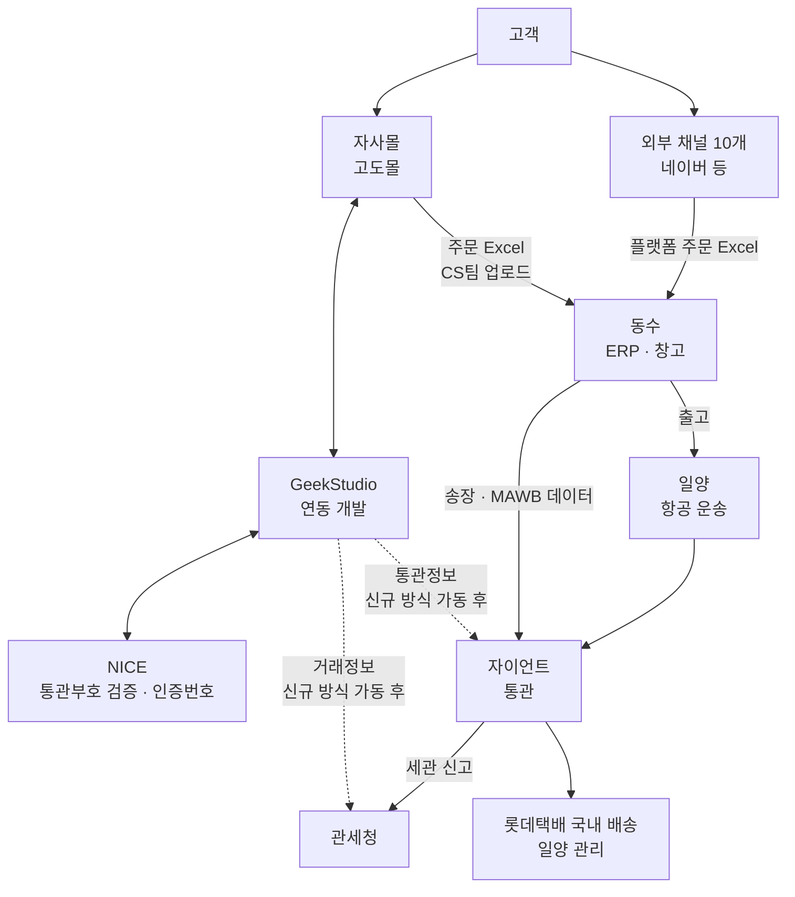
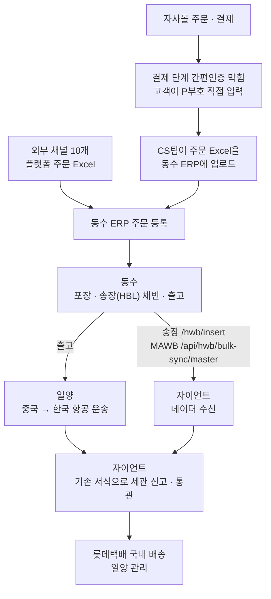
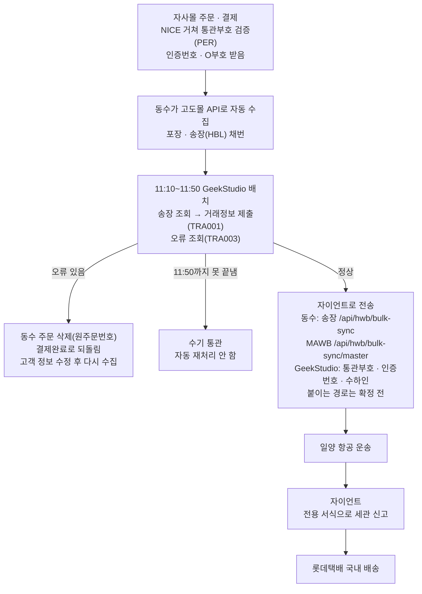
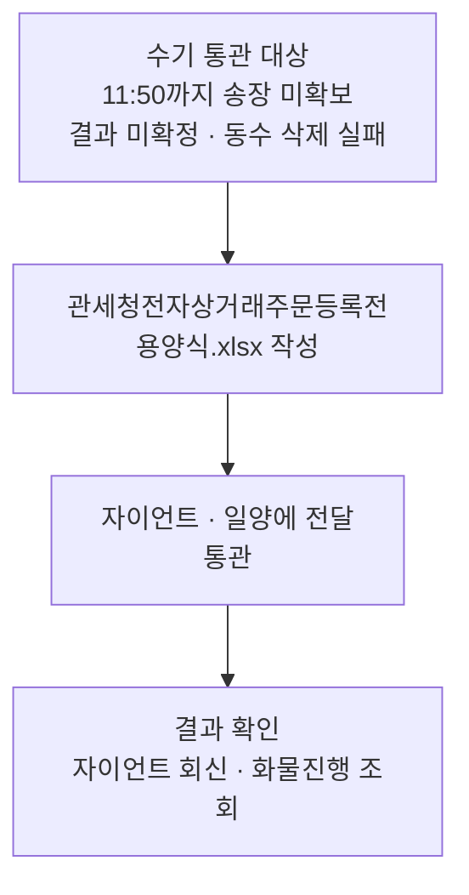
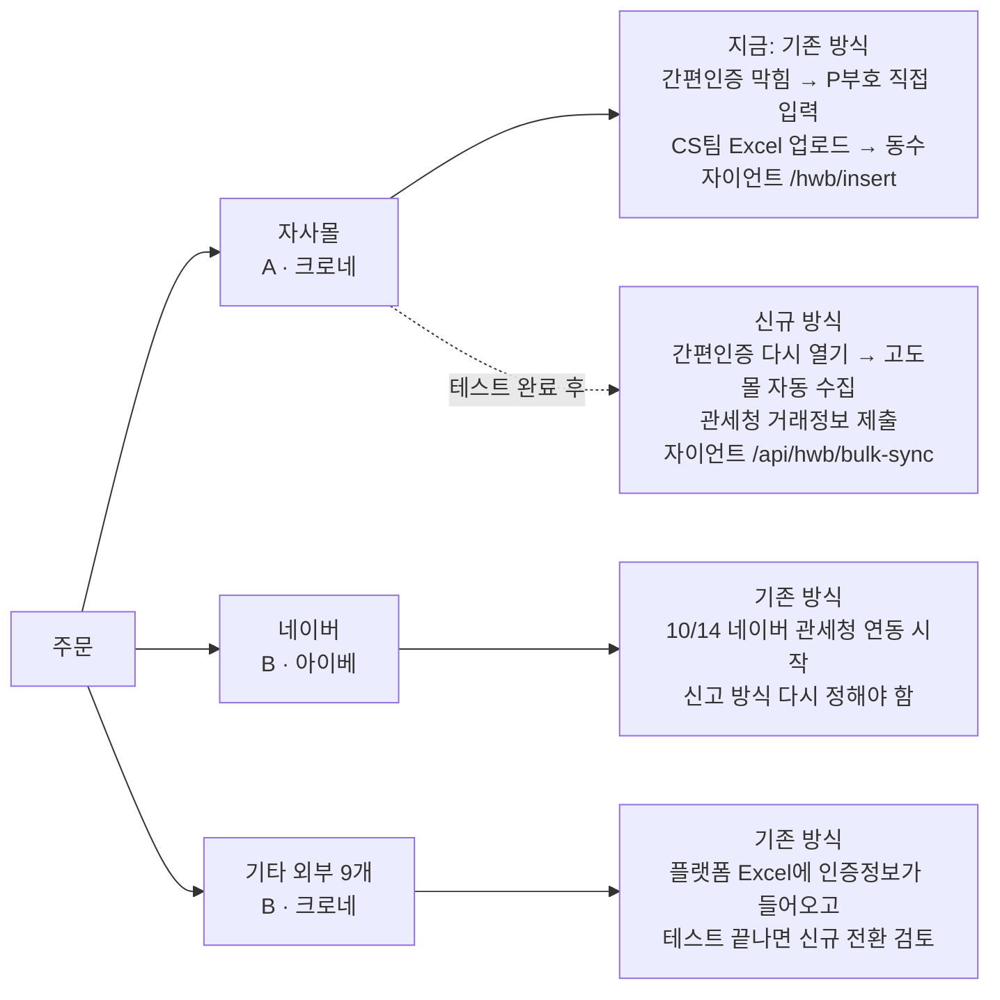

# 관세청 전자상거래 통관 연동 전체 기획서

2026-10-08 기준. 예전 기획서(planning_v6, planning_v7), 리스크·질의 대장, 관계사 협의 내용을 이 문서 하나로 합쳤음. 담당자 연락처와 인계할 일은 인수인계 문서에 있음.

## 1. 개요

### 배경

- 관세청이 2026-08-28부터 전자상거래 전용 통관플랫폼을 시범운영 중. 해외직구 물품용 전용 신고서(전용 통관목록, 전용 수입신고서)가 새로 생겼고 기존 서식도 한동안 같이 씀
- 전용 신고를 하려면 쇼핑몰이 주문 단계에서 고객 통관부호를 검증(PER)하고, 주문·결제·상품 거래정보를 관세청에 제출(TRA001)해야 함
- 근거는 관세법 제254조와 시행령 제258조(관세청 FAQ 안내). 통관부호 도용을 막고, 거래정보와 신고서를 대조할 수 있게 하려는 제도

### 목적

자사몰(뉴트리시아몰)과 외부 판매채널 10개의 주문이 주문마다 기존/신규 신고 방식을 정해서 동수(물류) → 자이언트(통관) → 관세청까지 끊기지 않고 통관되게 연결하는 것.

### 사업 구조

- 뉴트리시아 유럽 물량을 중국 동수 창고(옌타이)에 미리 보관. 재고 소유는 크로네
- 한국 고객이 주문하면 동수 창고에서 주문 단위로 출고 → 중국 수출 신고 → 일양 항공 운송 → 자이언트가 고객 통관부호 기준으로 개인직구 통관 → 롯데택배 국내 배송
- 재고가 해외에 있어야 해외직구(직접판매 A)가 성립함. 국내 재고 판매는 해외직구가 아님(관세청 담당자 8/21 회신)

### 개발

- 자사몰 연동 개발은 GeekStudio에 위탁. 계약 기간 6/1~8/31(계약서 documents/Geek 계약서)
- 1차 견적 범위: NICE 통관부호 검증, 관세청 거래정보 제출·오류 조회, 동수 송장 조회, 자이언트 연동
- 8/10 추가 견적: 통합인증, 자이언트 제출, 수동 API, 운영 화면 변경
- 개발비는 끝났고 이후 수정·개발·운영은 뉴트리시아 마케팅 예산의 Geek 운영비로 처리. 이미 개발된 로직 안의 문제는 Geek이 따로 비용 없이 해결

### 지금 상태 (10/8)

- 자사몰 포함 전 채널이 기존 신고 방식으로 운영 중
- 자사몰은 8/31부터 결제 단계 간편인증을 막아 두어 고객이 P부호를 직접 입력. 주문은 CS팀이 Excel로 동수 ERP에 업로드
- 자사몰 신규 방식은 동수·자이언트 테스트가 끝나지 않아 가동 대기

## 2. 참여사와 역할

| 회사 | 맡은 일 | 주고받는 것 |
|---|---|---|
| 아이베·크로네 | 자사몰 운영, 외부 플랫폼 구매대행 판매, 전체 조율, CS | 채널·업체부호 관리, 주문 Excel 업로드(CS팀) |
| GeekStudio | 자사몰 연동 개발 | NICE 통관부호 검증, 관세청 거래정보 제출, 동수 송장 조회, 자이언트 통관정보 전송 |
| NICE | 통관부호 검증·인증번호 발급 중계(관세청 수탁기관) | 검증 결과, P/O부호, 인증번호 6자리 |
| 관세청 | 제도, 신고 서식, REST API 운영 | 거래정보 접수, 오류 결과, 신고 수리 |
| 고도몰(NHN커머스) | 자사몰 플랫폼 | 주문·결제·수하인 데이터 |
| 동수 | 중국 ERP·창고. 주문 등록, 포장, 송장(HBL) 채번, 자이언트 전송 | 송장, 중량, 상품, MAWB |
| 자이언트 | 특송·통관. 송장·MAWB 받아서 세관 신고 | 신고 결과, 통관 이상 코드 |
| 일양 | 항공 운송, 롯데택배 국내 배송 관리 | 항공편, MAWB |
| 롯데택배 | 국내 배송 | — |

## 3. 운영 흐름

### 지금 운영 (기존 방식)

- 간편인증을 막은 이유: 간편인증으로 받는 O부호는 기존 서식에 쓸 수 없음(관세청 9/15 공지). 신규 방식이 가동되기 전까지 P부호로 기존 방식 신고
- 동수 ERP의 자사몰 운영 스토어 자동 수집은 9/8부터 꺼 둔 상태라 Excel 업로드로 운영

### 신규 방식 (설계, 가동 대기)

가동 전에 풀어야 할 것
- 동수·자이언트 테스트 완료, 가동일과 기준 주문 시각 서면 확정
- 동수 운영 스토어 자동 수집 재개 시각. 이미 Excel로 올린 주문이 다시 들어오면 자이언트에서 H006으로 묶음 전체 실패
- 간편인증 막아 둔 것을 가동 시각에 맞춰 해제(GeekStudio). 먼저 풀면 O부호가 기존 방식으로 가고, 늦게 풀면 신규 방식에 인증값이 빠짐
- 통관부호·인증번호·수하인 정보를 같은 송장에 붙이는 경로(GeekStudio·자이언트)
- 자이언트 실제 DB 자동 적재와 중복 차단. 9/10 테스트 때는 확인용 DB에만 들어가 자이언트가 수동으로 옮겼음
- 신규 경로에 P부호, 기존 경로에 O부호가 오면 자이언트가 어떻게 처리하는지
- 신고 수리·오류를 주문별로 회신받는 방법
- 한 MAWB에 기존·신규 송장이 섞여도 되는지. 안 되면 출고 전에 MAWB를 방식별로 나눔

### 하루 일정 (신규 방식 설계 기준)

| 시각 | 하는 일 |
|---|---|
| 결제 시 | 수하인 정보 확인, NICE 통관부호 검증 |
| 10:00 | 주문·송장·상품 수집 |
| 11:10~11:50 | 전용 신고 대상 거래정보 제출·오류 확인·동수 삭제 요청 |
| 11:50 | 못 끝낸 건은 수기 통관으로 격리 |
| 12:00 | 동수 창고 취소 반영 마감 |
| 13:00 | 라벨 부착, 출고 |
| 17:00 | MAWB 전송 |
| 18:00 | 자이언트 조회로 500건 단위 대사 |

- 처음(8/11)에는 09:00 수집 → 11:50 실패 통보 → 12:00 마감 → 13:00 출고였는데, 8/26 마케팅·MD 회의에서 11:10~11:50 처리창으로 바뀜
- 기존 방식 주문은 거래정보 제출 배치에 넣지 않음

### 주문 상태값

고도몰 기본값이 아니라 이 프로젝트에서 만든 값.

| 상태 | 뜻 | 고객이 할 수 있는 것 |
|---|---|---|
| 결제완료(p1) | 동수 수집 전 | 취소·환불·배송지 수정 가능 |
| 동수 수집 완료(d1) | 동수가 가져감 | — |
| 상품준비중(g1) | 포장 중 | 취소·수정 불가 |
| 항공발송중(g5) | 신고 정상 처리 후 출고 | 취소 불가, 배송 완료 후 반품 |
| 결제완료로 되돌림 | 신고 반려 후 동수 삭제 성공 | 정보 수정·취소 가능 |

### 출고 실패·수기 처리 (설계)

- 작성 주체, 넘기는 방식과 마감, 결과 확인 절차는 아직 정하지 않음
- A 실패 시 B로 바꿔 출고하는 절차는 없음. A/B는 실패했다고 바꾸는 값이 아님

## 4. 판매유형과 신고 방식

### 두 가지를 따로 봄

- 판매유형: 누가 파는가
  - A 직접판매: 주문 전에 매입·소유한 해외 재고를 직접 판매. 당사가 거래정보 제출
  - B 구매대행: 고객 주문 후 해외에서 대신 구매
- 신고 방식: 어느 서식으로 신고하는가
  - 기존 방식: 기존 통관목록·수입신고서. 거래정보·인증번호 필요 없음(관세청 담당자 8/25·8/28 회신)
  - 신규 방식: 전자상거래 전용 통관목록·수입신고서. 거래정보·인증번호 필요
- A라서 신규, B라서 기존으로 정하지 않음. 주문마다 따로 정함(8/28 결정)

### 채널 목록 (11개)

| 채널 | 동수 ERP 스토어명 | 판매유형 | 업체 |
|---|---|---|---|
| 자사몰 nutriciastore.co.kr | 직구 - 자사몰 - Aptamil Official Direct Store | A | 크로네 K26000099 |
| 네이버 brand.naver.com/nutricia | 직구 - 네이버미니샵 - Naver Mini Aptamil Direct | B | 아이베 K26014765 |
| 지마켓 | 직구 - 지마켓 - Gmarket Direct Crone | B | 크로네 K26000099 |
| 옥션 | 직구 - 옥션 - Auction Direct Crone | B | 크로네 K26000099 |
| 11번가 | 직구 - 11번가 - 11th Street direct Crone | B | 크로네 K26000099 |
| 롯데ON | 직구 - 롯데온 - Lotte On Crone | B | 크로네 K26000099 |
| 오늘의집 | 직구 - 오늘의집 - Todays House Crone | B | 크로네 K26000099 |
| SSG닷컴 | 직구 - SSG - SSG Direct Crone | B | 크로네 K26000099 |
| 쿠팡 | 직구 - 쿠팡 - Coupang direct Crone | B | 크로네 K26000099 |
| CJ온스타일 | 직구 - CJ온스타일 - CJ-On Store direct Crone | B | 크로네 K26000099 |
| 카카오 톡딜 | 직구 - 카톡 - KakaoTalk Crone | B | 크로네 K26000099 |

- 사업자번호: 크로네 776-87-00068, 아이베 132-81-63067 (documents/기타자료/직구 사업자별 판매 URL 주소.xlsx)
- 자사몰 A는 관세청 판매업체명 (주)크로네, 판매업체부호 K26000099를 꼭 보내야 함. 8/26 실제 오류로 확인
- 업체부호는 공백을 지우고 하이픈 없는 9자리로 보냄. 테스트용 K26000127, K26000128은 쓰지 않음
- ERP 스토어명을 정확히 찾아서 판정. 목록에 없는 채널에 기본값을 넣지 않음
- 주문자·수하인·통관부호·인증번호는 채널 고정값이 아니라 주문마다 다른 값

### 외부 채널 신규 전환 절차

외부 10개 채널은 지금도 앞으로도 플랫폼 주문 Excel을 동수 ERP에 올리는 방식(9/8 확정). 신규 전환은 API 개발이 아니라 Excel 컬럼을 맞추고 인증정보가 실제로 들어오는지 확인하는 일. Excel에 없는 통관부호·인증번호는 만들어지지 않음.

1. 플랫폼별 실제 주문 Excel 원본 확보 (지금 확보한 원본 없음. 지마켓 신양식만 동수 템플릿 설정 완료)
2. 원본 컬럼 → 동수 ERP → 자이언트 필드 매핑 정하기
3. 동수에 원본 그대로 넣어 보고 행 수·주문 수·금액 대사
4. 자이언트 전송 테스트
5. 한 MAWB에 자사몰 신규 송장과 외부 기존 송장을 섞어 테스트
6. 테스트 송장은 미리 동수에 알려서 실제 출고를 막음

### 네이버 (10/14 관세청 연동 시작)

- 네이버 공지로 확인된 것: 10/14 해외배송 주문부터 관세청 연동 시작, 그날 이후 주문부터 전용 신고서 사용 가능, 네이버는 수입신고서를 관리·제출하지 않음
- "네이버가 거래정보 제출, 자이언트가 신고"가 유력하지만 공지에 API·필드·인증번호 처리·결과 공개 범위가 없어서 확정 못 함. Z99999도 끝나서 임시값은 못 씀
- 네이버에 물어볼 것
  - 관세청 연동이 거래정보(TRA001) 직접 제출인지
  - 전자상거래업자=네이버, 구매대행업자=아이베(K26014765)로 넣는 게 맞는지
  - 통관부호 검증·인증번호를 누가 처리하고 판매자나 관세사에게 넘겨주는지
  - 거래정보 제출 결과·오류를 판매자가 볼 수 있는지
  - 송장 입력 후 언제 제출하는지, 분할·변경 시 누가 다시 제출하는지
  - 전용/기존 신고서를 어떻게 나누는지, 장애 때 재전송·통지 절차
  - 테스트 주문이나 명세를 주는지
- 외부 채널은 아래 셋 중 어디인지에 따라 대응이 달라짐
  - 플랫폼이 거래정보·인증·결과까지 다 줌: 당사는 중복 제출하지 않음
  - 플랫폼이 거래정보는 내는데 인증·결과는 안 줌: 자이언트와 조건부 필드 협의 필요
  - 플랫폼이 연계 안 함: 당사 명의로 제출하거나 기존 방식 유지. 관세청은 당사가 B유형 제출자가 되는 것도 인정함(8/21)

## 5. 연동 규격

### 관세청 REST API

기준 문서는 documents/관세청 자료의 REST API 명세서 v1.4.1 재개정판(76쪽). 같은 버전명의 74쪽 구판은 쓰지 않음. 운영 주소 https://ecapi.customs.go.kr, JSON/UTF-8, TLS 1.3만 지원.

| API | 하는 일 | 제약 | 우리 쪽 |
|---|---|---|---|
| AUT001 POST /oauth/token | 접근토큰 발급 | 24시간, 활성 토큰 2개까지 | 사용 |
| TRA001 POST /v1/transactions/submission | 거래정보 제출 | 3MB, 주문 1~300건 | 전용 신고 주문만 |
| TRA002 GET /v1/transactions/results/{번호} | 제출 결과 조회 | 초당 10건 이하 | 안 씀(8/11 결정) |
| TRA003 GET /v1/transactions/errors/unread | 미확인 오류 조회 | 최근 7일, 한 번 조회하면 다시 안 나옴 | 사용 |
| PER001 POST /v1/pccc/validation | 통관부호 검증·인증번호 | 수탁기관 경유 가능 | NICE 경유 |
| PER002 POST /v1/pccc/revalidation | 정보 바뀌었을 때 재검증 | 통관부호 자체가 바뀌면 PER001 새로 | NICE 경유 |
| PER003 POST /v1/pccc/validation/post-processing | 관세청이 인정한 장애 건 사후처리 | 임의 우회 금지 | NICE 쪽 3011 오류로 미검증 |

- 거래제출번호 = 업체부호 9자리 + YYMMDD + 일련번호 6자리. 같은 번호로 다시 내면 3000 중복 반려라 수정할 때도 새 번호
- 송장번호가 바뀌면 새 제출번호로 다시 제출(FAQ 8-14). 신고서 접수 후에는 거래정보 제출 불가(FAQ 8-8)
- 거래정보만 내고 반품으로 신고하지 않으면 따로 할 일 없음(FAQ 8-9)
- TRA003만 쓰기 때문에 상품 단위 오류가 있는데 승인처럼 보일 수 있음. 제출 건수와 응답 건수를 매일 맞춰 보고 자이언트 통관 이상 코드로 뒤에서 잡기로 함
- 인증정보는 계정당 3개까지, 6개월 동안 토큰을 안 받으면 정지, Secret은 처음 발급 때만 볼 수 있음
- 관세청 담당자 회신(8/25): 거래정보를 안 내도 통관은 되지만 검사율이 오르고 제출률이 떨어짐. 협력인정업체 평가는 분기 실적 기준

### NICE

주소 smartpcc.niceid.co.kr. 기준 문서는 documents/NICE자료의 고유식별키활용 가이드(7/28).

| 기능 | 하는 일 |
|---|---|
| 토큰 | 접근토큰(24시간) |
| NICE KEY 발급 | 처음 쓰는 회원의 고유식별값 발급 |
| 검증 요청·결과 | 통관부호 검증, 인증번호 6자리 받음 |
| 재검증 | 같은 통관부호로 이름·전화·우편번호가 바뀐 경우 |
| 사후처리 | 장애 건 처리. 3011 오류로 정상 동작 확인 안 됨 |

- NICE KEY는 API 비밀키가 아니라 회원별 개인식별값이라 암호화 저장
- 7/24 가이드와 7/28 가이드가 경로·필드명·우편번호 자릿수에서 서로 다름. 7/28판과 실제 응답 기준
- 8/6에 일반인증을 요청했는데 구매간소화로 응답이 옴. 서면 회신 전까지는 이 경로를 믿지 않음
- 협력인정업체(간소화 인증, O부호 발급) 신청은 보류(8/10). 일반인증만으로 결제·통관이 됨

### 고도몰5 Open API

- 운영 https://openhub.godo.co.kr/, 테스트 http://sbopenhub.godo.co.kr/. 기준 문서 documents/godomall5_openAPI_spec_v1.0_20250616.pdf
- 주문 조회 POST /godomall5/order/Order_Search.php (30일 이내), 상태 변경 POST /godomall5/order/Order_Status.php
- 1초 100회 넘게 부르면 429
- 우편번호는 5자리 receiverZonecode를 씀. 옛 6자리 receiverZipcode를 쓰면 관세청 3180 오류
- 전화는 050 안심번호가 아니라 receiverCellPhone
- 통관부호는 주문 추가정보(addField)에 저장. 항목명 "개인통관부호", "개인통관고유부호" 둘 다 인식

### 동수 내부 API

공개 명세 없이 협의로 정한 것. 인증 방식, 운영 주소, 한 번에 보낼 수 있는 건수, 전체 오류코드는 받지 못함.

| API | 하는 일 | 정한 것 |
|---|---|---|
| getTRA001OrderInfo | 해외 주문의 포장·송장 조회 | customerOrderNos에 원주문번호를 쉼표로 연결. 국내 주문은 안 나옴 |
| orderDelete | ERP 주문 삭제 | 원주문번호로 1건씩. 서브번호(-1)로 부르면 state 300 실패 |
| serachOrderInfo (원래 철자 그대로) | 국내·해외 송장, 해외 여부(isCrossBorder Y/N) | — |

### 자이언트 GGATE

인증은 X-Api-Key 헤더. 규격은 Postman 화면이 아니라 컬렉션 원본 JSON으로 확인(화면은 일부만 로딩돼서 8/10에 잘못 본 적 있음).

9/8 합의한 실제 경로(15:07 동수 정리, 15:19 자이언트 확인)

| 구분 | 경로 |
|---|---|
| 신규 방식 송장 | /api/hwb/bulk-sync |
| 기존 방식 송장 | /hwb/insert (문서 규격 없음) |
| MAWB (공통) | /api/hwb/bulk-sync/master |

공개 문서는 두 개
- 분리형 documenter.getpostman.com/view/11773234/2sBYArTsRz ("GGATE API V2 아이배", v2.0.1, 8/31): GeekStudio 통관정보(clearance)와 동수 물류정보(logistics)를 송장번호+주문번호로 합치는 방식
- 일체형 documenter.getpostman.com/view/11773234/2sBXqGrh3A ("GGATE API V2", v1.3.7, 8/25): /api/hwb/bulk-sync로 한 번에 보내는 방식
- V1, V2-1, V2-2 같은 버전 이름이 문서마다 다른 걸 가리켰음. 이야기할 때는 전체 경로로만 부름

알아둘 동작
- 응답 SUCCESS면 묶음 전체 성공, 그 밖에는 묶음 전체 실패. 부분 성공 없음. SUCCESS는 접수이지 수리가 아님
- 이미 등록된 송장을 다시 보내면 H006으로 막히고 같은 묶음 전부 실패
- 등록 후 고치거나 지우는 API가 없음(8/20 v2.0.0에서 수정·통관부호 검증 API 삭제, 수정은 "삭제 예정")
- 송장번호 없이 보내면 자이언트가 번호를 매겨서 issuedHwbNos로 돌려줌. 미리 붙여 보내면 비어 있는 게 정상
- 조회는 한 번에 500건까지, 늘릴 수 없음. 없는 송장은 에러 없이 빠지므로 요청 건수와 응답 건수를 맞춰 봐야 함
- 분리형 통관정보 필수값: 주문자명, 수하인명(한글·영문), 주소(한글·영문), 우편번호 5자리, 전화(실번호), 통관부호 13자리, 인증번호 6자리, 주문완료일시 14자리. 기존 방식 주문에 이 값을 억지로 채우지 않음
- 상품명 200자, 상품 1~50건, 상품순번 3자리(001부터), HS코드 6자리
- 9/1 운영 합의: 같은 송장에서 GeekStudio 쪽 값이 있으면 동수 값보다 우선, 빈 값으로 기존 값을 지우지 않음

### 오류코드

| 어디 | 코드 | 뜻 |
|---|---|---|
| 자이언트 | A003, A004 | API 키 없음, 키 무효 |
| 자이언트 | A005 | 등록 안 된 업체(다른 API 키 사용) |
| 자이언트 | H005 | 한 요청 안에 같은 송장 두 번 |
| 자이언트 | H006 | 이미 등록된 송장. 묶음 전체 실패 |
| 자이언트 | H014 | 중량 0 |
| 자이언트 | H016 | MAWB에 연결할 송장 없음 |
| 자이언트 | H019 | 합쳐진 뒤에 다시 보냄 |
| 자이언트 통관 이상 | 00 | 초기값. 정상 통관이라는 뜻이 아님 |
| 자이언트 통관 이상 | 01, 02, 11 | 검사, 검역, X-RAY 검사 |
| 자이언트 통관 이상 | 22, 23, 27 | 취하(지재권, 수량과다, 기타) 서류제출 |
| 자이언트 통관 이상 | 28, 29 | 세금 발생, 서류보완 |
| 자이언트 통관 이상 | 44, 45, 99 | 통관오류, 무적화물, 통관불가 |
| 관세청 | 3000 | 같은 제출번호 중복(IP 차단 아님) |
| 관세청 | 3180 | 수하인 정보 불일치 |
| 관세청 TRA003 | "판매유형코드A인 경우 판매업체명은 필수" | A유형 판매업체 값 누락(8/26 실제 발생) |
| 동수 | state 300 | 파라미터 오류, 서브번호로 삭제 호출 |
| NICE | 3011 | 내부 처리 오류(사후처리) |

통관 이상 코드 전체 표는 자이언트에 요청해야 함(공개 문서에는 "별첨 참고"로만 되어 있음).

## 6. 데이터 기준

실제 개발과 맞는지 확인된 최종 매핑표는 없음. 아래는 설계 기준.

### 주문을 찾는 기준

- 플랫폼 원주문번호 하나로 통일(8/26): 고도몰 주문번호 = 관세청 ord_no = 자이언트 orderNo = 동수 삭제 키
- 동수 주문번호 뒤 -1, -2는 포장 구분용 내부 번호. 밖으로 보내거나 삭제 키로 쓰지 않음
- 송장(HBL)은 동수가 채번. 관세청 hbl_no, 자이언트 hwbNo
- 자이언트는 송장번호+주문번호로 동수·GeekStudio 데이터를 합침
- 상품순번은 송장 단위로 001부터 보내는 쪽에서 매김

### 금액

| 어디 | 넣는 값 |
|---|---|
| 관세청 총결제금액(tot_stlm_amt) | 고객이 실제로 결제한 해외직구 최종 금액. 송장이 여러 개로 나뉘어도 건마다 주문 전체 금액 |
| 자이언트 금액(totalValueUsd 등) | 동수 USD 매입금 |

- 바뀐 과정: 8/5·8/10 전부 동수 USD → 8/19 고객 결제액 따로 → 8/26 다시 전부 동수 USD → 9/7 관세청 명세에 맞춰 위처럼 나눔
- GeekStudio 구현이 9/7 기준대로인지는 확인 안 됨
- 소수점: 관세청 소수 3자리, 자이언트 단가 3자리·총액 2자리

### 민감 정보

| 뜻 | 관세청 | 자이언트 | 주의 |
|---|---|---|---|
| 통관부호(P) 또는 일회용 통관부호(O) | cnsi_pers_ecm | pccCode | 임의값 금지 |
| 인증번호 6자리 | su_crtf_no(선택) | tempAuthNo(분리형 필수) | 고도몰·동수에 저장하지 않음 |
| 우편번호 | cnsi_psno 5자리 | consigneeZip 5자리 | 고도몰 receiverZonecode |
| 수하인 전화 | 하이픈 없이 | consigneeTel | 050 안심번호 금지 |
| 영문주소 | — | consigneeAddressEng | 행안부 API는 안 쓰고 자동 로마자 변환 |
| 상품명 | ord_prod_nm 600자 | productName 200자 | 판매페이지 원문. 자동으로 자르지 말고 넘치는 건 따로 처리 |

### 길이·건수 차이

| 항목 | 관세청 | 자이언트 |
|---|---|---|
| 상품명 | 600자 | 200자 |
| 상품 수 | 1~999 | 1~50 |
| 수하인명 | 150자 | 100자 |
| 주소 | 기본·상세 각 250자 | 150자, 영문 200자 |

원본 값은 그대로 두고 보내는 곳마다 한도를 검사함. 짧은 쪽에 맞춰 원본을 잘라 버리면 다른 쪽이 안 맞게 됨.

## 7. 운영 원칙

### 출고 단위

- 송장 1개 = USD 150 이하 포장 1개 = 거래정보 1건 = 자이언트 등록 1건(8/12)
- 한 주문이 여러 포장으로 나가면 거래정보도 여러 번. 고도몰에는 첫 송장만 저장
- 송장을 미리 받은 뒤에는 송장·품목·수량·금액을 바꾸거나 송장을 재사용하지 않음
- 동수는 주문의 송장이 모두 할당된 뒤에 한꺼번에 돌려줌. 하나라도 없으면 그 주문 송장이 전부 null. null은 버그가 아니라 발송 준비 전 상태라 계속 다시 조회함

### 혼재 주문

- 해외직구 상품과 국내 상품이 한 주문에 있으면 국내 상품도 해외직구 신고가 끝날 때까지 같이 출고 보류(8/26)
- 동수 ERP가 주문 단위로만 삭제·재생성할 수 있어서 국내분만 따로 먼저 보낼 수 없음
- 고객에게는 "같은 주문의 상품은 통관이 끝나면 함께 출고되고, 급하면 취소 후 국내 상품만 따로 주문하면 바로 출고"로 안내

### 하지 말 것

- 인증번호, Z99999, 가짜 주문완료일시, 형식만 맞춘 P/O부호를 만들지 않음
- 판매유형 A/B로 신고 방식을 정하지 않음
- 같은 송장+주문번호를 두 경로(API 두 종류, 또는 API와 Excel)로 보내지 않음
- 빈 값으로 다시 보내서 기존 값을 지우지 않음
- 동수 ERP 운영 스토어로 테스트하지 않음
- O부호를 기존 서식에 쓰지 않음

### CS 안내 기준

- 11:50을 넘긴 주문을 "내일 자동으로 다시 시도된다"고 안내하지 않음. "담당 부서에서 개별 처리 중"이 맞음
- 원인이 확인되지 않은 통관부호 누락을 "관세청 서버 오류"라고 안내하지 않음
- 통관부호, 관세청 인증번호, 임시 웹 접근번호는 서로 다른 번호
- 예전 정책 중 "7일 지나면 강제 취소", "관세청 95% 정합성 페널티"는 근거가 없어서 폐기. 합산과세 "입항일 동일" 기준은 2022-11-17에 폐지됨
- 결제창의 "반품/환불 절대 불가" 문구는 법무 검토가 남아 있음

## 8. 아직 정해지지 않은 것

| 내용 | 확인할 곳 |
|---|---|
| 자이언트 운영 주소, 실제 배포 버전 | 자이언트 |
| 한 MAWB에 기존·신규 송장 섞기 | 자이언트, 동수 |
| 자이언트 등록 상태 조회(status/search) 운영 주소, GeekStudio 구현 여부 | 자이언트, GeekStudio |
| 자이언트 등록 후 수정·삭제 방법 | 자이언트 |
| 자이언트 기존 방식 접수 경로의 필수값 | 자이언트 |
| 자이언트 "통관부호 검증 제외"(9/1) 예외의 범위·종료일 | 자이언트 |
| 같은 송장에서 GeekStudio 값 우선 적용 필드 목록, 필드별 최종 출처 조회 | 자이언트 |
| NICE KEY 응답 필드명·길이, 가이드 간 차이 | NICE, GeekStudio |
| 동수 API 인증·한도·오류코드 | 동수 |
| 외부 채널 Excel 원본·매핑 | 당사, 동수 |
| 상품명 원문 사용, 한 송장에 여러 주문(관세청 재개정판 반영) | GeekStudio, 동수 |
| 금액 나눠 보내기 구현 | GeekStudio, 동수 |
| 관세청·자이언트 길이·건수 차이 처리 | GeekStudio, 자이언트, 동수 |
| 고도몰 상품행 ↔ 동수 단품 ↔ 송장 연결 | 동수, GeekStudio |
| 동수 상품분류 값(1단계에 "국내 발송/국제 직구", 2단계에 브랜드명이 들어감) | 동수 |
| 동수 응답에 포장 개수 없음, 수량·단가가 문자열 | 동수 |
| 고도몰 조회 기준(주문일/수정일, 시작일) | 동수 |
| 통관 이상 코드 받은 뒤 CS 처리, 조회 주기 | 당사, GeekStudio |
| 통관 끝난 뒤 반품 시 관세 환급 | 관세사 |
| 관세청 간담회 권고(9~18시 피해서 제출)와 배치 시각 충돌 | 당사 |
| 개인정보: 전달 경로별 근거, 인증번호 보관 범위, NICE KEY만 보유 시 KISA 제출 대상 여부 | 법무 |
| 자이언트 A코드 표시명(관세청 "직접판매", 자이언트 "직접구매") | 자이언트 |

## 9. 결정 이력

| 날짜 | 내용 |
|---|---|
| 5월 | GeekStudio 마일스톤 계획서 |
| 6/1 | GeekStudio 개발 계약 시작(~8/31) |
| 6/29 | 고도몰 운영 → 동수 ERP 주문 수집 확인(25건 동기화). 동수는 특정 스토어만 출고 중지가 안 돼서 평소엔 수집 OFF, 테스트 때만 ON |
| 7/23 | NICE 인증 화면 시연. 사후처리 3011 오류 확인 |
| 7/27 | 관세청 REST 명세 재개정판(76쪽) 게시 |
| 7/31 | 오픈일 8/28 확정. 거래정보 취합을 자사몰 쪽으로. 오류 건 통보 방식 |
| 8/3 | 가송장 폐기 가능 확인. 동수 주문 삭제 API 신설. 동수 → 자이언트 직송 구조 |
| 8/4 | 필드 매핑 화상회의. 동수 제공 항목 14개로 정리 |
| 8/5 | 동수 이원화: EIBE ERP → GeekStudio(발송 전 데이터), DS Logistics → 자이언트(발송 후 실측) |
| 8/6 | 세트 상품은 단품별 전송. 한 주문에 송장 여러 개·거래정보 여러 건. NICE 일반인증 요청에 구매간소화 응답 |
| 8/10 | 신고금액 동수 USD, HS코드 6자리 자이언트 전송, 협력인정업체 신청 보류, GeekStudio 추가 견적 |
| 8/11 | TRA002 안 쓰고 TRA003만 사용. 통관부호는 고도몰 addField 저장. 일일 일정 09:00/11:50/12:00/13:00 |
| 8/12 | 송장 1개 = 포장 1개 원칙. 국내·해외 혼재 주문 분리. 인증번호는 GeekStudio → 자이언트 직접. 자이언트 조회 500건 |
| 8/13 | 동수 송장 조회 다건 지원. 주문 송장 전부 할당 후 일괄 반환 |
| 8/14~15 | 고도몰 세트 상품과 동수 신고 단품이 달라 상품행↔송장 연결 문제 확인 |
| 8/19 | 금액 원천 다시 검토. 실주문 테스트는 출고·신고 없이만 |
| 8/20 | 자이언트 v2.0.0: 분리형으로 바뀌고 수정·통관부호 검증 API 삭제 |
| 8/21 | 관세청 테스트 서버 종료. 관세청 공지(Z99999 9/27까지, 신규 서식 변경, 기존 통관목록 연말까지). 관세청 담당자 A/B형 확인 |
| 8/24 | 판매유형 확정: 자사몰 A/크로네, 네이버 B/아이베, 기타 B/크로네 |
| 8/25 | 관세청 회신: 인증값 없는 주문은 기존 수입신고 가능(거래정보·인증번호 불필요) |
| 8/26 | 원주문번호 하나로 통일. 동수 삭제는 원주문번호만. 혼재 주문 국내분 동반 보류. 11:10~11:50 처리창과 수기 통관 격리. A유형 판매업체 값 필수(GeekStudio가 구버전 기획서로 개발해서 생긴 오류). 어드민 Excel 관세청 제출 기능 제거 |
| 8/28 | 자사몰 오픈. 판매유형과 신고 방식을 따로 보기로 결정. 채널 11개 확정. 동수에 기준 문서 4종 전달 |
| 8/31 | 자사몰 A 정상 경로 운영 테스트 완료. 자사몰 간편인증 막기 시작(전 주문, P부호 직접 입력). 자이언트 분리형 v2.0.1 |
| 9/1 | 자이언트와 운영 전환 협의: GeekStudio 값 우선 합치기, 기존·신규 신고 혼재 |
| 9/4 | 동수에 경로 설명: 자사몰은 신규 가능, PER 없는 외부 채널은 기존 유지, 한 MAWB 혼재 문제 |
| 9/7 | 동수: 한 MAWB에 다른 API 송장 보낼 수 있다고 함(보장 없음). 금액 원천 나눠 보내기로 정정. 채널 수 11개로 정리 |
| 9/8 | 외부 채널 주문 수집은 전부 Excel로 확정. 자이언트 전송 경로 3개 합의. 테스트 주문 2건. 동수 운영 스토어 수집 중지 |
| 9/9~10 | 신규 방식 송장 전송 성공, MAWB 연결 성공(자이언트 수동 적재 후). 지마켓 신양식 전달 |
| 9/11 | 동수 테스트 2건 성공 보고. 지마켓 템플릿 설정 |
| 9/14~16 | 관세청 공지: O부호는 전용 서식에만, 쇼핑몰 협조 요청·기존 서식 기한, 정정 전자문서 변경 |
| 9/17 | 동수에 자사몰 신규 가동 가능 여부 문의 |
| 9/27 | Z99999 허용 종료 |
| 10/8 | 자사몰 신규 가동은 테스트 미완료로 대기. 운영은 기존 방식, 자사몰 주문은 CS팀이 Excel 업로드 |

자이언트 전송 구조가 바뀐 순서
- 자사몰 단독 등록 → 동수 단독 등록(개인정보 포함) → GeekStudio 통관정보 + 동수 물류정보 합치기 → (8/28) 신고 방식별 경로 정해질 때까지 자동 전송 보류 → (9/1) 동수 분리형 통일 + GeekStudio 값 우선 → (9/4) 자사몰 신규, 외부 기존 → (9/8) 신규 /api/hwb/bulk-sync, 기존 /hwb/insert, MAWB /api/hwb/bulk-sync/master (지금 기준)

협력사 문서 관리
- 8/26 GeekStudio가 구버전 기획서를 보고 개발해서 운영 오류가 났음. 공유 문서 파일명에 배포일을 넣고, 다시 보낼 때 바뀐 필드를 같이 알려줌. 값을 고칠 때는 상대가 어느 판을 갖고 있는지부터 확인

## 10. 관세청 공지

| 날짜 | 내용 | 영향 |
|---|---|---|
| 8/21 | Z99999 8/28~9/27 한시 허용. 전용 통관목록 송장번호 필수, 전용 수입신고서 상품명 600→300자, 화물관리번호 19자리. 기존 통관목록 A는 12월 말까지 | Z99999 종료됨. 상품명 길이 검사 |
| 9/14 | 수입신고 동기화 결과통보서 변경 | 자이언트 반영 여부만 확인 |
| 9/15 | O부호는 전용 서식에만. 기존 서식은 P부호만. 12/31 이후 기존 통관목록 불가 | 자사몰 간편인증을 막은 이유 |
| 9/16 | 기존 통관목록 연말까지, 기존 수입신고서는 법 개정 전까지. 국내 쇼핑몰은 입점 구매대행업자에게 통관부호·인증번호를 넘겨주도록 지원 요청 | 외부 플랫폼 주문 양식이 계속 바뀜 |
| 9/16 | 정정 전자문서(5FE·5FK) 변경. 연계 테스트 9/28~30, 시행 10/7 | 자이언트 반영 여부만 확인 |

관세청 전자상거래통관과 042-481-3258, eccs@korea.kr

## 11. 용어

- P부호(PCCC): 개인통관고유부호. P로 시작하는 13자리
- O부호: 일회용 개인통관부호. 관세청 인정 인증 체계를 갖춘 쇼핑몰이 받는 13자리. 전용 서식에만 사용
- 일회용 인증번호: 본인확인 후 받는 6자리. 관세청 su_crtf_no, 자이언트 tempAuthNo
- PER: 관세청 통관부호 검증·인증번호 발급. 자사몰은 NICE를 거침
- TRA001 / TRA003: 관세청 거래정보 제출 / 미확인 오류 조회
- 기존 방식: 기존 통관목록·수입신고서. 거래정보·인증번호 필요 없음
- 신규 방식: 전자상거래 전용 통관목록·수입신고서. 8/28 시범운영 시작
- 송장(HBL): 고객 포장 1개의 운송장. 자이언트에서는 hwbNo
- MAWB: 항공편 단위로 송장을 묶는 마스터 운송장. 자이언트에서는 mwbNo
- Z99999: 8/28~9/27 한시 허용됐던 임시 인증번호. 종료됨
- 혼재 주문: 해외직구와 국내 상품이 한 주문에 있는 경우
- 협력인정업체: 관세청 인정 업체. O부호를 받을 수 있음. 당사는 신청 보류
